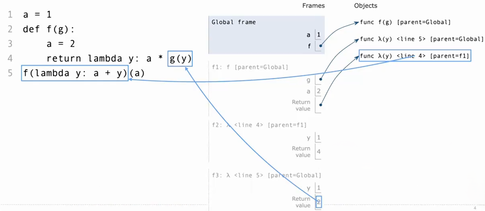

# Lambda Function Environments

> 调用 lambda 函数时创建的新帧，其父帧是该 lambda 表达式被求值时所在的环境。



# 返回语句（Return Statements）

> 从函数调用返回意味着结束函数的调用，并确定调用表达式的值。如果函数执行到函数体末尾仍未遇到 `return`，Python 默认返回 `None`。

> 当对用户定义的函数进行调用表达式的求值时，必须在新的环境中执行该函数的主体，直到达到返回语句或者到达主体的末尾。

# 函数抽象（Function Abstraction）

> 核心：调用者只需要知道函数“如何调用、完成什么功能”，不需要知道其内部实现。

## 1. 示例

```python
def square(x):
    return x * x

# sum_squares 使用 square 计算两个数的平方和。
def sum_squares(x, y):
    return square(x) + square(y)
```

## 2. 调用者需要知道什么？

|       关于 `square` 的信息       | 是否需要 |              原因              |
| :------------------------------: | :------: | :----------------------------: |
|           接收一个参数           |    ✅     |          决定如何调用          |
|         返回这个数的平方         |    ✅     |        决定如何使用结果        |
|    函数的固有名称是 `square`     |    ❌     | 可以通过另一个名称引用同一函数 |
| 内部使用 `mul`、`pow` 或乘法运算 |    ❌     |          属于实现细节          |

可以把函数看成一个黑盒：

输入 → 函数 → 输出

调用者依赖的是函数对外的使用约定，而不是内部的计算过程。

## 3. 易混点：绑定名称与固有名称

```python
def f(x):
    return x * x

square = f

print(f.__name__)       # f
print(square.__name__)  # f
print(square(3))        # 9
```

此时：

- `f` 和 `square` 指向同一个函数对象。
- 函数的固有名称仍然是 `f`，即 `square.__name__ == "f"`。
- `sum_squares` 仍能通过 `square(x)` 调用这个函数。

**注意：不关心固有名称**（固有名称是函数对象自身记录的名称，通常就是定义时 `def` 后面的名字。可以用 `__name__` 查看），不代表代码中的名称可以没有定义。

`sum_squares` 中使用的 `square`，必须绑定到一个符合预期的函数。

## 4. 函数抽象的好处

下面两种实现都可以满足“返回平方”的约定：

```python
def square(x):
    return x * x
```

```python
def square(x):
    return pow(x, 2)
```

只要在约定的输入范围内保持相同的对外行为，替换 `square` 的实现就不需要修改 `sum_squares`。

**一句话记忆：知道怎么调用、结果是什么；内部怎么做，可以不关心。**

# 如何选择名称（Choosing Names）

> 核心：名称通常不影响程序的计算结果，但会影响代码的可读性，以及理解、组合和维护代码的难度。

## 1. 为什么说名称通常不影响正确性？

只要名称的绑定关系不变，并且一致地修改相关引用，换个名字通常不会改变计算结果。

```python
def square(x):
    return x * x
```

```python
def square(number):
    return number * number
```

这里把参数名 `x` 换成 `number`，函数的计算行为不变。

**注意：改名时必须同步修改相关引用，不能只修改一处。**

## 2. 好名称应该表达什么？

**表达所绑定的值的含义或用途，而不只是类型。**

| 不推荐的名称  |   更好的名称   |                  改进原因                  |
| :-----------: | :------------: | :----------------------------------------: |
| `true_false`  | `rolled_a_one` |        说明布尔值表示“是否掷出了 1”        |
|      `d`      |     `dice`     |               明确与骰子有关               |
| `play_helper` |  `take_turn`   |        说明具体任务是“执行一个回合”        |
|   `my_int`    |  `num_rolls`   |           说明整数表示“投掷次数”           |
| `l`、`I`、`O` | `k`、`i`、`m`  | 需要单字母名称时，避免与数字 `1`、`0` 混淆 |

例如：

```python
true_false = True    # 看不出什么事情成立
rolled_a_one = True  # 能看出：掷出了 1
```

名称优先表达业务含义；参数和返回值的类型信息可以在函数的文档字符串（`docstring`）中说明。

## 3. 函数应该如何命名？

函数名通常描述以下内容之一：

|   命名角度   |   示例   | 名称表达的含义 |
| :----------: | :------: | :------------: |
|  产生的效果  | `print`  |    输出内容    |
|  执行的操作  | `triple` | 将输入变为三倍 |
| 返回值的含义 |  `abs`   |   返回绝对值   |

尽量使用具体名称，让读者看到名称就能大致理解函数的作用。

# 用命名简化表达式

> 核心：给重复的计算结果、有明确含义的中间结果起名，让代码更容易理解和复用。

## 1. 给重复表达式起名

同一个复杂表达式需要多次使用时，可以先计算并保存结果。

修改前：

```python
if sqrt(square(a) + square(b)) > 1:
    x = x + sqrt(square(a) + square(b))
```

修改后：

```python
hypotenuse = sqrt(square(a) + square(b))

if hypotenuse > 1:
    x = x + hypotenuse
```

`hypotenuse` 表示直角三角形的“斜边长度”。

这样做有两个好处：

- **减少重复计算**：条件成立时，原代码会计算两次，修改后只计算一次。
- **表达计算含义**：读者看到名称，就知道这个结果代表什么。

注意：这里保存的是计算得到的值。之后修改 `a` 或 `b`，`hypotenuse` 不会自动重新计算。

## 2. 给复杂表达式中有意义的部分起名

即使某个表达式只出现一次，只要它具有明确含义，也可以单独命名。

例如，计算二次方程的一个根：

```python
x = (-b + sqrt(square(b) - 4 * a * c)) / (2 * a)
```

可以拆成：

```python
discriminant = square(b) - 4 * a * c
x = (-b + sqrt(discriminant)) / (2 * a)
```

其中，`discriminant` 表示判别式：Δ = b² − 4ac

**原则：提取有意义的部分，并让名称准确描述保存的值。**

## 3. 名称应该长还是短？

### 有具体含义时，优先表达清楚

```python
average_age = average(age, students)
```

比下面的写法更容易理解：

```python
# 计算学生的平均年龄
aa = avg(a, st)
```

清楚的名称能直接解释代码，减少靠注释说明缩写的需要。

### 表示通用数量时，可以使用短名称

|   常见名称    |     常见用途     |
| :-----------: | :--------------: |
| `n`、`k`、`i` | 整数、数量、索引 |
| `x`、`y`、`z` | 数学运算中的数值 |
| `f`、`g`、`h` |     通用函数     |

这些只是命名习惯，不是 Python 的类型规定。**判断标准是含义是否清楚，而不是名称越长越好。**。。

