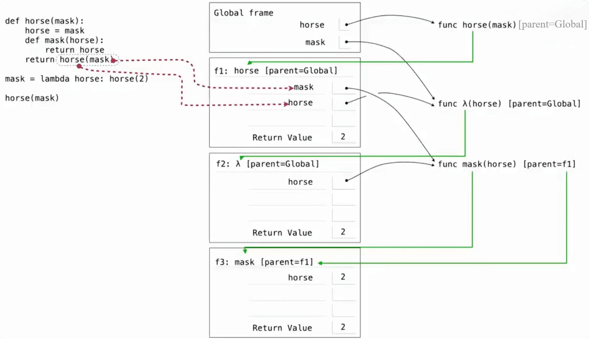

# 装饰器（Decorators）

> 装饰器就是“函数外面再包一个函数”，从而在不改原函数代码的情况下增加功能。
>
> 本质上就是：用一个函数，去接收另一个函数，并返回一个新的函数。

~~~python
def 装饰器(原函数):

    def 新函数(...):

        # 原函数执行前，可以加东西

        原函数(...)

        # 原函数执行后，也可以加东西

    return 新函数
~~~

## 装饰器的等价写法

```python
@装饰器
def 原函数():
    ...
```

等价于：

~~~python
def 原函数():
    ...

原函数 = 装饰器(原函数)
~~~

> **注意：**
>
> `@装饰器` 本身不是在调用原函数。
>
> 它是在函数定义完成之后，把原函数传给装饰器，然后让原函数名指向装饰器返回的新函数。

## 示例

~~~python
def trace(fn):
    def wrapper(x):
        print("before")
        return fn(x)

    return wrapper


@trace
def square(x):
    return x * x
~~~

不看@trace，把它展开：

~~~python
def square(x):
    return x * x

square = trace(square)
~~~

执行过程：

~~~python
 square(3)
	↓
wrapper(3)
	↓
  x = 3
	↓
print("before")
	↓
   fn(3)
	↓
原来的 square(3)
	↓
  3 * 3
	↓
	9
~~~

