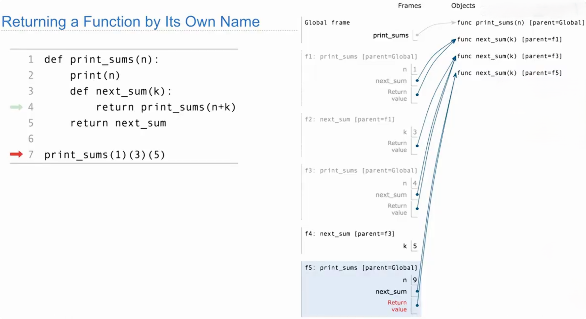
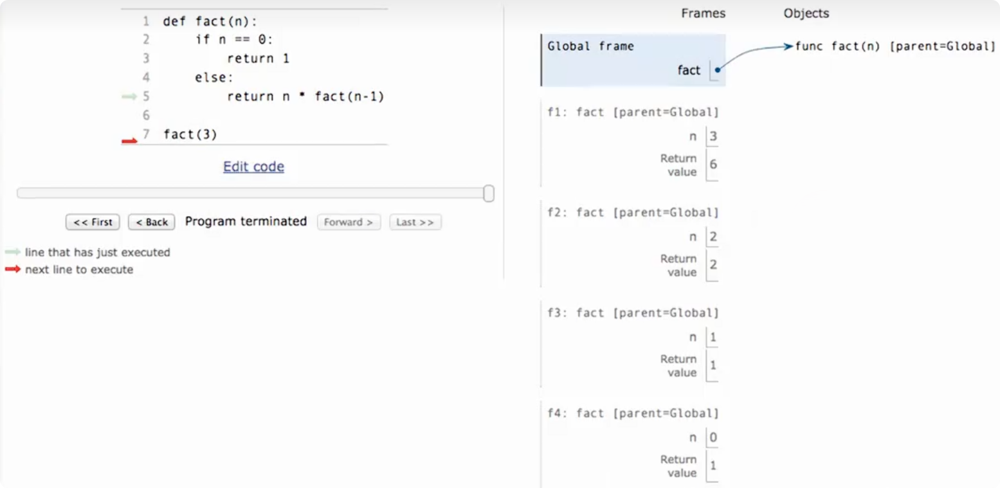
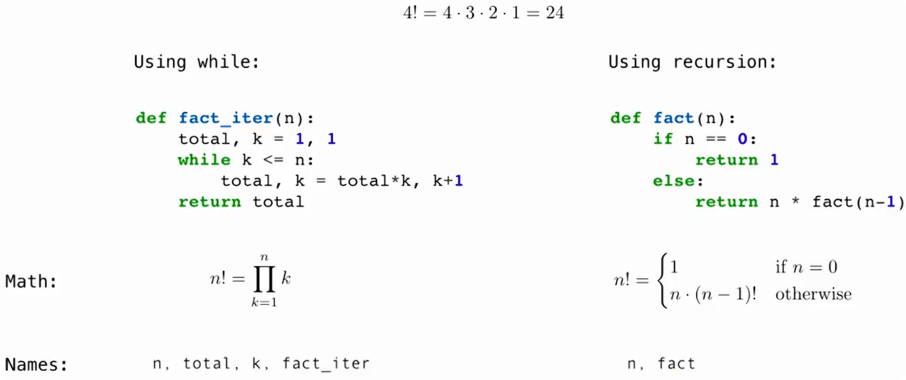

# 返回函数与连续调用



~~~python
def print_sums(n):
    print(n)

    def next_sum(k):
        return print_sums(n + k)

    return next_sum


print_sums(1)(3)(5)
~~~

依次打印：

~~~text
1
4
9
~~~

整个表达式最终返回的仍然是一个函数，而不是数字 `9`。

每次调用 `print_sums` 都会建立新的局部环境，并执行内部的 `def next_sum`，创建一个新的函数对象。

# 闭包

> 一个函数保留了对外层函数中变量的访问能力，即使外层函数已经执行结束，它仍然能使用这些变量。

~~~python
def make_adder(n):
    def add(x):
        return x + n

    return add


add3 = make_adder(3)

print(add3(10))  # 13
print(add3(20))  # 23
~~~

**① 执行 `add3 = make_adder(3)`**

这次调用中，`n = 3`。`make_adder` 创建内部函数 `add`，然后把它返回，赋给 `add3`。

所以，`add3` 指向的是这个内部函数：

```
def add(x):
    return x + n
```

此时，`make_adder(3)` 已经执行结束了，`add` 的函数体还没有执行。

**② 执行 `add3(10)`**

现在才开始执行内部函数：

```
return x + n
```

两个变量的来源不同：

| 变量 |                     从哪里来                      |  值  |
| :--: | :-----------------------------------------------: | :--: |
| `x`  |          当前调用 `add3(10)` 传入的参数           | `10` |
| `n`  | 定义这个内部函数时，外层 `make_adder(3)` 中的变量 | `3`  |

**虽然 `make_adder(3)` 已经结束，返回的 `add` 仍然可以访问那次调用中的 `n`。** 因此结果是 `13`。

# 递归函数（Recursive Functions）

> 递归是指函数在执行过程中直接或间接调用自身。
>
> 递归常把一个问题转化成规模更小的同类问题，直到遇到可以直接求解的情况。



## 执行过程：先逐层调用，再逐层返回

执行 `fact(3)` 时：

| 当前调用  | 当前要计算的内容 |        执行状态        |
| :-------: | :--------------: | :--------------------: |
| `fact(3)` |  `3 * fact(2)`   | 等待 `fact(2)` 的结果  |
| `fact(2)` |  `2 * fact(1)`   | 等待 `fact(1)` 的结果  |
| `fact(1)` |  `1 * fact(0)`   | 等待 `fact(0)` 的结果  |
| `fact(0)` |       `1`        | 满足终止条件，直接返回 |

到达 `fact(0)` 后，结果按相反顺序传回：

1. `fact(0)` 返回 `1`。
2. `fact(1)` 得到结果，计算 `1 * 1`，返回 `1`。
3. `fact(2)` 得到结果，计算 `2 * 1`，返回 `2`。
4. `fact(3)` 得到结果，计算 `3 * 2`，返回 `6`。

**必须先算出** `return` **后面的表达式，当前调用才能返回。

因此，执行 `return n * fact(n - 1)` 时，当前调用需要等待下一层调用完成，再完成乘法并返回。

## 父环境与调用者不同

**父环境由函数的定义位置决定。** `fact` 定义在全局，因此它的所有调用帧都标记为 `parent=Global`。

以 `f2` 为例：

|  概念  |                 作用                 |        `f2`中的对应对象        |
| :----: | :----------------------------------: | :----------------------------: |
| 父环境 | 确定查找外层变量时沿哪个环境继续查找 | Global，因为 `fact` 定义在全局 |
| 调用者 |   发起当前调用，等待并接收返回结果   |  `f1`，因为它调用了 `fact(2)`  |

递归调用不会让上一层调用帧自动变成下一层的父环境。

## 迭代VS递归



### 相同的任务，两种实现方式

两段代码都计算 n 的阶乘。例如，`4! = 1 × 2 × 3 × 4 = 24`，并规定 `0! = 1`。

- **迭代**：使用循环，反复更新变量，逐步得到结果。
- **递归**：通过调用自身，把当前问题交给更小规模的同类问题来求解。

### 递归转换成迭代：以数字求和为例

> 找出迭代函数必须维护哪些状态，“状态”可以理解为：**程序执行到当前这一步，为了继续计算，必须记住的信息。**

~~~python
def sum_digits(n):
    """计算一个非负整数的各位数字之和（递归）"""
    if n < 10:
        return n
    else:
        all_but_last, last = split(n)
        return sum_digits(all_but_last) + last
~~~

以 `sum_digits(1234)` 为例：

```
sum_digits(1234)
= sum_digits(123) + 4
= (sum_digits(12) + 3) + 4
= ((sum_digits(1) + 2) + 3) + 4
= ((1 + 2) + 3) + 4
= 10
```

~~~python
def sum_digits_iter(n):
    """计算一个非负整数的各位数字之和（迭代）"""
    digit_sum = 0
    while n > 0:
        n, last = split(n)
        digit_sum += last
    return digit_sum
~~~

#### 递归转迭代的思考步骤

|     步骤      |        需要回答的问题        |                  本例中的答案                  |
| :-----------: | :--------------------------: | :--------------------------------------------: |
| 1. 找剩余任务 |    下一步还需要处理什么？    |              去掉末位后剩下的数字              |
| 2. 找中间结果 |  已经处理的信息要怎样保存？  |         用 `digit_sum` 累加取出的数字          |
| 3. 写状态更新 |     每一步怎样推进计算？     | 取出末位并更新 n，再把 last 累加到 `digit_sum` |
| 4. 定终止条件 | 什么时候完成？最后返回什么？ |       `n == 0` 时完成，返回 `digit_sum`        |

### 迭代转换成递归：把状态作为参数传递

> 核心：本例的循环通过赋值更新状态；转换后的递归通过传入新的参数，把更新后的状态交给下一次调用。

~~~python
def sum_digits_iter(n):
    """计算一个非负整数的各位数字之和（迭代）"""
    digit_sum = 0
    while n > 0:
        n, last = split(n)
        digit_sum += last
    return digit_sum
~~~

~~~python
def sum_digits_rec(n, digit_sum):
    if n == 0:
        return digit_sum  # 所有数字处理完，返回累计结果
    else:
        n, last = split(n)

        # 把剩余数字和更新后的累计和传给下一次调用
        return sum_digits_rec(n, digit_sum + last)
~~~

**迭代：在同一次函数调用中，不断更新这两个变量。**

**递归：把更新后的两个值，传给下一次函数调用。**

```
return sum_digits(all_but_last) + last
```

需要先得到下一层的结果，返回后再加上 `last`。

```
return sum_digits_rec(n, digit_sum + last)
```

先算好新的累计和，再递归调用；下一层返回后，直接返回它的结果。
