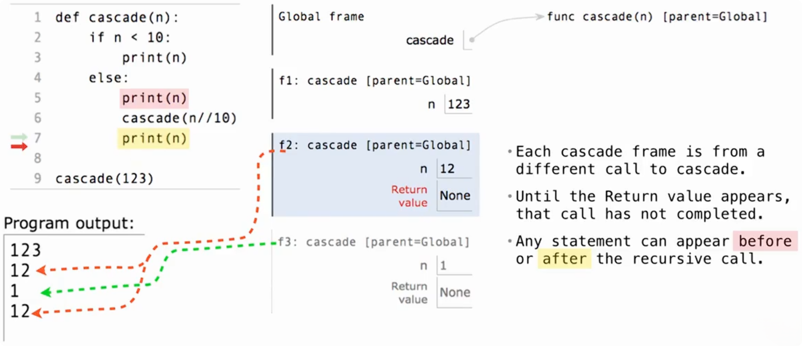
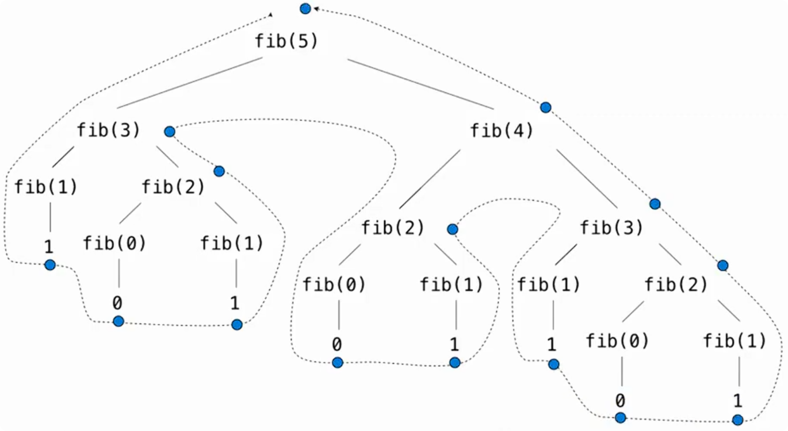

# 递归调用的执行顺序

> 核心：调用下一层递归时，当前层暂停；下一层结束后，当前层从调用语句之后继续执行。



```python
def cascade(n):
    """先打印当前数字并递归去掉末位，再在递归返回时按相反顺序打印"""
    if n < 10:
        print(n)  # 基本情况：只打印一次，不再递归
    else:
        print(n)       # 进入下一层之前执行
        cascade(n // 10)
        print(n)       # 下一层调用结束后执行


cascade(123)
```

完整输出：

```text
123
12
1
12
123
```

看这三行：

```python
print(n)
cascade(n // 10)
print(n)
```

执行顺序是：

1. 执行当前层的第一个 `print(n)`。
2. 调用 `cascade(n // 10)`，执行下一层函数。
3. 等下一层函数完整执行结束。
4. 回到当前层，执行第二个 `print(n)`。

**递归调用不会让当前层直接结束。只要后面还有语句，就需要在下一层返回后继续执行。**

图中某一帧出现 `Return value: None`，表示**这一帧对应的调用已经完成**。

# cascade 的两种写法：基本情况与代码可读性

### 写法一：明确区分基本情况与递归情况

```python
def cascade(n):
    if n < 10:
        print(n)  # 基本情况：打印一次，不再递归
    else:
        print(n)
        cascade(n // 10)
        print(n)
```

结构清楚地分成两部分：

- `n < 10`：直接处理，不再继续递归。
- `n >= 10`：先打印，再递归，返回后再打印。

### 写法二：把共同的打印操作提到前面

```python
def cascade(n):
    print(n)  # 无论 n 是否小于 10，都先打印一次

    if n >= 10:
        cascade(n // 10)
        print(n)  # 只有进入递归情况，才需要再次打印
```

两种写法执行 `cascade(123)`，完整输出都是：

```text
123
12
1
12
123
```

**简化的关键是提取重复操作，同时保留原来的执行条件和执行顺序。**

**基本情况指的是“不再继续递归、能够直接完成当前调用的情况”。它不一定要单独写成一个 `if` 分支，也不一定要显式写 `return`。**

# inverse_cascade：递归、函数参数与 lambda

> 核心：递归后再打印，让输出由短变长；先打印再递归，让输出由长变短。

执行 `inverse_cascade(1234)`，希望输出：

```text
1
12
123
1234
123
12
1
```

它可以拆成三个部分：

|    部分     |                 作用                 | 本例的输出（每个数字单独一行） |
| :---------: | :----------------------------------: | :----------------------------: |
|  `grow(n)`  | 打印由短变长的前缀，不包含完整的 `n` |          `1、12、123`          |
| `print(n)`  |          打印中间的完整数字          |             `1234`             |
| `shrink(n)` | 打印由长变短的前缀，不包含完整的 `n` |          `123、12、1`          |

主函数负责依次执行这三部分：

```python
def inverse_cascade(n):
    grow(n)
    print(n)
    shrink(n)
```

`inverse_cascade`、`grow`、`shrink` 都是自定义的函数名。

## 普通递归函数理解打印顺序

```python
def grow(n):
    prefix = n // 10  # 去掉末位，不打印完整的 n
    if prefix > 0:
        grow(prefix)   # 先处理更短的前缀
        print(prefix)  # 返回后再打印当前前缀


def shrink(n):
    prefix = n // 10
    if prefix > 0:
        print(prefix)   # 先打印当前前缀
        shrink(prefix)  # 再处理更短的前缀


inverse_cascade(1234)
```

**两个函数的递归参数都在逐渐缩小。`grow` 的“变长”指的是输出顺序，因为打印发生在递归返回之后。**

## 完整实现

课件把“先递归还是先打印”的共同结构提取到了 `f_then_g` 中：

```python
def inverse_cascade(n):
    grow(n)
    print(n)
    shrink(n)


def f_then_g(f, g, n):
    if n:
        f(n)  # 先执行 f，等它完成
        g(n)  # 再执行 g


grow = lambda n: f_then_g(grow, print, n // 10)
shrink = lambda n: f_then_g(print, shrink, n // 10)

inverse_cascade(1234)
```

`f_then_g` 接收两个函数 `f`、`g` 和一个数值 `n`，先执行 `f(n)`，等它完整结束后，再执行 `g(n)`。

`f(n)` 和 `g(n)` 接收到的是同一个数值 `n`；这里没有把 `f(n)` 的返回值传给 `g`。

```python
grow = lambda n: f_then_g(grow, print, n // 10)
```

行为等价的普通函数写法是：

```python
def grow(n):
    return f_then_g(grow, print, n // 10)
```

# 树形递归

> 一个函数调用在执行过程中会产生多个递归调用，因此整个递归过程会形成类似树的结构。

~~~python
def fib(n):
    if n == 0:
        return 0
    elif n == 1:
        return 1
    else:
        return fib(n - 2) + fib(n - 1)
~~~



# 整数划分

> 把正整数 `n` 拆成若干个正整数之和，并且每个部分都不能超过 `m`，一共有多少种不同的拆法。
>
> - `n`：**现在还需要凑出的总和**
> - `m`：**允许使用的最大数字**

```
count_partitions(6, 4)
```

表示：

> 要把 `6` 拆成若干个正整数之和，并且每个数最大不能超过 `4`。

因此允许使用：

```
1, 2, 3, 4
```

不允许使用：

```
5, 6, ...
```

例如下面这些拆法是合法的：

```
4 + 2
4 + 1 + 1
3 + 3
3 + 2 + 1
3 + 1 + 1 + 1
2 + 2 + 2
2 + 2 + 1 + 1
2 + 1 + 1 + 1 + 1
1 + 1 + 1 + 1 + 1 + 1
```

一共 `9` 种，所以：

```
count_partitions(6, 4) == 9
```

> 注意：加数的顺序不同不算新的拆法。
>
> 例如 `1 + 2 + 3` 和 `3 + 2 + 1` 算同一种。

## 递归的核心：对于最大的数 `m`，只有两种选择

对于：

```
count_partitions(n, m)
```

可以把所有拆法分成两类：

1. **至少使用一个** `m`
2. **完全不使用** `m`

这两类不会重复，也不会漏掉任何情况。

因此：

```
count_partitions(n, m) = 使用 m 的方案数 + 不使用 m 的方案数
```

## 完整递归代码

```python
def count_partitions(n, m):
    """
    返回把 n 拆成若干个正整数之和，
    且每个部分最大不超过 m 的拆分方案数。
    """
    if n == 0:
        return 1
    elif n < 0:
        return 0
    elif m == 0:
        return 0
    else:
        return count_partitions(n - m, m) + count_partitions(n, m - 1)
```

### 情况 1：`n == 0`

```
if n == 0:
    return 1
```

表示：

> 刚好把目标总和凑完了。

例如原来要凑 `4`，现在已经选了一个 `4`：

```
4 - 4 = 0
```

说明找到了一种合法拆法，因此返回：

```
1
```

### 情况 2：`n < 0`

```
elif n < 0:
    return 0
```

表示：

> 已经凑过头了，这条路线不可能成功。

例如：

```
要凑 2
却尝试拿一个 4

2 - 4 = -2
```

显然不可能，所以返回 `0`。

### 情况 3：`m == 0`

```
elif m == 0:
    return 0
```

表示：

> 还没有把 `n` 凑完，但已经没有任何正整数可以使用了。

例如：

```
count_partitions(3, 0)
```

还要凑 `3`，但最大允许数字已经是 `0`，没有办法继续，所以返回 `0`。

### 情况 4：至少使用一个 `m`

```python
count_partitions(n - m, m)
```

表示：

> 当前这条路线决定至少使用一个 `m`。

既然已经确定使用一个 `m`，就先从目标总和 `n` 中减掉它：

```
n → n - m
```

但是第二个参数仍然是 `m`：

```
count_partitions(n - m, m)
```

因为接下来的拆分中，仍然可以继续使用 `m`。

例如：

```
count_partitions(6, 4)
```

如果决定使用一个 `4`：

```
6 - 4 = 2
```

问题就变成：

```
count_partitions(2, 4)
```

它表示：

> 已经确定用了一个 `4`，现在只需要把剩下的 `2` 拆完，并且剩余部分仍然允许使用不超过 `4` 的数字。

------

### 情况 5：完全不使用 `m`

```
count_partitions(n, m - 1)
```

表示：

> 当前拆法中完全不使用 `m`。

因为没有拿走任何数字，所以需要凑出的总和 `n` 不变。

但是既然已经决定不用 `m`，允许使用的最大数字就变成：

```
m - 1
```

因此：

```
count_partitions(n, m - 1)
```

例如：

```
count_partitions(6, 4)
```

如果决定不用 `4`：

```
count_partitions(6, 3)
```

表示：

> 仍然需要凑出 `6`，但是现在只能使用 `1、2、3`。

------

因此：

```
count_partitions(6, 4)
```

可以拆成：

```
count_partitions(2, 4) + count_partitions(6, 3)
```

分别代表：

```
使用至少一个 4 + 完全不使用 4
```