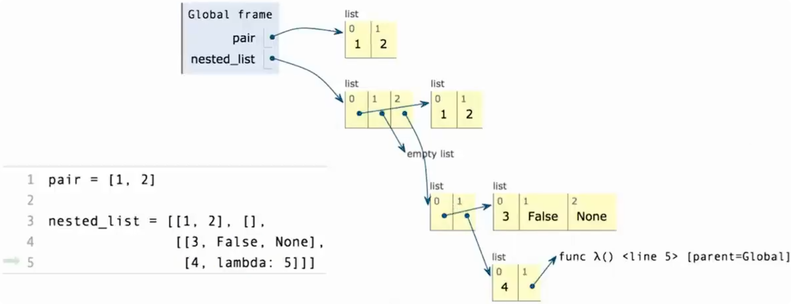
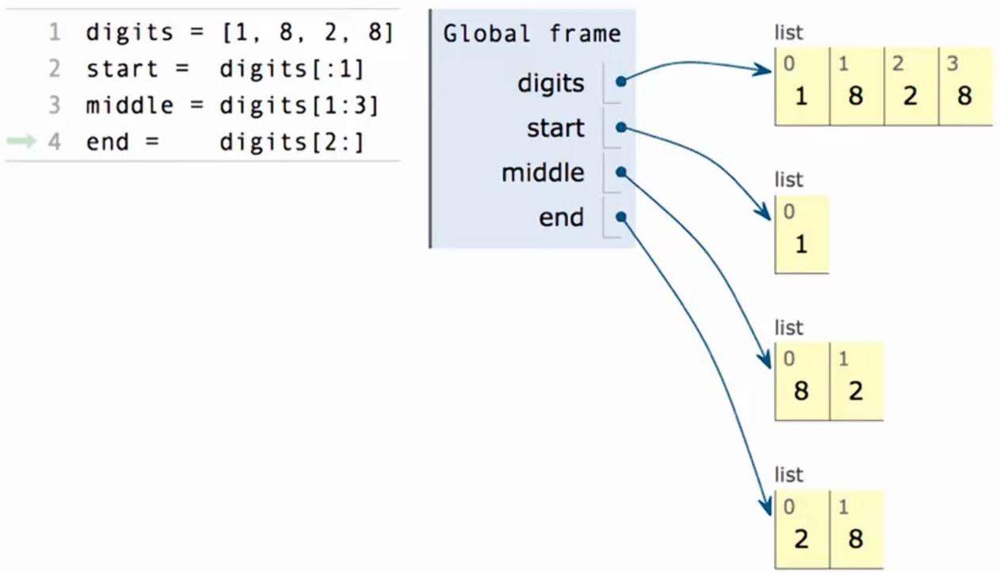

# 数据类型的闭包性质：组合结果还能继续组合

> 如果一种数据组合方式得到的结果，还能继续参与同一种组合，那么这种组合方式就具有闭包性质（closure property）。

列表可以把多个值组合成一个整体：

```python
a = [1, 2]
b = [3, 4]
```

得到的 `a` 和 `b` 本身也是数据值，可以继续作为元素组成新列表：

```python
pairs = [a, b]

print(pairs) # [[1, 2], [3, 4]]
```

新得到的 `pairs` 又可以继续参与列表构造：

```python
data = [pairs, 5]

print(data)
# [[[1, 2], [3, 4]], 5]
```

**已经组合好的列表，仍然能作为另一个列表的元素。**

## 层次结构（hierarchical structures）

> 一个整体由若干部分组成，而这些部分本身又可以由更小的部分组成。

在上面的例子中：

- `data` 的第一个部分是 `pairs`。
- `pairs` 的两个部分是列表 `a` 和 `b`。
- `a` 和 `b` 又分别包含整数。

因此，可以反复使用列表构造来表达更复杂的结构，而不必每增加一层就引入一种新的容器类型。

### 用索引逐层访问

```python
data = [[[1, 2], [3, 4]], 5]

data[0]        # [[1, 2], [3, 4]]
data[0][1]     # [3, 4]
data[0][1][0]  # 3
```

每增加一次索引操作，就从当前列表中取出一个元素。

```python
len(data)     # 2
len(data[0])  # 2
```

`len` 统计当前这一层的元素个数，不会自动统计所有内层元素。

## 列表嵌套与列表拼接要区分

已知：

```python
a = [1, 2]
b = [3, 4]
```

|  表达式  |        结果        |                 含义                 |
| :------: | :----------------: | :----------------------------------: |
| `[a, b]` | `[[1, 2], [3, 4]]` | 把两个列表分别作为元素，保留分组层次 |
| `a + b`  |   `[1, 2, 3, 4]`   |     把两个列表中的元素按顺序拼接     |

列表中的元素也不必都是同一种类型：

```python
mixed = [1, 'hello', [2, 3]]
```

数字、字符串和列表都能成为列表元素。

**闭包性质并不要求列表中的元素类型完全相同。**

## 与函数闭包区别

|        概念        |                  关注的问题                  |                   例子                   |
| :----------------: | :------------------------------------------: | :--------------------------------------: |
| 数据组合的闭包性质 |  组合得到的结果，能否继续用同一种方式组合？  |     一个列表还能作为另一个列表的元素     |
|      函数闭包      | 函数如何保留对其定义处外层作用域变量的访问？ | 返回的内部函数仍然能使用外层函数中的变量 |

# 列表的方框指针图

> 核心：变量名指向对象；列表的每个方框对应一个元素，箭头表示引用关系。



## 方框和箭头

用一排相邻的方框表示一个列表，每个方框对应一个元素，并标注索引。

|          图中的符号           |                   含义                   |
| :---------------------------: | :--------------------------------------: |
|        `Global frame`         | 全局环境帧，记录全局名字与对象的绑定关系 |
|     `pair`、`nested_list`     |                  变量名                  |
|       变量名旁边的箭头        |          这个变量绑定到哪个对象          |
|    标注 `list` 的一排方框     |               一个列表对象               |
|    方框上方的 `0、1、2……`     |                 元素索引                 |
| 方框中的数字、布尔值或 `None` |             直接写出的元素值             |
|       从方框出发的箭头        | 这个元素引用另一个对象，例如子列表或函数 |

## 连续索引就是沿结构逐层取值

以取得整数 `3` 为例：

```python
nested_list[2][0][0]  # 3
```

可以分成三步：

1. `nested_list[2]`：取出外层的第 3 个元素，它是一个列表。
2. 再取 `[0]`：得到其中的第 1 个元素 `[3, False, None]`。
3. 再取 `[0]`：得到这个列表中的第 1 个元素 `3`。

读图时，先找到变量指向的列表，再按索引选中方框；需要继续进入子列表时，就沿对应箭头读取下一层。

## 从嵌套列表中取出并调用函数

```python
fn = nested_list[2][1][1]  # 先取出函数对象
fn()                      # 调用函数，返回 5
```

也可以直接写：

```python
nested_list[2][1][1]()  # 5
```

这句包含两个操作：

1. 前面的连续索引找到函数。
2. 最后的 `()` 调用这个函数。

# 切片

> `列表[start:stop]` 按索引取出一段元素，包含起始索引，不包含结束索引。
>
> **对列表进行切片，得到的仍然是列表，即使只取到一个元素或没有取到元素。**



## 切片的基本写法

```python
odds = [3, 5, 7, 9, 11]

odds[1:3] # [5, 7]
```

`odds[1:3]` 取出索引 `1` 和 `2` 对应的元素，不包含索引 `3`。

**冒号两边写的是索引边界，不是要查找的元素值。**

## 省略起点、终点

对于默认步长为 `1` 的切片：

- 省略起点：从列表开头开始。
- 省略终点：一直取到列表末尾，包含最后一个元素。
- 两者都省略：取出全部元素，形成一个新列表。

|   表达式    |          含义           |        结果        |
| :---------: | :---------------------: | :----------------: |
| `odds[1:3]` |      取索引 `1、2`      |      `[5, 7]`      |
| `odds[:3]`  | 从开头取到索引 `3` 之前 |    `[3, 5, 7]`     |
| `odds[1:]`  |   从索引 `1` 取到末尾   |  `[5, 7, 9, 11]`   |
|  `odds[:]`  |      取出全部元素       | `[3, 5, 7, 9, 11]` |

对应关系：

```python
odds[:3]  # 与 odds[0:3] 结果相同
odds[1:]  # 与 odds[1:len(odds)] 结果相同
odds[:]   # 与 odds[0:len(odds)] 结果相同
```

```python
list(range(1, 3)) # [1, 2]
```

这得到的是两个整数，可以把它们用作索引：

```python
[odds[i] for i in range(1, 3)] # [5, 7]
```

同一段元素也可以直接通过切片取得：

```python
odds[1:3] # [5, 7]
```

切片能够处理超出范围的起止索引，而逐项索引可能报错。

## odds[:] 与直接赋值区别

```python
odds = [3, 5, 7, 9, 11]

alias = odds
copied = odds[:]
```

- `alias = odds`：给同一个列表增加一个引用它的名字。
- `copied = odds[:]`：创建一个新的外层列表，元素与原列表对应。

```python
alias is odds   # True：同一个列表对象
copied is odds  # False：不同的列表对象
copied == odds  # True：内容相等
```

## 切片得到的是浅拷贝

切片会创建新列表，但不会递归复制其中的子列表。

```python
items = [[1, 2], [3, 4]]
copied = items[:]

copied is items        # False：外层列表不同
copied[0] is items[0]  # True：第一个子列表仍是同一个对象
```

**外层重新画一排方框，但各元素仍引用原来的对象。**

切片读取操作不会修改原列表。

### 修改外层列表不会影响原列表

```python
copied.append([5, 6])
```

此时：

```python
copied # [[1, 2], [3, 4], [5, 6]]

items # [[1, 2], [3, 4]]
```

### 修改共享的子列表会同时反映在两者中

~~~python
copied[0].append(99)
~~~

此时：

~~~python
copied # [[1, 2, 99], [3, 4]]

items # [[1, 2, 99], [3, 4]]
~~~

## 起止索引超出范围

切片的起止索引可以超出范围，Python 会截取其中的有效部分：

```python
odds[1:100]  # [5, 7, 9, 11]
odds[100:]   # []
```

单个索引则必须指向实际存在的元素：

```python
odds[100]  # IndexError
```

## 使用负数索引

```python
odds[-2:]  # [9, 11]：最后两个元素
odds[:-1]  # [3, 5, 7, 9]：取到最后一个元素之前
```

## 指定步长

完整形式是：

```text
列表[start:stop:step]
```

默认步长为 `1`。

```python
odds[::2]   # [3, 7, 11]：索引每次增加 2
odds[::-1]  # [11, 9, 7, 5, 3]：逆序生成新列表
```

`[::-1]` 的步长为负；在这种情况下省略起止边界，会从末尾向开头遍历。

步长不能为 `0`，否则会触发 `ValueError`。

# 序列聚合：sum、max 与 all

> 聚合（aggregation）：把可迭代对象中的多个元素汇总成一个结果值。
> 这个结果可以是数字、布尔值，也可以是一个完整的列表等对象。

| 函数  |              作用              |              示例               |
| :---: | :----------------------------: | :-----------------------------: |
| `sum` |      从指定起始值开始累加      |    `sum([2, 3, 4])` 得到 `9`    |
| `max` |  按比较规则选出最大的原始元素  |    `max([2, 3, 4])` 得到 `4`    |
| `all` | 判断每个元素的真假值是否都为真 | `all([True, True])` 得到 `True` |

这三个函数都是 Python 内置的，不需要导入。

## sum：起始值与元素逐项相加

常见用法：

```python
sum(iterable)
sum(iterable, start)
```

**`start` 是累加起始值，默认为 `0`，不是开始遍历的索引。**

```python
sum([2, 3, 4])     # 9：0 + 2 + 3 + 4
sum([2, 3, 4], 5)  # 14：5 + 2 + 3 + 4

sum([])           # 0
sum([], 5)        # 5：没有元素时，直接返回起始值
```

### 字符串不会自动转换成数字

```python
sum(['2', '3', '4'])  # TypeError
```

这些元素是字符串。默认起始值是整数 `0`，无法执行 `0 + '2'`。

如果想做数字求和，需要先转换：

```python
sum([int(x) for x in ['2', '3', '4']])  # 9
```

如果想拼接字符串，可以使用：

```python
''.join(['2', '3', '4'])  # '234'
```

`sum` 也不接受字符串作为起始值，因此改成 `sum(['2', '3', '4'], '')` 仍会报错。

### sum拼接列表

列表的 `+` 表示拼接：

```python
[2, 3] + [4]  # [2, 3, 4]
```

如果起始值也是列表，就可以逐项拼接：

```python
sum([[2, 3], [4]], []) # [2, 3, 4]
等价于：[] + [2, 3] + [4]
```

如果不传入 `[]`，默认起始值是 `0`：

```python
sum([[2, 3], [4]])  # TypeError
```

因为第一步就需要执行不合法的操作：

```python
0 + [2, 3]  # TypeError
```

## max：按比较规则选出原始元素

### 两种基本调用方式

```python
max(range(5))        # 4：从可迭代对象中选出最大元素
max(0, 1, 2, 3, 4)  # 4：从多个参数中选出最大的参数
```

### key：指用什么值进行比较

```python
max(range(10), key=lambda x: 7 - (x - 4) * (x - 2)) # 3
```

可以把 `key` 函数理解为“给每个候选元素计算一个评分”：

~~~
def score(x):
	return 7 - (x - 4) * (x - 2) 

max(range(10), key=score)  # 3 
~~~

执行时，对 `range(10)` 中的各个候选值计算评分，并按评分比较：

| 候选元素 `x` | 比较用的值 `score(x)` |
| :----------: | :-------------------: |
|     `0`      |         `-1`          |
|     `1`      |          `4`          |
|     `2`      |          `7`          |
|     `3`      |          `8`          |
|     `4`      |          `7`          |
|     `5`      |          `4`          |
|     `6`      |         `-1`          |
|     `7`      |         `-8`          |
|     `8`      |         `-17`         |
|     `9`      |         `-28`         |

最高评分是 `8`，对应的原始元素是 `3`。

**`max(..., key=score)` 返回原始元素 `3`，不是评分 `8`。**

```python
best = max(range(10), key=score)

best         # 3：哪个元素的评分最大
score(best)  # 8：这个元素的评分是多少
```

如果直接对评分组成的列表求最大值，得到的才是 `8`：

```python
max([score(x) for x in range(10)])  # 8
```

### lambda 后面加括号表示调用

```python
(lambda x: 7 - (x - 4) * (x - 2))(3) # 8
```

### 并列与空输入

- 如果多个元素的比较值并列最大，返回遍历时最先遇到的那个。
- `max([])` 会触发 `ValueError`，因为没有可选元素。
- 对可迭代对象形式，可以用 `default` 指定空输入的返回值。

```python
max([], default=0)  # 0
```

## all：判断每个元素的真假值

```python
all(iterable)
```

**只有每个元素转换成布尔值后都为 `True`，结果才为 `True`。**

输入不必原本就是布尔值：

```python
bool('hello')  # True：非空字符串
bool('')       # False：空字符串
bool(0)        # False
bool(2)        # True
bool(None)     # False
bool([])       # False

all([1, 2, 3])   # True
all([1, 0, 3])   # False
all(['a', 'b'])  # True
all(['a', ''])   # False
```

第一种：先把条件判断结果组成列表。

```python
[x < 5 for x in range(5)] # [True, True, True, True, True]

all([x < 5 for x in range(5)]) # True
```

第二种：直接检查原始整数的真假值。

```python
all(range(5)) # False
```

`range(5)` 的第一个元素是 `0`，而 `bool(0)` 是 `False`。

### all([]) 是 True

`all` 的判断逻辑可以用下面的函数理解：

```python
def all_like(items):
    for item in items:
        if not item:
            return False
    return True
```

只要发现一个假值，就返回 `False`；如果遍历结束仍没有发现假值，就返回 `True`。

空输入没有任何假值（列表 `[]` 没有任何元素，不进入循环体），因此：

```python
all([])  # True
```

如果还要求输入非空，需要另行判断是否为空。

> 空容器（empty container）可以遍历，只是遍历次数为0。

# 字符串 String

字符串（`str`）用来表示文本。字符串可以表示不同内容，但内容的含义不会自动改变它的类型：

|   字符串   |      表示的内容      | 对应的非字符串写法 |
| :--------: | :------------------: | :----------------: |
|  `'200'`   |    整数的文本形式    |    `200`：整数     |
| `'1.2e-5'` | 科学计数法的文本形式 |  `1.2e-5`：浮点数  |
| `'False'`  |   布尔值的文本形式   |  `False`：布尔值   |
| `'(1, 2)'` |    元组的文本形式    |   `(1, 2)`：元组   |

```python
'200' == 200          # False
'200' + '3'           # '2003'：字符串拼接
200 + 3              # 203：数值相加
int('200') + 3       # 203：先显式转换为整数
```

字符串也可以表示自然语言、诗歌，以及程序代码。

```python
message = '您好'
code = 'x = 1 + 2'
```

这里的 `code` 保存的是文本；这条赋值语句只绑定 `code`，不会执行文本里的 `x = 1 + 2`。

> 字符串可以描述一个值或一段程序，但不会自动变成那个值，也不会自动执行那段程序。

## 字符串字面量的三种写法

**字面量**就是直接写在代码中、用来表示一个值的形式，例如 `123` 和 `'hello'`。

字符串字面量常见的三类写法：

|  写法  |              示例              |             使用场景             |
| :----: | :----------------------------: | :------------------------------: |
| 单引号 |           `'hello'`            |             普通文本             |
| 双引号 |           `"hello"`            | 普通文本，尤其是内容包含单引号时 |
| 三引号 | `'''hello'''` 或 `"""hello"""` |         方便书写多行文本         |

它们创建的都是 `str`，没有三种不同的字符串类型。

```python
'hello' == "hello"        # True
'hello' == """hello"""    # True
```

外层引号用于标记字符串的开始和结束，不属于字符串内容。

```python
len('hello')    # 5，不计算外层引号
```

当内容本身含有引号时，可以换一种外层引号：

```python
sentence = "I've got an apostrophe"
quote = 'He said "hello".'
```

## 三引号可以保留多行文本

```python
text = """第一行
第二行
第三行"""

print(text)
```

输出：

```text
第一行
第二行
第三行
```

这仍然是**一个字符串**，其中包含两个换行字符。

三引号内部实际写入的换行和缩进空格都会保留。例如：

```python
text = """
你好
"""

text == '\n你好\n'    # True：开头和结尾也有换行
```

**三引号本身是字符串语法。** 当这样的字符串位于函数等定义体的第一条语句位置时，可以充当文档字符串（`docstring`）；普通注释使用 `#`。

## 转义字符

在普通字符串字面量中，反斜杠 `\` 可以引出转义序列，用来表示换行、引号等内容。

| 源代码中的写法 |  表示的内容  |
| :------------: | :----------: |
|      `\n`      | 一个换行字符 |
|      `\t`      |  一个制表符  |
|      `\'`      |  一个单引号  |
|      `\"`      |  一个双引号  |
|      `\\`      |  一个反斜杠  |

例如：

```python
print('第一行\n第二行')
```

输出：

```text
第一行
第二行
```

源码中写出的 `\n` 有两个符号，但在这个字符串里表示**一个换行字符**。

```python
len('\n')     # 1：一个换行字符
len('\\n')    # 2：一个反斜杠和一个字母 n
```

如果想输出字面上的 `\n`，需要把反斜杠本身写成 `\\`：

```python
print('第一行\\n第二行')
```

输出：

```text
第一行\n第二行
```

引号也可以用转义表示：

```python
'I've got an apostrophe'   # 错误写法：内部单引号提前结束字符串
'I\'ve got an apostrophe'    # 正确写法
"I've got an apostrophe"     # 正确写法，通常更易读
```

## 交互式显示与 print 的区别

在 Python 交互式解释器中，直接输入字符串变量，通常看到的是它的表示形式：外层有引号，换行显示为 `\n`。

调用 `print` 时，输出的是字符串内容，换行字符会产生实际换行。

```python
>>> text = "第一行\n第二行"
>>> text
'第一行\n第二行'
>>> print(text)
第一行
第二行
```

两种显示方式对应的是**同一个字符串**。

## 字符串可以保存程序，exec 可以执行其中的代码

```python
code = 'curry = lambda f: lambda x: lambda y: f(x, y)'
```

此时只是创建并保存字符串。接着，在模块顶层或交互式解释器中执行：

```python
exec(code)
```

Python 会把这个字符串的内容作为代码执行，从而定义 `curry`。

|          写法          |       作用       |
| :--------------------: | :--------------: |
| `code = 'curry = ...'` | 保存一段程序文本 |
|     `print(code)`      | 显示这段程序文本 |
|      `exec(code)`      | 执行这段程序文本 |

`exec` 执行后，`curry` 绑定到函数对象。`exec` 自身返回 `None`，不会把定义的函数作为返回值交出来。

完整示例：

```python
code = 'curry = lambda f: lambda x: lambda y: f(x, y)'
exec(code)

from operator import add

print(curry(add)(3)(4))    # 7
```

`curry(add)(3)(4)`用普通 `def` 改写，相同的调用过程会更直观：

```python
def curry(f):
    def take_x(x):
        def take_y(y):
            return f(x, y)
        return take_y
    return take_x
```

`return take_y` 和 `return take_x` 返回的是函数本身；后续括号再调用这些函数。

## 字符串支持长度与索引操作

字符串是一种序列，可以像列表一样使用 `len` 获取长度、使用索引取出元素。

```python
city = 'Berkeley'

len(city)    # 8
city[0]      # 'B'
city[3]      # 'k'
city[-1]     # 'y'：最后一个元素
```

索引与内容的对应关系：

| 索引 |  0   |  1   |  2   |  3   |  4   |  5   |  6   |  7   |
| :--: | :--: | :--: | :--: | :--: | :--: | :--: | :--: | :--: |
| 内容 |  B   |  e   |  r   |  k   |  e   |  l   |  e   |  y   |

**索引从 `0` 开始，所以 `city[3]` 取出的是第 4 个元素。**

长度为 `8`，合法的非负索引是 `0` 到 `7`；访问 `city[8]` 会引发 `IndexError`。

## 字符串取出的单个元素，仍然是字符串

```python
city = 'Berkeley'
letter = city[3]

letter          # 'k'
type(letter)    # <class 'str'>
len(letter)     # 1
```

Python 没有单独的 `char` 字符类型；单个字符用长度为 `1` 的字符串表示。

因此，还可以继续对它取索引：

```python
letter[0]       # 'k'
city[3][0]      # 'k'
```

## 字符串的 in 判断连续子串

**子串（substring）**是字符串中连续的一段内容。

```python
'here' in "Where's Waldo?"    # True
```

因为 `"Where's Waldo?"` 中包含连续出现的 `'here'`：

```python
"Where's Waldo?"[1:5]    # 'here'
```

字符串的 `in` 可以匹配一个字符，也可以匹配多个连续字符：

```python
'a' in 'abc'      # True
'ab' in 'abc'     # True
'abc' in 'abc'    # True
'ac' in 'abc'     # False：a 和 c 不相邻
```

两个重点：

- **必须连续**：仅仅按顺序出现、但中间夹着其他字符，不算子串。
- **区分大小写**：`'here'` 和 `'Here'` 是不同的字符串。

```python
'here' in "Where's Waldo?"    # True
'Here' in "Where's Waldo?"    # False
```

`not in` 判断是否不包含该子串，等价于对 `in` 的结果取反：

```python
'cat' not in 'Berkeley'       # True
not ('cat' in 'Berkeley')     # True
```

## 字符串的 in 与列表的 in

| 右侧对象 |           in 判断什么？            |               示例                |
| :------: | :--------------------------------: | :-------------------------------: |
|  字符串  |       是否包含指定的连续子串       |    `'23' in '12345'` → `True`     |
|   列表   | 是否有某个直接元素与待查找的值匹配 | `23 in [1, 2, 3, 4, 5]` → `False` |

图片中的两个列表例子：

```python
234 in [1, 2, 3, 4, 5]          # False
[2, 3, 4] in [1, 2, 3, 4, 5]    # False
```

原因分别是：

1. 列表里没有整数 `234`，只有整数 `1`、`2`、`3`、`4`、`5`。
2. 列表里没有 `[2, 3, 4]` 这个列表元素。列表的 `in` 不会把相邻的三个元素组合起来匹配。

如果列表中确实有这样一个元素，结果才是 `True`：

```python
[2, 3, 4] in [1, [2, 3, 4], 5]    # True
```

同样，列表里存有字符串，也不会自动进入每个字符串进行子串搜索：

```python
'here' in "Where's Waldo?"      # True：字符串中的子串匹配
'here' in ["Where's Waldo?"]    # False：列表中的元素匹配
'here' in ['here', 'there']     # True：有一个元素就是 'here'
```

> 判断 `in` 的含义时，先看右侧是什么类型：字符串匹配子串，列表匹配直接元素。

空字符串是任何字符串的子串，包括空字符串自身：

```python
'' in 'abc'    # True
'' in ''       # True
```

字符串的子串判断要求左侧也是字符串，不会自动把数字转换为文本：

```python
'234' in '12345'    # True
# 234 in '12345'    # TypeError：左侧不是字符串
```

# 字典

```python
numerals = {'I': 1, 'V': 5, 'X': 10}
```

字典（`dict`）用花括号 `{}` 表示，每一项写成 `键: 值`，不同项之间用逗号分隔。

```python
{}             # 空字典
{1: 'item'}    # 一个键值对：整数 1 对应字符串 'item'
```

**键不限于字符串，也可以是整数等符合要求的对象。**

列表、字符串与字典都使用 `[]` 取值，但查找依据不同：

| 对象类型 | 方括号中的内容 |              示例               |
| :------: | :------------: | :-----------------------------: |
|   列表   |    位置索引    | `['I', 'V', 'X'][0]` 得到 `'I'` |
|  字符串  |    位置索引    |      `'IVX'[0]` 得到 `'I'`      |
|   字典   |       键       |    `numerals['X']` 得到 `10`    |

图片中的成功查找：

```python
numerals['X']    # 10
numerals['V']    # 5
```

下面的写法会报错：

```python
numerals[0]          # KeyError: 0
numerals['X-ray']    # KeyError: 'X-ray'
numerals[5]          # KeyError: 5
```

|       表达式        |                  为什么报错？                   |
| :-----------------: | :---------------------------------------------: |
|    `numerals[0]`    |       没有键 `0`；这里不是取第一个键值对        |
| `numerals['X-ray']` | 没有键 `'X-ray'`；不会拿其中的 `'X'` 做部分匹配 |
|    `numerals[5]`    |       `5` 是一个值，但不是这个字典中的键        |

**字典按键找到值，不会自动根据值反查键。**

## 查看字典的键、值与键值对

```python
numerals = {'I': 1, 'V': 5, 'X': 10}
```

### list(字典) 默认收集键

```python
list(numerals) # ['I', 'V', 'X']
```

直接遍历字典，得到的也是键：

```python
for key in numerals:
    print(key)
```

输出：

```text
I
V
X
```

### values() 获取所有值的视图

```python
numerals.values() # dict_values([1, 5, 10])
```

**`dict_values([1, 5, 10])` 是值视图的显示形式，不是普通列表。**

值视图是一个用来查看字典当前所有 value 的特殊对象

它可以被遍历，也可以交给前面学过的 `sum` 求和：

```python
sum(numerals.values()) # 16，即 1 + 5 + 10
```

需要列表时，再使用 `list` 转换：

```python
list(numerals.values()) # [1, 5, 10]
```

虽然视图的显示形式里包含方括号，但它不支持位置索引：

```python
# numerals.values()[0]    # TypeError

list(numerals.values())[0]    # 1
```

“视图”还意味着它会反映原字典后续的变化；`list(...)` 则创建一个列表，收集转换时遍历到的元素。

### 三种常见查看方式

|        写法         | 获取什么？ |        转换成列表后的结果         |
| :-----------------: | :--------: | :-------------------------------: |
|  `numerals.keys()`  |   键视图   |         `['I', 'V', 'X']`         |
| `numerals.values()` |   值视图   |           `[1, 5, 10]`            |
| `numerals.items()`  | 键值对视图 | `[('I', 1), ('V', 5), ('X', 10)]` |

```python
list(numerals.keys()) == list(numerals)    # True
```

`items()` 中的每一项是一个二元组，形式为 `(键, 值)`。

## 字典的值可以是不同类型的对象

```python
d = {1: ['first', 'second'], 3: 'third'}
```

|  键  |       对应的值        |   值的类型   |
| :--: | :-------------------: | :----------: |
| `1`  | `['first', 'second']` | 列表 `list`  |
| `3`  |       `'third'`       | 字符串 `str` |

```python
d[1]    # ['first', 'second']
d[3]    # 'third'
```

同一个字典中的值不必具有相同类型。列表、字典、函数等对象都可以作为值。

```python
{1: {}}
```

它表示：整数键 `1` 对应一个空字典。

### 连续方括号要逐步看对象类型

```python
d[1][0]    # 'first'
```

分两步理解：

1. `d[1]`：在字典中查找键 `1`，得到列表 `['first', 'second']`。
2. `['first', 'second'][0]`：在这个列表中取索引 `0`，得到 `'first'`。

同样：

```python
d[3][0]    # 't'
```

先按键 `3` 得到字符串 `'third'`，再按字符串索引 `0` 得到 `'t'`。

**每一次 `[]` 的含义，都由它左边当前得到的对象类型决定。**

## `len(d)` 统计键值对的数量

```python
d = {1: ['first', 'second'], 3: 'third'}

len(d)       # 2
len(d[1])    # 2
len(d[3])    # 5
```

例如：

```python
len(d[3])
```

可以按下面的过程理解：

```python
d[3]           # 'third'
len('third')   # 5
```

**`len(d)` 不会把键和值分开计数，也不会进入列表或字符串，把内部内容继续计入字典长度。**

## 重复键会保留后面的值

```python
{1: 'first', 1: 'second'} # {1: 'second'}
```

两次写入的键都是 `1`，后面的值 `'second'` 覆盖了前面的值 `'first'`。

```python
d = {1: 'first', 1: 'second'}

len(d)    # 1
d[1]      # 'second'
```

**一个字典中的键是唯一的；不同的键可以对应相同的值。**

```python
{'a': 1, 'b': 1}    # 合法：两个不同的键都对应整数 1
```

如果希望同一个键关联多个数据，可以把它们放进一个列表作为值：

```python
{1: ['first', 'second']}
```

这仍然只有一个键值对，只是这个值本身包含两个列表元素。

## 键必须可哈希，值不要求可哈希

```python
{[1]: 'first'} # TypeError: unhashable type: 'list'

{{}: 'zero'} # TypeError: unhashable type: 'dict'
```

分别尝试把列表 `[1]` 和字典 `{}` 用作键，而这两种内置类型都不可哈希，因此报错。

### 可哈希

字典使用键的哈希值辅助查找。可哈希对象的哈希值在其生命周期内保持不变；判断为相等的可哈希对象，也必须具有相同的哈希值。

|     对象示例     | 能否作为字典的键？ |          说明           |
| :--------------: | :----------------: | :---------------------: |
|     `1`、`3`     |        可以        |       整数可哈希        |
| `'I'`、`'name'`  |        可以        |      字符串可哈希       |
|     `(1, 2)`     |        可以        |  元组中的元素都可哈希   |
|     `[1, 2]`     |       不可以       |      列表不可哈希       |
| `{'a': 1}`、`{}` |       不可以       |      字典不可哈希       |
|     `{1, 2}`     |       不可以       | 普通集合 `set` 不可哈希 |

不能简单记成“所有不可变对象都能作为键”。例如，元组本身不可变，但包含列表时仍不可哈希：

```python
{(1, 2): 'pair'}    # 合法

# {(1, [2]): 'pair'}    # TypeError：元组中包含不可哈希的列表
```

### 键和值的要求不同

```python
{1: [2, 3]}    # 合法：列表作为值
{1: {}}        # 合法：字典作为值

# {[2, 3]: 1}    # 错误：列表作为键
# {{}: 1}        # 错误：字典作为键
```

**判断是否合法时，先看对象在冒号的哪一边：左边是键，必须可哈希；右边是值，没有可哈希要求。**

## in 和 get 

字典的 `in` 默认检查键：

```python
numerals = {'I': 1, 'V': 5, 'X': 10}

'V' in numerals             # True：存在键 'V'
5 in numerals               # False：不存在键 5
5 in numerals.values()      # True：存在值 5
```

如果允许键不存在，可以使用 `get`：

```python
numerals.get('X')           # 10
numerals.get('L')           # None：没有这个键
numerals.get('L', 0)        # 0：没有这个键时返回指定默认值
```

`get` 的第二个参数是“键不存在时返回什么”。它不会把缺失的键自动加入字典。

## 字典推导式

> 字典推导式（dictionary comprehension）用于遍历一个可迭代对象，根据每次取出的元素生成键和值，并把这些键值对收集成一个新字典。

带筛选条件的写法：

```python
{键表达式: 值表达式 for 变量 in 可迭代对象 if 筛选条件}
```

不需要筛选时，可以省略 `if`：

```python
{键表达式: 值表达式 for 变量 in 可迭代对象}
```

例如：

```python
{x: x * x for x in [1, 2, 3]} # {1: 1, 2: 4, 3: 9}
```

每取出一个 `x`，就用 `x` 作为键、`x * x` 作为值。

**冒号左边决定键，右边决定值。**

**每一轮先检查筛选条件；条件的真假值为真时，才计算键和值并写入字典。**

### 用普通 for 循环理解

```python
result = {}    # 先准备一个空字典

for x in [1, 2, 3, 4, 5]:
    if x > 2:
        result[x * x] = x

print(result)
# {9: 3, 16: 4, 25: 5}
```

其中：

```python
result[x * x] = x
```

表示：以 `x * x` 为键，把对应的值设为 `x`。

- 键不存在：新增键值对。
- 键已经存在：更新对应的值。

例如，当 `x = 3` 时，这条语句相当于：

```python
result[9] = 3
```

### 推导式的循环变量不会覆盖外层同名变量

> 推导式中的循环变量具有自己的局部作用域，不会覆盖外层作用域中的同名变量

```python
x = 100

result = {x * x: x for x in [1, 2, 3]}

print(result)    # {1: 1, 4: 2, 9: 3}
print(x)         # 100
```

推导式里的 `x` 用来依次接收 `1、2、3`；外面的 `x` 仍然是 `100`。

相比之下，在同一外层作用域中直接写普通循环：

```python
x = 100
result = {}

for x in [1, 2, 3]:
    result[x * x] = x

print(x)    # 3
```

普通 `for` 循环不会创建这样的独立作用域，所以这里改变了外层 `x` 的绑定。

### 推导式可以使用外层变量

```python
factor = 10

result = {x: x * factor for x in [1, 2, 3]} # {1: 10, 2: 20, 3: 30}
```

其中：

- `x` 是推导式的循环变量。
- `factor` 从外层环境中取得。

整个推导式使用一个新的局部环境，循环变量在其中依次绑定到不同元素；不是每处理一个元素就再新建一个 frame。

### 与列表推导式的不同

|    类型    |                        写法                        | 每轮收集什么？ |
| :--------: | :------------------------------------------------: | :------------: |
| 列表推导式 |       `[表达式 for x in 可迭代对象 if 条件]`       |  一个列表元素  |
| 字典推导式 | `{键表达式: 值表达式 for x in 可迭代对象 if 条件}` |   一个键值对   |

使用相同的数据和筛选条件：

```python
[x * x for x in [1, 2, 3, 4, 5] if x > 2] # [9, 16, 25]

{x * x: x for x in [1, 2, 3, 4, 5] if x > 2} # {9: 3, 16: 4, 25: 5}
```

字典推导式不仅要决定“收集什么”，还要决定“键与值怎样对应”。

补充：如果使用花括号却没有冒号，下面的形式是集合推导式：

```python
{x * x for x in [1, 2, 3]} # 得到包含 1、4、9 的集合，不是字典
```
