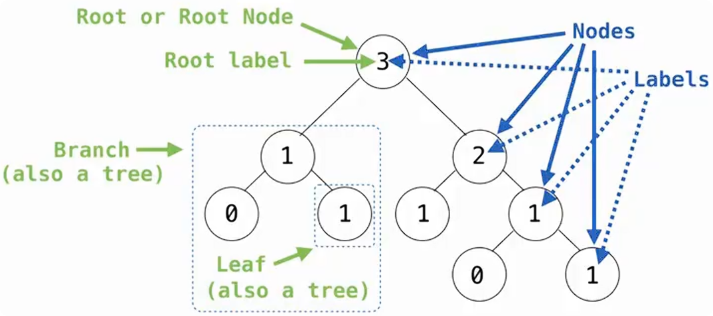

# 树（Trees）

## 树的基本结构 

一棵树由根标签和若干分支组成。



其中：

- `3` 是整棵树的 **root label（根标签）**
- 根标签所在的位置称为 **root / root node（根节点）**
- 每个圆圈代表一个 **node（节点）**
- 节点中的值称为 **label（标签）**
- 从一个节点向下连接的树称为 **branch（分支）**
- 没有分支的节点对应 **leaf（叶子）**

> 但 leaf 本身仍然是一棵 tree。 
>
> leaf 可以看作树递归结构中的基本情况。

需要区分：

```text
node = 树中的一个位置
label = 这个位置中保存的值
```

例如：

```text
        1
       / \
      0   1
```

这里有三个 node，但它们的 label 分别是：

```text
1, 0, 1
```

不同节点可以拥有相同的 label。

## 树的递归定义

树最重要的特征是它具有 **recursive structure（递归结构）**。

即：一棵树 = 一个 root label + 一个 branches 列表，而每一个 branch 本身又是一棵完整的 tree。

例如：

```text
        3
       / \
      1   2
     / \
    0   1
```

对于根节点 `3` 来说：

```text
左边：
    1
   / \
  0   1
```

是一棵树。

右边：

```text
2
```

以及它下面的结构同样是一棵树。

