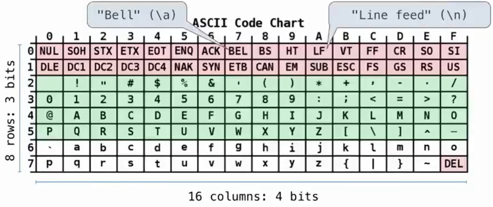
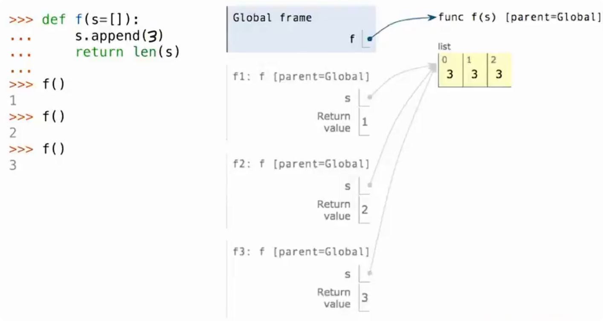
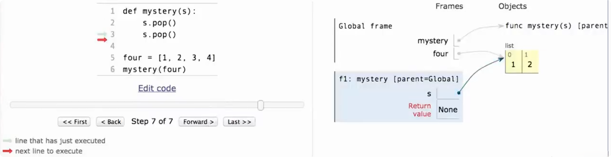

# 对象（Objects）

在 Python 中，**每一个值（value）都是一个对象（object）**。

例如：

```python
3
"hello"
[1, 2, 3]
```

整数、字符串、列表等，本质上都是对象。

对象可以理解为：**一个具有身份、类型，并可以通过相关操作访问或处理的数据实体。Object = Data + Behavior**

例如一个字符串对象：

```
name = "alice"
```

其中：

- `"alice"` 是它保存的数据
- `.upper()`、`.replace()` 等是这个对象提供的操作

```python
name.upper() # 'ALICE'
```

## 对象是一种抽象

**抽象（abstraction）** 指的是：使用一个东西时，只关注它提供的功能，而不必关心内部具体是怎么实现的。

例如：

```
lst.append(3)
```

我们只需要知道：

> `append` 可以把元素加入列表。

并不需要知道 Python 内部到底如何管理列表的内存。

对象通过把**数据和相关操作封装在一起**，帮助我们建立这种抽象。

## Class 和 Object

对象具有不同的类型，而描述这种对象类型的东西叫做 **class（类）**。

例如：

```python
type(3) # <class 'int'>

type("hello") # <class 'str'>

type([1, 2]) # <class 'list'>
```

这里：

- `3` 是一个对象，属于 `int` 类
- `"hello"` 是一个对象，属于 `str` 类
- `[1, 2]` 是一个对象，属于 `list` 类

可以暂时理解为：

> **Class 描述一类对象，而 Object 是具体的对象。**
>
> **class 本身也是一个值（value）**。

因此它和函数类似，可以：

- 赋值给变量
- 作为参数传递
- 作为函数返回值

例如：

```
x = int
x("123")# 123
```

这里 `int` 本身就是一个 class，同时也可以赋值给变量 `x`。

## 属性（Attribute）

对象内部可以包含一些与它有关的信息，这些信息称为 **属性（attribute）**。

通常使用：

```
对象.属性
```

进行访问。

## 方法（Method）

对象提供的、与该对象相关的函数称为 **method（方法）**。

例如：

```
s = "hello"

s.upper()
s.replace("h", "H")
```

`upper` 和 `replace` 都是字符串对象的方法。

很多 Python 中的数据操作都是通过：

```
object.method(...)
```

这种形式完成的。

# 字符串的表示

## ASCII 编码

> ASCII（American Standard Code for Information Interchange，美国信息交换标准代码）是一套早期的字符编码标准，用数字表示字符。

计算机底层只能处理二进制，因此像：

```text
A
a
0
!
```

这些字符都需要先对应到一个数字，再由计算机存储和处理。

例如：

```
'A' -> 65
'a' -> 97
'0' -> 48
```

ASCII 使用 **7 位二进制**表示字符，因此一共可以表示 2^7^ = 128 个不同的字符。

ASCII 中不仅包含英文字母和数字，还包含一些控制字符，例如：

```
\n    换行
\a    响铃
```

这些字符通常不直接显示，而是用于控制文本或早期通信设备的行为。

## ASCII 编码表



ASCII 编码表可以通过“行 + 列”确定一个字符的编码。

例如编码表中的：

```
A -> 0x41
```

其中：

```
4  表示行
1  表示列
```

组合起来得到十六进制 `41`，对应十进制：

```
65
```

因此：

```python
ord('A') # 65
```

ASCII 的排列并不是完全随意的，相似字符通常连续排列，例如：

```
'0' ~ '9'
'A' ~ 'Z'
'a' ~ 'z'
```

这也使字符比较和排序更加方便。

## ASCII 的局限

ASCII 主要针对英文设计，只能表示 128 个字符，因此无法表示：

```
中文
日文
韩文
阿拉伯文
Emoji
```

随着计算机在不同语言环境中的使用，需要一种可以统一表示世界各地字符的标准，因此出现了 Unicode。

## Unicode

Unicode 是一套统一的字符编码标准，目标是为不同语言中的字符分配唯一的编号。

它不仅包含英文字母，还可以表示：

- 中文
- 日文
- 韩文
- 各种文字系统
- 数学符号
- 特殊符号
- Emoji

Unicode 中，每个字符都有一个唯一的编号，这个编号称为**码点（code point）**。

通常写成：

```
U+xxxx
```

例如：

```
U+0058 -> X
U+263A -> ☺
U+2639 -> ☹
```

这里的 `U+` 表示 Unicode，后面的数字通常使用十六进制表示。

# 对象的变化

## 对象状态

> 对象状态表示对象当前保存的信息。
>
> 对于可变对象，对象状态可以在程序运行过程中发生改变。

例如：

```python
person = ["Jessica"]
```

随着程序运行，某个对象内部保存的信息可能发生变化。

需要注意：

> 变化的是对象本身保存的值，而不是变量名。

变量只是一个指向对象的名字。

## 多个名字引用同一个对象

Python 中，一个对象可以被多个变量引用。

例如：

```python
jessica = person
```

此时：

```
jessica ──┐
          ↓
       同一个对象
          ↑
person ───┘
```

两个变量指向的是同一个对象。

如果这个对象发生改变：

```
		对象变化
		   ↓
所有引用该对象的变量都会看到变化
```

因此：

> 指向同一个对象的所有名字，都会受到对象变化的影响。

## 可变对象

> 有些对象创建后，可以改变自身内容，这类对象称为**可变对象（mutable object）**。

例如：

- 列表
- 字典

示例：

```
numbers = [1, 2, 3]

numbers.append(4)
```

执行后：

```
原对象:[1, 2, 3]

变化后:[1, 2, 3, 4]
```

这里列表对象本身没有被替换，而是内容发生了改变。

### 默认参数

Python 函数可以设置默认参数。

例如：

```python
def greet(name="Alice"):
    print(name)
```

调用：

```
greet()
```

如果没有传入参数，就会使用默认值。

#### 默认参数的创建时机

> 默认参数值属于函数对象的一部分，而不是每次函数调用时创建。



例如：

```python
def f(s=[]):
    s.append(5)
    return len(s)
```

可能会误以为：每次调用 `f()` 时，都会创建一个新的空列表：

```
第一次调用:[]

第二次调用:[]

第三次调用:[]
```

但实际情况不是这样。

在执行函数的定义时，发生：

```
	  创建列表 []
         ↓
	保存给默认参数 s
         ↓
	函数 f 创建完成
```

类似于：

```python
default_s = []

def f(s=default_s):
    s.append(5)
    return len(s)
```

因此，之后每次调用都会使用同一个列表。

函数定义时，默认参数对象会被保存到函数对象的属性中。

例如：

```
f.__defaults__
```

可以看到：

```
([],)
```

## 不可变对象

> 与可变对象相对应，有些对象创建后不能修改自身内容，称为**不可变对象（immutable object）**。

例如：

- 整数
- 字符串
- 元组

例如：

```
name = "Alice"

name = "Bob"
```

看起来像改变了字符串，但实际上：

```
"Alice" 对象没有改变

而是 name 重新指向了新的 "Bob" 对象
```

## 函数调用中的对象变化

### 函数可以修改作用域中的对象

> **函数参数传递的是对象的引用绑定，函数内部的参数名会绑定到传入的对象。**

函数执行过程中，可以修改它能够访问到的对象。

对于可变对象来说：

> 如果函数修改了对象本身，那么函数调用结束后，外部也能看到这个变化。

例如列表：

```python
four = [1, 2, 3, 4]
```

### 通过参数修改对象

例如：

```python
def mystery(s):
    s.pop()
    s.pop()
```

调用：

```python
four = [1, 2, 3, 4]

mystery(four)

len(four)
```



执行过程：

1.`four` 指向列表对象：

```
four → [1, 2, 3, 4]
```

2.调用函数：

```
mystery(four)
```

参数 `s` 也指向同一个列表：

```
four ──┐
       ↓
   [1,2,3,4]
       ↑
       s
```

3.执行：

```
s.pop()
```

删除最后一个元素：

```
[1,2,3]
```

4.再次执行：

```
s.pop()
```

变成：

```
[1,2]
```

因此函数结束后：

```python
len(four) # 2
```

虽然函数没有返回任何值，但是列表已经被修改。

### 修改对象本身

例如：

```
s.pop()
```

这是直接改变列表内容。

变化：

```
原对象: [1,2,3,4]

修改后: [1,2]
```

所有引用该对象的变量都会看到变化。

### 修改变量绑定

例如：

```
s = []
```

这不是修改原来的列表，而是让 `s` 指向新的对象。

变化：

```
原对象: [1,2,3,4]

s → []
```

原来的列表并没有改变。

### 函数也可以直接修改外部对象

对象不一定必须作为参数传入。

例如：

```python
four = [1,2,3,4]

def another_mystery():
    four.pop()
    four.pop()
```

函数内部可以访问外部变量 `four`。

执行：

```
another_mystery()

len(four)
```

结果：

```
2
```

原因：函数直接修改了外部列表对象。

### 切片赋值也可以改变列表

另一种修改列表的方法：

```python
def mystery(s):
    s[2:] = []
```

对于：

```
s = [1,2,3,4]
```

执行：

```
s[2:] = []
```

表示删除索引 2 之后的所有元素：

```
[1,2]
```

注意：

```
s[2:] = []
```

修改的是原列表。

而：

```
s = s[:2]
```

只是让变量重新指向一个新的列表。

## 复合对象

> 复合对象（compound object）是由多个部分组成的对象。

例如：

```python
x = [1, 2, 3]
```

列表就是一个复合对象，它由多个元素组成。

在对象不会发生变化时，我们可以认为：

> 一个复合对象就是它包含的所有部分。但复合对象是否可变，取决于对象本身以及内部引用的对象。

例如一个有理数：

```
1 / 2
```

可以看作：

```
分子 + 分母
```

两个部分共同组成这个对象。

## 对象身份

> 对象身份（identity）表示：两个变量是否引用同一个对象。
>
> 使用 `is` 判断对象身份。

例如：

```python
a = [10]
b = a

a is b
```

结果：

```
True
```

原因：

```
a ──┐
    ↓
  [10]
    ↑
b ──┘
```

两个变量指向同一个列表对象。

## 对象相等

> 对象相等（equality）表示：两个对象包含的值是否相同。
>
> 使用 `==` 判断值是否相等。

例如：

```python
a = [10]
b = [10]

a == b
```

结果：

```
True
```

因为：

```
两个列表内容相同
```

但是：

```
a is b
```

结果：

```
False
```

因为：

```
a 和 b 指向不同的列表对象
```

**`==` 比较内容，`is` 比较身份。**

## 同一个对象的变化

```python
a = [10]
b = a
```

此时：

```
 a
 ↓
[10]
 ↑
 b
```

执行：

```
a.append(20)
```

结果：

```python
a # [10, 20]

b # [10, 20]
```

因为两个变量引用的是同一个对象。

## 不同对象但内容相同

```python
a = [10]
b = [10]
```

此时：

```
a → [10]

b → [10]
```

两个列表内容一样，但是对象不同。

执行：

```
b.append(20)
```

结果：

```python
a # [10]

b # [10, 20]
```

修改其中一个对象不会影响另一个。

# 元组

> 元组（tuple）是一种不可变的序列。

例如：

```python
turtle = (1, 2, 3)
```

元组创建后，内部元素不能被修改：

```
turtle[0] = 4
```

会产生错误。

因为元组对象本身受到保护，不能发生变化。

## 不可变对象的特点

> 不可变对象（immutable object）：创建之后，对象内部的内容不能被修改。

例如：

- 整数
- 字符串
- 元组

如果想改变它们的值，实际上是创建新的对象，然后让变量指向新的对象。

## 名字改变

例如：

```python
x = 2
x + x # 4

x = 3
x + x # 6
```

这里不是数字 `2` 变成了 `3`。

实际上：

```
x ➡ 2
```

变成：

```
x ➡ 3
```

只是变量 `x` 重新绑定到了另一个对象。

原来的整数对象没有改变。

## 对象改变

对于可变对象：

```python
x = [1, 2]

x.append(3)
```

执行后：

```
原对象: [1, 2]

变化后: [1, 2, 3]
```

这里列表对象本身发生了变化。

因此：

```
x + x
```

结果为：

```
[1, 2, 3, 1, 2, 3]
```

## 不可变容器中的可变对象

虽然元组本身不可变，但是元组里面可以存放可变对象。

例如：

```python
s = ([1, 2], 3)
```

元组不能改变它的元素：

```
s[0] = 4
```

错误。

因为这相当于替换元组中的第一个元素。

但是：

```
s[0][0] = 4
```

可以成功。

原因：

这里修改的是元组内部的列表对象。

变化：

```
修改前:([1,2],3)

修改后:([4,2],3)
```

元组本身没有改变，改变的是它引用的列表对象。

## 不可变性是对象自身的性质

判断对象是否可变，需要看对象本身，而不是看外层结构。

例如：

```
tuple
 └── list
```

其中：

- tuple 不可变
- list 可变

所以：

```
不能改变 tuple 中保存的引用

但是可以改变引用指向的可变对象
```

