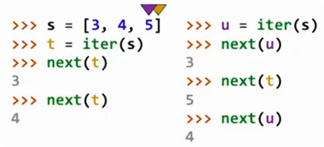

# 迭代器

## 容器

容器（container）是保存多个元素的数据结构，例如：

```python
s = [3, 4, 5]
```

一个容器可以提供迭代器，使我们能够按照一定顺序访问其中的元素。

可以传入 `iter()` 并产生迭代器的对象称为可迭代对象（`iterable`）。

列表就是一种容器，也是可迭代对象。

容器本身保存所有数据，而迭代器负责提供一种访问这些数据的方式。

可以理解为：

```
 	容器
 	 ↓
提供一个迭代器
 	 ↓
迭代器逐个访问元素
```

## 创建迭代器

使用：

```
iter(iterable)
```

根据一个可迭代对象创建迭代器。

例如：

```python
s = [3, 4, 5]

t = iter(s)
```

此时：

```
s:[3,4,5]

t:指向列表元素访问过程的迭代器
```

注意：迭代器不是复制了一份列表，而是记录了当前访问的位置。

## 获取下一个元素

使用：

```
next(iterator)
```

获取迭代器中的下一个元素。

例如：

```python
s = [3, 4, 5]

t = iter(s)

next(t)
```

结果：

```
3
```

再次调用：

```
next(t)
```

结果：

```
4
```

再次调用：

```
next(t)
```

结果：

```
5
```

迭代器会记住当前位置。

## 多个迭代器互相独立

同一个容器可以创建多个迭代器。



例如：

```
s = [3, 4, 5]

t = iter(s)
u = iter(s)
```

此时：

```
 t
 ↓
[3,4,5] 当前在开头


 u
 ↓
[3,4,5] 当前在开头
```

两个迭代器拥有各自的访问状态。

例如：

```
next(t)
```

结果：

```
3
```

此时：

```
t 已经移动到 4
u 仍然在 3
```

执行：

```
next(t)
```

得到：

```
4
```

但是：

```
next(u)
```

仍然得到：

```
3
```

因为 `u` 没有移动。

## 迭代器的特点

### 记录当前位置

迭代器会保存当前访问到哪里。

例如：

```
[3,4,5]

第一次 next:
 ↑
 3


第二次 next:
   ↑
   4
```

### 一次访问一个元素

迭代器不会一次返回所有元素，而是每次返回一个。

例如：

```
next(t)
```

每调用一次，就向后移动一步。

## 迭代器的消耗性

> 迭代器是一次性的对象。
>
> 它保存当前访问位置，元素被访问后不会自动重新开始。
> 如果需要重新遍历，需要创建新的迭代器。

例如：

```python
r = range(3, 6)

ri = iter(r)
```

这里：

- `r` 是可迭代对象
- `ri` 是迭代器

### 直接遍历迭代器

```python
for i in ri:
    print(i)
```

输出：

```
3
4
5
```

再次遍历同一个迭代器：

```python
for i in ri:
    print(i)
```

不会输出任何内容。

原因：迭代器已经被消耗完。

### 可迭代对象可以重复遍历

直接遍历：

```python
for i in r:
    print(i)
```

输出：

```
3
4
5
```

再次：

```python
for i in r:
    print(i)
```

仍然输出：

```
3
4
5
```

原因：

`range` 是可迭代对象，但不是迭代器。

每次调用 `iter(range对象)` 都会创建新的迭代器。

## for 循环的内部机制

当执行：

```python
for i in r:
    print(i)
```

实际类似于：

```python
iterator = iter(r)

while True:
    try:
        i = next(iterator)
        print(i)
    except StopIteration:
        break
```

因此：

- `for` 循环需要的是可迭代对象
- Python 会自动创建迭代器
- 遍历完成后迭代器结束

## 迭代器结束

当迭代器中的元素全部访问完成后：

```
next(t)
```

继续调用会产生：

```
StopIteration
```

表示没有更多元素。

## 字典是可迭代对象

字典、字典的键、字典的值以及字典的键值对都可以进行迭代。

例如：

```
d = {
    "one": 1,
    "two": 2,
    "three": 3
}
```

字典可以有三种迭代方式

> 字典默认遍历键；如果想遍历值或键值对，需要明确调用 `values()` 或 `items()`。

|             方法              | 迭代内容 |
| :---------------------------: | :------: |
| `iter(d)` 或 `iter(d.keys())` |    键    |
|      `iter(d.values())`       |    值    |
|       `iter(d.items())`       |  键值对  |

#### 迭代字典的键

直接对字典使用 `iter()`：

```
d = {
    "one": 1,
    "two": 2,
    "three": 3
}

k = iter(d)
```

等价于：

```
k = iter(d.keys())
```

调用：

```
next(k)
```

依次得到：

```
one
two
three
```

字典默认迭代的是键。

#### 迭代字典的值

使用：

```
v = iter(d.values())
```

获取值：

```
next(v)
```

结果：

```
1
2
3
```

#### 迭代字典的键值对

使用：

```
i = iter(d.items())
```

获取键和值组成的元组：

```
next(i)
```

结果：

```
("one", 1)
```

继续：

```
next(i)
```

结果：

```
("two", 2)
```

每个元素都是一个包含两个值的元组：

```
(key, value)
```

#### 字典的迭代顺序

> Python 3.7+：字典会保持元素插入的顺序。

例如：

```
d = {
    "one": 1,
    "two": 2,
    "three": 3
}
```

迭代顺序：

```
one
two
three
```

与添加顺序一致。

------

> Python 3.5 及以前：字典中的元素顺序是不确定的。

因此：

```
添加顺序 ≠ 访问顺序
```

#### 字典迭代规则

> 迭代器会记录当前访问的位置。
>
> 当迭代一个可变对象时，如果对象结构发生变化，可能会导致迭代器失效。

迭代字典时：

|        操作        | 是否允许 |
| :----------------: | :------: |
| 修改已有键对应的值 |   允许   |
|     添加新的键     |  不允许  |
|       删除键       |  不允许  |

##### 迭代时增加键

例如：

```python
d = {
    "one": 1,
    "two": 2
}

k = iter(d)

next(k)
```

输出：

```
'one'
```

此时迭代器已经访问了第一个键。

然后：

```
d["zero"] = 0
```

向字典中添加新的键。

现在字典变成：

```
{
    "one": 1,
    "two": 2,
    "zero": 0
}
```

继续：

```
next(k)
```

会报错：

```
RuntimeError:
dictionary changed size during iteration
```

原因：字典的大小发生了变化，原来的迭代器无法确定接下来应该访问哪个元素。

##### 迭代时修改值

重新创建迭代器：

```python
d = {
    "one": 1,
    "two": 2,
    "zero": 0
}

k = iter(d)
```

访问：

```python
next(k)
```

得到：

```
'one'
```

继续：

```python
next(k)
```

得到：

```
'two'
```

然后修改已有键：

```python
d["zero"] = 5
```

此时：

```
原来:"zero": 0

修改后:"zero": 5
```

但是：

- 字典的键数量没有变化
- 字典的结构没有变化
- 键迭代器仍然有效

所以继续：

```python
next(k)
```

最后得到：

~~~text
'zero'
~~~

## 迭代相关的内置函数

> `map` 负责转换，`filter` 负责筛选，`zip` 负责组合，`reversed` 负责反向遍历。

### 惰性计算

Python 中很多处理序列的函数会返回迭代器，而不是立即生成完整结果。

这种方式称为**惰性计算（lazy evaluation）**：

> 需要元素时才计算元素，而不是提前计算所有结果。

优点：

- 节省内存
- 可以处理大量数据
- 避免不必要的计算

### map函数

```
map(func, iterable)
```

作用：

> 对可迭代对象中的每个元素执行函数，并返回结果组成的迭代器。

例如：

```
def square(x):
    return x * x

nums = [1, 2, 3]

result = map(square, nums)
```

执行过程：

```
1 → square → 1
2 → square → 4
3 → square → 9
```

查看结果：

```
list(result)
```

输出：

```
[1, 4, 9]
```

### filter函数

```
filter(func, iterable)
```

作用：

> 根据函数返回值筛选元素。

如果 `func(x)` 返回：

- True：保留元素
- False：过滤元素

例如：

```
nums = [1, 2, 3, 4, 5]

result = filter(lambda x: x % 2 == 0, nums)
```

结果：

```
list(result)
```

输出：

```
[2, 4]
```

### zip函数

> `zip()` 用于将多个可迭代对象中相同位置的元素组合起来。

语法：

```python
zip(iterable1, iterable2, ...)
```

例如：

```
list(zip([1, 2], [3, 4]))
```

执行过程：

```
第 1 个位置: 1 和 3 组合

第 2 个位置: 2 和 4 组合
```

结果：

```
[(1, 3), (2, 4)]
```

每个元素都是一个元组：

```
(第一个列表元素, 第二个列表元素)
```

#### 长度不同的可迭代对象

如果传入的多个可迭代对象长度不同：

> `zip()` 只会组合能够匹配的位置，多余的元素会被忽略。

例如：

```
list(zip([1, 2], [3, 4, 5]))
```

两个列表：

```
第一个:1  2

第二个:3  4  5
```

对应组合：

```
1 → 3
2 → 4
```

结果：

```
[(1, 3), (2, 4)]
```

最后的：

```
5
```

没有对应元素，因此被忽略。

#### zip 的应用场景

例如：

```python
names = ["Alice", "Bob", "Tom"]

scores = [90, 80, 70]

for name, score in zip(names, scores):
    print(name, score)
```

效果：

```
Alice 90
Bob 80
Tom 70
```

相比使用索引：

```
for i in range(len(names)):
```

更加简洁。

### reversed函数

```
reversed(sequence)
```

作用：

> 按照相反顺序遍历序列。

例如：

```python
nums = [1, 2, 3]

result = reversed(nums)
```

转换：

```
list(result)
```

输出：

```
[3, 2, 1]
```

注意：`reversed()` 返回的是迭代器，不会直接生成列表。

### 查看迭代器内容

由于迭代器不会直接显示所有元素：

```
map(...)
filter(...)
zip(...)
reversed(...)
```

通常需要转换成容器查看。

#### list

```
list(iterable)
```

作用：

> 将可迭代对象转换成列表。

例如：

```
it = map(lambda x: x + 1, [1, 2, 3])

list(it)
```

结果：

```
[2, 3, 4]
```

#### tuple

```
tuple(iterable)
```

作用：

> 将可迭代对象转换成元组。

例如：

```
tuple([1, 2, 3])
```

结果：

```
(1, 2, 3)
```

#### sorted

```
sorted(iterable)
```

作用：

> 将可迭代对象中的元素排序，并返回新的列表。

例如：

```
nums = [3, 1, 2]

sorted(nums)
```

结果：

```
[1, 2, 3]
```

注意：`sorted()` 不会修改原对象。

例如：

```
nums
```

仍然是：

```
[3, 1, 2]
```
