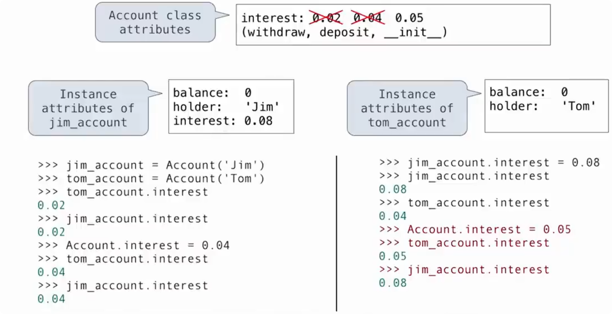
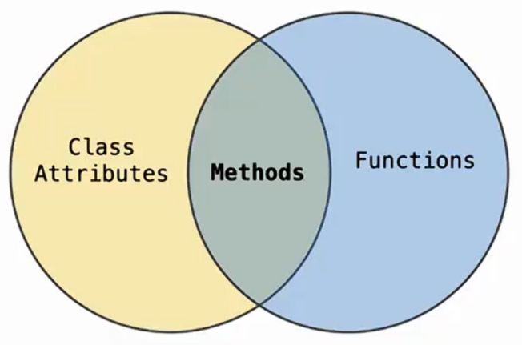

# class 语句

> `class` 语句用于创建一个新的类。

基本形式：

```python
class ClassName:
    ...
```

执行 `class` 语句时，类体中的代码会执行，并最终创建一个类对象。

例如：

```python
class Account:
    interest = 0.02

    def deposit(self, amount):
        self.balance += amount
        return self.balance
```

类体中的：

```python
interest = 0.02
```

会创建类属性，而：

```python
def deposit(...):
```

也会创建一个属于类的属性，只不过这个属性的值是一个函数。

> 方法本质上是定义在类中的函数。

# 实例属性与类属性

```python
class Account:
    interest = 0.02

    def __init__(self, holder):
        self.holder = holder
        self.balance = 0
```

创建两个实例：

```python
tom_account = Account("Tom")
jim_account = Account("Jim")
```

> 类属性属于类，被所有实例共享。

因此，都可以访问：

```python
tom_account.interest # 0.02

jim_account.interest # 0.02
```

`interest` 实际存放在 `Account` 类中，而不是分别存放在两个实例中。

可以理解为多个实例共享同一个类属性：

```
Account
    interest = 0.02
        ↑
        ├── tom_account
        └── jim_account
```

> 实例属性属于具体对象。

每个实例都有自己独立的数据：

```
tom_account
    balance = 0
    holder = "Tom"

jim_account
    balance = 0
    holder = "Jim"
```

## 属性查找

> **实例属性优先于类属性。**

点号表达式：

```
object.name
```

表示在对象中查找名为 `name` 的属性。

例如：

```python
tom_account.interest
```

查找顺序可以理解为：

```
先找实例属性
  	↓
找到 → 返回

  没找到
    ↓
再找类属性
    ↓
找到 → 返回
```

因此：

```python
tom_account.interest
```

虽然 `tom_account` 本身没有 `interest`，但它所属的 `Account` 类中存在：

```python
interest = 0.02
```

所以结果仍然是：

```python
0.02
```

## 属性赋值



> 点号出现在赋值语句左边时，表示给这个对象设置属性：

```python
object.name = value
```

如果左边是实例：

```python
tom_account.interest = 0.08
```

那么创建或修改的是 **tom_account 的实例属性**。

它不会修改：

```python
Account.interest
```

例如：

```python
class Account:
    interest = 0.02

tom_account = Account("Tom")
jim_account = Account("Jim")

tom_account.interest = 0.08
```

此时：

```python
tom_account.interest # 0.08

jim_account.interest # 0.02

Account.interest # 0.02
```

因为现在 `tom_account` 自己已经拥有：

```python
interest = 0.08
```

查找时会优先找到实例属性，不再继续查找类。

## 修改类属性

如果直接：

```python
Account.interest = 0.04
```

修改的是类属性。

没有自己 `interest` 属性的实例都会看到新的值：

```python
tom_account.interest # 0.04

jim_account.interest # 0.04
```

但是如果某个实例已经有自己的同名属性：

```python
jim_account.interest = 0.08
```

之后再修改：

```python
Account.interest = 0.05
```

结果：

```python
tom_account.interest # 0.05

jim_account.interest # 0.08
```

# `getattr` 与 `hasattr`

除了点号表达式，也可以使用 `getattr()` 根据字符串查找属性。

例如：

```python
tom_account.balance # 10
```

等价于：

```python
getattr(tom_account, "balance") # 10
```

------

`hasattr()` 用于判断对象是否具有某个属性：

```python
hasattr(tom_account, "deposit") # True
```

常见形式：

```python
getattr(object, "name")
hasattr(object, "name")
```

# self 的自动绑定

类中定义：

```python
def deposit(self, amount):
    self.balance += amount
    return self.balance
```

可以直接调用：

```python
tom_account.deposit(100)
```

虽然 `deposit` 定义了两个参数：

```
self
amount
```

调用时却只需要提供：

```
100
```

原因是点号表达式已经自动完成：

```
self = tom_account
amount = 100
```

因此：

```
tom_account.deposit(100)
```

大致等价于：

```
Account.deposit(tom_account, 100)
```

区别只是前一种写法中，Python 自动绑定了 `self`。

# 绑定方法



类中的：

```python
def deposit(self, amount):
    ...
```

首先是一个函数，并作为属性存放在类中。

因此：

```python
Account.deposit
```

得到的是函数：

```python
type(Account.deposit) # <class 'function'>
```

但是：

```python
tom_account.deposit
```

通过实例访问时，会得到一个**绑定方法（bound method）**：

```python
type(tom_account.deposit) # <class 'method'>
```

# 方法也是对象

绑定方法本身也是 Python 对象，因此可以像普通函数一样：

- 赋值给变量
- 作为参数传递
- 之后再调用

例如：

```python
f = tom_account.deposit
```

此时 `f` 已经绑定了 `tom_account`。

所以：

```python
f(10)
```

等价于：

```python
tom_account.deposit(10)
```

连续调用：

```python
f(10)
f(10)
```

都会修改同一个 `tom_account`。

## 方法作为高阶函数的参数

> 方法和函数一样，都是可以被保存和传递的对象。

因为绑定方法也是对象，所以可以直接传给 `map()`：

```python
m = map(tom_account.deposit, range(10, 20))
```

这里 `tom_account.deposit` 已经绑定了：

```python
self = tom_account
```

因此 `map()` 每次只需要提供一个 `amount`：

```
10
11
12
...
```

例如：

```python
next(m)
```

相当于：

```python
tom_account.deposit(10)
```

再次：

```python
next(m)
```

相当于：

```python
tom_account.deposit(11)
```