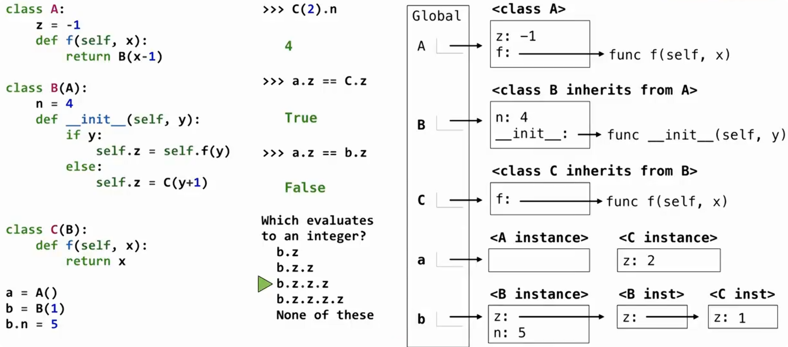

# 继承

> 继承（inheritance）用于建立类之间的关系。
>
> 当两个类的大部分属性和行为相同，但其中一个类更加特殊时，可以让特殊的类继承通用的类。

```python
class SubClass(BaseClass):
    ...
```

其中：

- `BaseClass`：父类 / 基类
- `SubClass`：子类

可以理解为：

```text
父类
├── 通用属性
├── 通用方法
│
└── 子类
    ├── 继承父类已有的行为
    └── 只定义自己不同的部分
```

> 继承的主要作用是：复用已有代码，只描述子类与父类之间的差异。

假设已经定义了普通银行账户：

```python
class Account:
    interest = 0.02

    def __init__(self, holder):
        self.holder = holder
        self.balance = 0

    def deposit(self, amount):
        self.balance += amount
        return self.balance

    def withdraw(self, amount):
        if amount > self.balance:
            return "Insufficient funds"
        self.balance -= amount
        return self.balance
```

现在需要定义一种更加特殊的账户：

```python
class CheckingAccount(Account):
    withdraw_fee = 1
    interest = 0.01

    def withdraw(self, amount):
        return Account.withdraw(self, amount + self.withdraw_fee)
```

`CheckingAccount` 是 `Account` 的子类。

它和普通账户相比：

- 存款方式相同
- 初始化方式相同
- 利率不同
- 取款时额外收取手续费

因此只需要重新定义不同的部分。

## 继承已有属性和方法

> 子类可以直接使用父类中没有被重新定义的属性和方法。

创建子类实例：

```python
ch = CheckingAccount("Tom")
```

`CheckingAccount` 本身没有定义 `__init__`，因此会使用父类的：

```python
Account.__init__
```

所以仍然会得到：

```python
ch.holder # 'Tom'

ch.balance # 0
```

子类也没有重新定义 `deposit`：

```python
ch.deposit(20) # 20
```

因此会使用：

```python
Account.deposit
```

## 方法重写

> 子类可以重新定义父类中已经存在的方法，这称为方法重写（override）。

父类：

```python
def withdraw(self, amount):
    ...
```

子类重新定义：

```python
def withdraw(self, amount):
    return Account.withdraw(self, amount + self.withdraw_fee)
```

此时：

```python
ch.withdraw(5)
```

不会直接调用父类的 `withdraw`，而是先调用子类版本。

假设当前：

```python
ch.balance # 20
```

执行：

```python
ch.withdraw(5)
```

结果：

```python
14
```

## 子类中的类属性

> 子类也可以重新定义父类中的类属性。

父类：

```python
class Account:
    interest = 0.02
```

子类：

```python
class CheckingAccount(Account):
    interest = 0.01
```

因此：

```python
ch.interest # 0.01
```

虽然父类中也存在 `interest`，但子类自己的属性优先。

## 属性查找

> 继承并不是把父类的所有属性复制一份放进子类。

例如：

```python
class CheckingAccount(Account):
    ...
```

`Account.deposit` 并没有被复制到 `CheckingAccount` 中。

Python 会在需要时沿着继承关系查找属性。

## 类属性查找顺序

> 越具体的类优先级越高。

对于子类：

```text
CheckingAccount
      ↓
   Account
```

查找某个属性时：

```text
 先找子类
   ↓
找到了 → 使用

 没找到
   ↓
再找父类
```

例如：

```python
ch.interest
```

查找过程：

```text
CheckingAccount
    ↓
interest = 0.01
    ↓
找到，停止查找
```

因此：

```python
ch.interest # 0.01
```

---

而：

```python
ch.deposit
```

查找过程：

```text
CheckingAccount
    ↓
没有 deposit
    ↓
 Account
    ↓
找到 deposit
```

所以最终使用：

```python
Account.deposit
```



# 继承与组合

## 继承表示 is-a 关系

> 继承适合表示：一个对象是另一种对象。

即 `is-a` 关系。

例如：

```
CheckingAccount is an Account
```

意思：

```
CheckingAccount 是一种 Account
```

因此：

```python
class CheckingAccount(Account):
    ...
```

合理。

因为支票账户拥有普通账户的大部分行为。

## 组合表示 has-a 关系

> 组合适合表示：一个对象拥有另一个对象。

即 `has-a` 关系。

例如：

银行拥有账户：

```
Bank has accounts
```

银行不是账户，而是包含账户。

因此：

```python
class Bank:

    def __init__(self):
        self.accounts = []
```

表示：

```text
Bank
 |
 └── accounts
        |
        ├── Account
        ├── Account
        └── Account
```

判断方法：

如果可以说：

> A 是一种 B

使用继承。

如果可以说：

> A 拥有 B

使用组合。

# 多继承

> 一个类可以拥有多个父类

语法：

```python
class Child(Parent1, Parent2):
    ...
```

例如：

```python
class SavingsAccount(Account):

    deposit_fee = 2

    def deposit(self, amount):
        return Account.deposit(self, amount - self.deposit_fee)
    
class CheckingAccount(Account):

    withdraw_fee = 1

    def withdraw(self, amount):
        return Account.withdraw(self, amount + self.withdraw_fee)

class AsSeenOnTVAccount(CheckingAccount, SavingsAccount):
    ...
```

表示：

```
          Account
          /    \
CheckingAccount SavingsAccount
          \    /
      AsSeenOnTVAccount
```

这个类同时具有：

- `CheckingAccount` 的取款行为
- `SavingsAccount` 的存款行为

## 多继承中的方法查找

当一个对象调用方法时：

```python
obj.method()
```

Python 会按照继承顺序查找。

例如：

```python
class AsSeenOnTVAccount(CheckingAccount, SavingsAccount):
```

查找顺序：

```
AsSeenOnTVAccount
        ↓
 CheckingAccount
        ↓
 SavingsAccount
        ↓
	 Account
```

如果找到对应属性，就停止查找。


