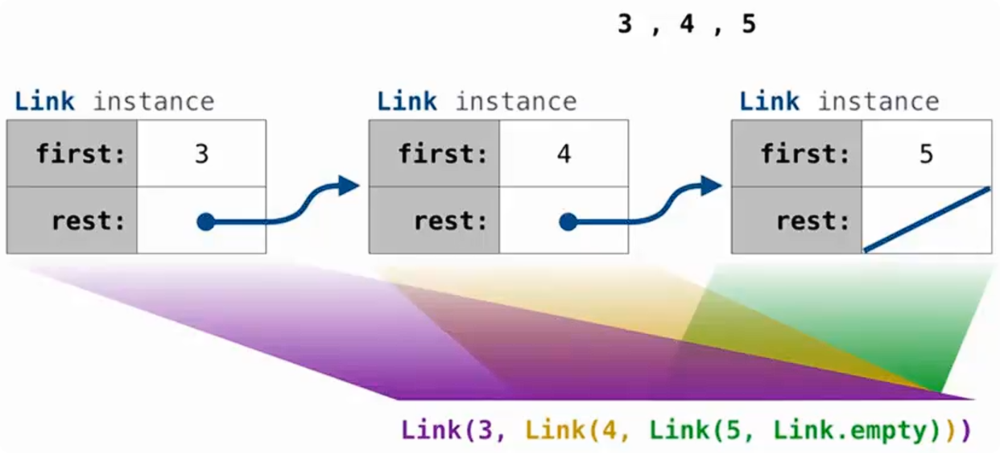
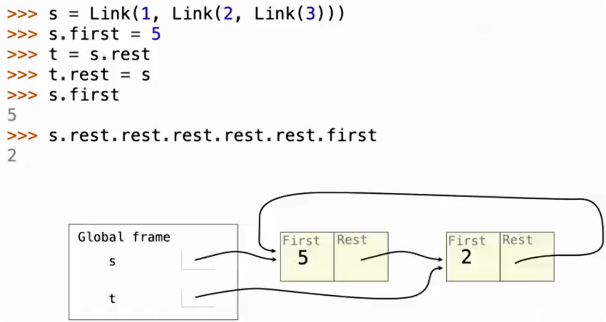
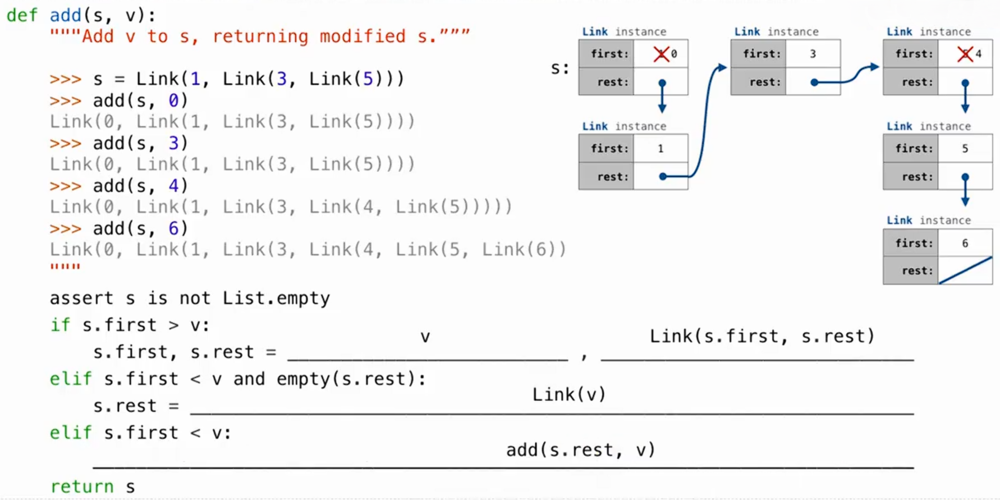

# 链表（Linked List）

链表是一种递归的数据结构：

> 一个 Linked List 要么为空，要么由 **第一个元素（first） + 剩余链表（rest）** 组成。

可以表示为：

```
Link(first, rest)
```

其中：

- `first`：当前节点存储的数据
- `rest`：指向剩余链表的引用（也是一个 Link 对象）

例如：



```python
Link(3, Link(4, Link(5, Link.empty)))
```

表示：

```
3 → 4 → 5 → empty
```

结构：

```
        Link instance
       ┌─────────────┐
first  │      3      │
       ├─────────────┤
rest   │     ────────┼──→ Link(4, ...)
       └─────────────┘
```

## 空链表（Empty Linked List）

链表通常使用类属性：

```python
Link.empty = ()
```

表示空链表。

例如：

```python
Link(5, Link.empty)
```

表示：

```
5 → empty
```

也就是只有一个元素的链表。

## Link 类的实现

一个简单的链表节点：

```python
class Link:

    empty = ()

    def __init__(self, first, rest=empty):
        assert rest is Link.empty or isinstance(rest, Link)

        self.first = first
        self.rest = rest
```

创建：

```python
link = Link(3, Link(4, Link.empty))
```

等价于：

```python
link.first = 3
link.rest = Link(4, Link.empty)
```

所以：

```python
link.first
```

得到：

```
3
```

而：

```python
link.rest
```

得到：

```python
Link(4, Link.empty)
```

## assert 检查

```python
assert rest is Link.empty or isinstance(rest, Link)
```

作用：

保证 `rest` 必须是：

1.空链表：

```python
Link.empty
```

或者：

2.另一个 Link 对象：

```python
Link(4, Link.empty)
```

例如：

正确：

```python
Link(3, Link(4))
```

因为：

```python
rest = Link(4)
```

是 Link 实例。

------

错误：

```python
Link(3, 4)
```

因为：

```python
rest = 4
```

既不是空链表，也不是 Link 对象。

## `isinstance()` 函数

> 作用：判断一个对象是否属于某个类。

语法：

```python
isinstance(object, class)
```

例如：

```python
x = Link(5)

isinstance(x, Link)
```

结果：

```python
True
```

因为：

```
x 是 Link 类创建的对象
```

## 创建链表示例

创建：

```python
link = Link(3, Link(4, Link(5, Link.empty)))
```

Python 实际创建过程：

先创建：

```python
Link(5, Link.empty)
```

得到：

```
5 → empty
```

再创建：

```python
Link(4, 上面的链表)
```

得到：

```
4 → 5 → empty
```

最后：

```python
Link(3, 上面的链表)
```

得到：

```
3 → 4 → 5 → empty
```

最终结构：

```
Link(
    first=3,
    rest=Link(
        first=4,
        rest=Link(
            first=5,
            rest=Link.empty
        )
    )
)
```

## 修改 Linked List 的属性

> Linked List 中的节点本质上是 **可变对象（mutable object）**。

因此，可以通过属性赋值语句修改节点的：

- `first`：当前节点存储的值
- `rest`：指向下一个节点的引用

> 变量保存的是引用，不是复制
>
> 修改属性会影响所有指向该节点的变量



例如：

```python
s = Link(1, Link(2, Link(3)))
```

初始结构：

```
s
↓
[1 | rest] → [2 | rest] → [3 | empty]
```

### 修改 `first`

代码：

```python
s.first = 5
```

表示把第一个节点保存的数据从1 → 5：

结构变为：

```
s
↓
[5 | rest] → [2 | rest] → [3 | empty]
```

注意：这里只修改节点里的值，不会创建新的 Link。

### 获取子链表（Sub-list）

代码：

```python
t = s.rest
```

含义：让变量 `t` 指向 `s` 的剩余部分。

此时：

```python
t.first
```

就是：

```
2
```

结构：

```
s
↓
[5 | rest] → [2 | rest] → [3 | empty]
              ↑
              |
              t
```

这里：`s.rest` 返回的是第二个节点本身，而不是复制一份。

### 修改 rest 指向

代码：

```python
t.rest = s
```

因为 t 指向第二个节点：

```
[2 | rest]
```

所以修改：

```
t.rest = s
```

相当于：让第二个节点的 `rest` 指向第一个节点。

修改前：

```
s
↓
[5] → [2] → [3] → empty
      ↑
      t
```

修改后：

```
s
↓
[5] → [2]
↑     |
|_____|
```

形成了一个循环链表（cycle）。

即：

```
5 → 2 → 5 → 2 → ...
```

## 使用 Linked List 表示有序集合（Ordered Set）



有序集合（ordered set）特点：

- 元素按照从小到大排列
- 不允许重复元素
- 使用 `Link` 节点保存元素

例如：

```python
s = Link(1, Link(3, Link(5)))
```

表示集合：

```
{1, 3, 5}
```

结构：

```
1 → 3 → 5 → empty
```

### add 函数

目标：向有序集合 `s` 中添加元素 `v`。

要求：

1. 保持有序
2. 如果元素已经存在，不重复添加
3. 返回修改后的集合

函数定义：

```python
def add(s, v):
    """Add v to s, returning modified s."""
```

### 添加元素的四种情况

假设：

```python
s = Link(1, Link(3, Link(5)))
```

现在执行：

```python
add(s, v)
```

#### 情况一：v 等于当前元素

如果：

```python
v == s.first
```

说明集合中已经存在 `v`，不需要修改链表，直接返回 `s`。

#### 情况二：v 小于当前元素

条件：

```
s.first > v
```

例如：

```
add(s, 0)
```

当前：

```
1 → 3 → 5
```

因为：

```
0 < 1
```

所以需要把 `0` 插入最前面。

------

但是由于：

```
s
```

已经指向第一个节点：

```
s
↓
[1 | rest]
```

不能直接让 `s` 指向新节点。

所以采用修改当前节点内容：

```python
s.first, s.rest = v, Link(s.first, s.rest)
```

> 赋值语句的右边会先全部计算，然后才同时赋值给左边

执行过程：

原来：

```
[1 | → 3 → 5]
```

先创建：

```
[1 | → 3 → 5]
```

作为新的 rest。

然后：

```
[0 | → 1 → 3 → 5]
```

最终：

```
add(s,0)
```

结果：

```python
Link(0, Link(1, Link(3, Link(5))))
```

#### 情况三：v 大于当前元素，并且到达末尾

条件：

```python
s.first < v and s.rest is Link.empty
```

例如：

```python
add(s,6)
```

当前：

```
1 → 3 → 5 → empty
```

因为：

```
6 > 5
```

并且：

```
5 后面没有节点
```

所以直接添加：

```
s.rest = Link(v)
```

结果：

```
1 → 3 → 5 → 6 → empty
```

#### 情况四：v 大于当前元素，但后面还有节点

条件：

```python
s.first < v
```

例如：

```python
add(s,4)
```

当前：

```
1 → 3 → 5
```

因为：

```
4 > 1
```

所以继续向后查找：

```python
add(s.rest, v)
```

递归处理：

第一次：

```
add(3 → 5, 4)
```

继续：

```
add(5,4)
```

发现：

```
5 > 4
```

于是插入：

```
1 → 3 → 4 → 5
```

# Tree 类的实现

```python
class Tree:

    def __init__(self, label, branches=[]):
        self.label = label

        for branch in branches:
            assert isinstance(branch, Tree)

        self.branches = list(branches)
```

## `label`

表示当前节点存储的数据。

例如：

```python
t = Tree(1)
```

结构：

```
  1
```

其中：

```python
t.label
```

结果：

```
1
```

## `branches`

表示当前节点的子树。

例如：

```python
t = Tree(1, [
    Tree(2),
    Tree(3)
])
```

结构：

```
        1
       / \
      2   3
```

其中：

```python
t.branches
```

得到：

```
[
    Tree(2),
    Tree(3)
]
```

# Tree 的函数式表示

## 创建树

```python
def tree(label, branches=[]):
    for branch in branches:
        assert is_tree(branch)

    return [label] + list(branches)
```

例如：

```
tree(1, [
    tree(2),
    tree(3)
])
```

得到：

```
[
    1,
    [2],
    [3]
]
```

表示：

```
        1
       / \
      2   3
```

## 获取 label

```python
def label(tree):
    return tree[0]
```

例如：

```python
t = tree(1, [tree(2)])
```

执行：

```python
label(t)
```

结果：

```
1
```

## 获取 branches

```python
def branches(tree):
    return tree[1:]
```

例如：

```python
branches(t)
```

结果：

```
[
    [2]
]
```