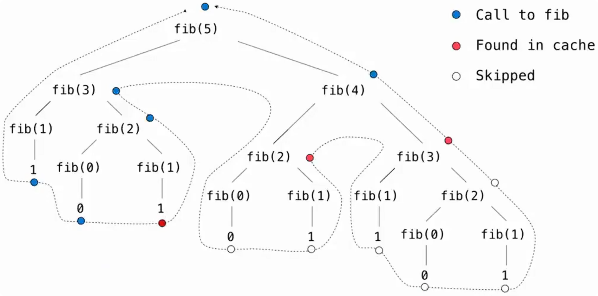
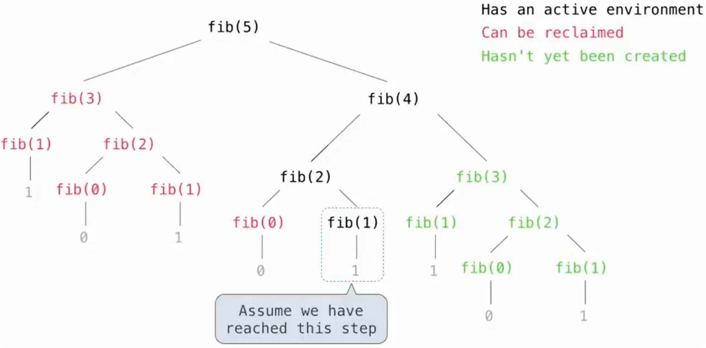

# 记忆化（`Memoization`）

> 把已经计算过的结果保存下来；如果之后再次遇到相同的输入，直接返回之前的结果，而不是重新计算。
>
> 本质上是用**额外的存储空间换取更少的重复计算**。

一个简单的记忆化函数：

```python
def memo(f):
    cache = {}

    def memoized(n):
        if n not in cache:
            cache[n] = f(n)

        return cache[n]

    return memoized
```

```python
fib = memo(fib)
```

并不是“修改原来的 `fib`”，而是：

1. 把当前 `fib` 传给 `memo`
2. `memo` 创建 `memoized`
3. 返回 `memoized`
4. 名字 `fib` 重新绑定到 `memoized`

即：

```
	fib ──> 原 fib 函数

执行：

	fib = memo(fib)

之后：

	fib ──> memoized
           		│
           		└── f ──> 原 fib 函数
```

其中：

```python
cache = {}
```

用于保存：

```
参数 → 计算结果
```

例如某个函数已经计算过：

```python
f(5) == 8
```

那么缓存中可以记录：

```python
cache[5] = 8
```

下一次再调用：

```python
memoized(5)
```

就直接返回：

```
8
```

而不会重新执行 `f(5)`。

> `memoized` 和原函数 `f` 能保持相同行为，有一个重要前提：`f` 是纯函数（pure function）。
>
> 纯函数对于相同输入，总会得到相同输出，不依赖会变化的外部状态，并且不会产生可观察的副作用。

~~~python
def fib(n):
    if n == 0 or n == 1:
        return n
    else:
        return fib(n - 2) + fib(n - 1)


def count(f):
    def counted(n):
        counted.call_count += 1
        return f(n)

    counted.call_count = 0
    return counted


def memo(f):
    cache = {}

    def memoized(n):
        if n not in cache:
            cache[n] = f(n)
        return cache[n]

    return memoized

if __name__ == "__main__":
    fib = count(fib)
    counted_fib = fib
    fib = memo(fib)
    fib = count(fib)
    print(fib(30))  # 832040
    print(fib.call_count)  # 59
    print(counted_fib.call_count)  # 31
~~~



假设最开始的 Fibonacci 函数记作：

```
original_fib
```

执行：

```python
fib = count(fib)
```

得到：

```
    fib
 	 ↓
  counted ①
 	 ↓
original_fib
```

此时：

```python
counted_fib = fib
```

所以：

```
  counted_fib ──┐
                ↓
fib ───────> counted ①
                ↓
            original_fib
```

注意：

```python
counted_fib = fib
```

**没有复制一个函数。**两个名字只是暂时指向同一个函数对象。

------

接着：

```python
fib = memo(fib)
```

得到：

```
	fib
 	 ↓
  memoized
 	 ↓
  counted ①
 	 ↓
original_fib
```

但是：

```python
counted_fib
```

仍然指向原来的：

```
counted ①
```

所以：

```
  counted_fib ──────┐
                    ↓
fib → memoized → counted ① → original_fib
```

------

最后：

```python
fib = count(fib)
```

再套一层：

```
	fib
  	 ↓
  counted ②
 	 ↓
  memoized
 	 ↓
  counted ①
 	 ↓
original_fib
```

最终结构非常重要：

```
fib ──> counted ② ──> memoized ──> counted ① ──> original_fib
                                      ↑
                                      │
                                counted_fib
```

其中：

```
counted ②
```

统计的是**对 `memoized` 的所有调用**。

而：

```
counted ①
```

统计的是**真正穿过缓存、需要重新计算的调用**。

```
虽然 counted ① 中保存的 f 指向原来的 fib 函数对象， 但原 fib 函数体中的：
	fib(n - 2)
	fib(n - 1)
```

使用的是全局名字 `fib`。

这些递归调用真正执行时，会重新查找当前全局环境中的 `fib`。

经过：

```
fib = count(fib)
fib = memo(fib)
fib = count(fib)
```

以后，全局名字 `fib` 已经指向最外层的 `counted ②`。

因此原始 `fib` 产生的递归调用也会重新经过：

```
 counted②
	↓
 memoized
	↓
  cache
```

# 幂运算

## 基本递归实现

计算 \(b^n\) 最直接的递归方式：

```python
def exp(b, n):
    if n == 0:
        return 1
    else:
        return b * exp(b, n - 1)
```

递归关系：

```
b^n = b × b^(n-1)
```

例如：

```
exp(2, 4)
= 2 × exp(2, 3)
= 2 × 2 × exp(2, 2)
= 2 × 2 × 2 × exp(2, 1)
= 2 × 2 × 2 × 2 × exp(2, 0)
= 16
```

基本情况：

```
n == 0
```

因为：

```
b^0 = 1
```

## 线性时间复杂度

普通 `exp` 每次递归只把 `n` 减少 `1`：

```
n
n - 1
n - 2
n - 3
...
0
```

因此大约需要进行 `n` 次递归调用和乘法操作。

时间复杂度：

```
Θ(n)
```

输入规模翻倍时：

```
n → 2n
```

运行时间也大约翻倍：

```
T(n) → 2T(n)
```

因此这种增长方式称为 **linear time（线性时间）**。

## 快速幂

快速幂利用指数的数学性质减少重复乘法。

当 `n` 为偶数时：

```
b^n = (b^(n/2))^2
```

例如：

```
2^8
= (2^4)^2
= ((2^2)^2)^2
```

每次只需要把指数：

```
n → n / 2
```

就能继续解决规模减半后的问题。

课程中的目标可以概括为：

> 只增加一次乘法，就能够把可以处理的指数规模扩大一倍。

### 快速幂实现

```python
def exp_fast(b, n):
	if n == 0:        
		return 1    
	elif n % 2 == 0:        
		return square(exp_fast(b, n // 2))    
	else:        
		return b * exp_fast(b, n - 1)

def square(x):   
	return x * x
```

分别处理三种情况：

```
n = 0
n 为偶数
n 为奇数
```

#### 偶数指数

当：

```
n % 2 == 0
```

说明 `n` 是偶数。

利用：

```
b^n = (b^(n/2))^2
```

因此：

```
return square(exp_fast(b, n // 2))
```

例如：

```
2^8 = (2^4)^2
```

所以不需要：

```
2 × 2 × 2 × 2 × 2 × 2 × 2 × 2
```

而是先求：

```
2^4
```

再平方。

#### 奇数指数

当 `n` 为奇数时：

```
return b * exp_fast(b, n - 1)
```

因为：

```
b^n = b × b^(n-1)
```

而奇数减 `1` 后一定变成偶数。

例如：

```
2^9 = 2 × 2^8
```

接下来：

```
2^8
```

就可以使用指数减半的规则。

所以快速幂中的奇数情况虽然只减少 `1`，但下一步通常马上就可以把指数减半。

#### 执行过程

例如：

```
exp_fast(2, 10)
```

执行过程：

```
2^10
↓ 10 为偶数
(2^5)^2

2^5
↓ 5 为奇数
2 × 2^4

2^4
↓ 4 为偶数
(2^2)^2

2^2
↓ 2 为偶数
(2^1)^2

2^1
↓ 1 为奇数
2 × 2^0

2^0
↓
1
```

可以看到，指数变化大致为：

```
10 → 5 → 4 → 2 → 1 → 0
```

而普通方法是：

```
10 → 9 → 8 → 7 → 6 → 5 → 4 → 3 → 2 → 1 → 0
```

快速幂明显减少了递归次数。

#### 对数时间复杂度

快速幂的关键是不断让指数减半：

```
n
n / 2
n / 4
n / 8
n / 16
...
1
```

假设经过 `k` 次减半后到达 `1`：

```
n / 2^k = 1
```

因此：

```
n = 2^k
```

得到：

```
k = log₂ n
```

所以递归层数大约是：

```
log₂ n
```

时间复杂度：

```
Θ(log n)
```

通常不需要特别写底数，因为不同底数的对数只相差常数倍。

```
log₂ n
log₁₀ n
ln n
```

因此

```
Θ(log₂ n) = Θ(log n)
```

#### 输入规模与运行时间

对于线性时间算法：

```
输入扩大 2 倍
→ 时间大约扩大 2 倍
```

例如：

```
n → 1024n
```

运行时间大约也扩大：

```
1024 倍
```

------

对于对数时间算法：

```
输入扩大 2 倍
→ 只增加常数级工作量
```

因为：

```
log₂(2n)
= log₂ n + 1
```

也就是输入扩大一倍，只多一层左右的递归。

如果输入扩大 1024 = 2^10^ 倍：

```
log₂(1024n) = log₂ n + 10
```

因此只增加大约 `10` 层工作量，而不是增加 `1024` 倍。

这就是对数时间算法增长非常慢的原因。

# 增长阶

> 增长阶（Order of Growth）描述的是：当输入规模 `n` 变大时，程序运行时间或空间使用量如何增长。

分析增长阶时，重点关注 `n` 很大时起主要作用的部分，通常忽略：

- 常数倍
- 较低次项
- 与输入规模无关的固定开销

例如：

```text
3n + 10        → Θ(n)
5n² + 2n + 8   → Θ(n²)
```

因为当 `n` 足够大时，真正决定增长速度的是最高阶项。

### Θ 表示法

> Θ（Big Theta）表示一个函数的**紧确增长阶**。

例如：

```text
T(n) = 3n² + 5n + 10
```

可以写成：

```text
T(n) = Θ(n²)
```

意思是当 `n` 足够大时，它的增长速度和 `n²` 属于同一个数量级。

### O 表示法

> O（Big O）表示渐近**上界**。

例如：

```text
T(n) = Θ(n)
```

那么它同时也是：

```text
O(n)
O(n²)
O(n³)
...
```

因为这些都可以作为它的上界。

但为了准确描述算法的实际增长速度，通常更希望找到最贴近的界，例如：

```text
Θ(n)
```

而不是笼统地写：

```text
O(n³)
```

O(n²) 也对是因为当 \(n\) 很大时：

```
n 比 n² 小
```

所以如果实际只增长到 \( n \)，当然不会超过 \( n^2^ ) 这个上界。

因此可以简单区分为：

```text
Θ：描述实际的增长数量级
O：描述增长速度不会超过某个上界
```

## 常见增长阶

从增长最慢到最快：

```text
Θ(1) < Θ(log n) < Θ(n) < Θ(n²) < Θ(b^n)
```

其中 `b > 1`。

算法的增长阶越慢，在输入规模很大时通常越有优势。

### 常数增长

```text
Θ(1)
```

输入 `n` 增大时，运行时间基本不受影响。

例如：

```python
x = lst[0]
```

无论列表长度是：

```text
10
1000
1000000
```

访问第一个元素所需的操作数量基本相同。

特点：

```text
n 增大 → 时间基本不变
```

### 对数增长

```text
Θ(log n)
```

典型例子是前面学习的快速幂：

```python
exp_fast(b, n)
```

它会不断把问题规模缩小：

```text
n → n / 2 → n / 4 → n / 8 → ...
```

输入规模翻倍时：

```text
n → 2n
```

运行时间只增加一个常数级的工作量。

因为：

```text
log(2n) = log n + log 2
```

后面的 `log 2` 是常数。

### 线性增长

```text
Θ(n)
```

例如普通递归求幂：

```python
def exp(b, n):
    if n == 0:
        return 1
    return b * exp(b, n - 1)
```

问题规模变化：

```text
n → n - 1 → n - 2 → ... → 0
```

输入增加 `1`，通常只增加一个固定数量的操作。

例如：

```text
T(n) = an
```

那么：

```text
T(n + 1)
= a(n + 1)
= an + a
```

也就是只多了常数 `a`。

### 二次增长

```text
Θ(n²)
```

常见于需要处理长度为 `n` 的序列中**所有元素对**的程序。

例如：

```python
def overlap(a, b):
    count = 0
    for item in a:
        for other in b:
            if item == other:
                count += 1
    return count
```

#### 相同长度序列

```text
len(a) = n
len(b) = n
```

外层循环执行：

```text
n 次
```

而每一次外层循环都会让内层循环执行：

```text
n 次
```

总比较次数：

```text
n × n = n²
```

所以：

```text
Θ(n²)
```

```python
overlap([3, 5, 7, 6], [4, 5, 6, 5])
```

程序会把第一个列表中的每个元素和第二个列表中的每个元素比较：

```text
      3   5   7   6

4     ×   ×   ×   ×
5     ×   ✓   ×   ×
6     ×   ×   ×   ✓
5     ×   ✓   ×   ×
```

一共 4 × 4 = 16 次比较。

匹配情况共有：

```text
5 == 5
5 == 5
6 == 6
```

所以：

```python
overlap([3, 5, 7, 6], [4, 5, 6, 5]) # 3
```

注意这里统计的是**匹配的元素对数量**，重复元素会被重复计算。

#### 不同长度序列

```text
len(a) = n
len(b) = m
```

那么比较次数为：

```text
n × m
```

所以复杂度更准确地写成：

```text
Θ(nm)
```

只有两个输入长度都用同一个 `n` 表示时，才写：

```text
Θ(n²)
```

#### 二次增长的输入变化

假设运行时间：

```text
T(n) = an²
```

把输入从 `n` 增加到 `n + 1`：

```text
T(n + 1)
= a(n + 1)²
= an² + a(2n + 1)
```

相比原来的：

```text
an²
```

增加了：

```text
a(2n + 1)
```

它本身大约和 `n` 成正比。

因此二次增长的特点可以理解为：

```text
n 每增加 1 → 新增的工作量大约与 n 成正比
```

### 指数增长

```text
Θ(b^n)
```

其中：

```text
b > 1
```

典型例子是没有使用记忆化的递归 Fibonacci：

```python
def fib(n):
    if n == 0 or n == 1:
        return n
    return fib(n - 2) + fib(n - 1)
```

一次调用会继续产生多个递归调用：

```text
fib(n)
├── fib(n - 2)
└── fib(n - 1)
```

这些调用又继续产生新的调用，因此递归树会快速扩大。

指数增长的特点是：

```text
n 增加 1 → 运行时间乘上一个近似固定的倍数
```

例如：

```text
T(n) = a · b^n
```

那么：

```text
T(n + 1)
= a · b^(n+1)
= (a · b^n) · b
```

即：

```text
T(n + 1) = T(n) · b
```

因此指数级算法在 `n` 较大时增长非常快。

# 空间消耗

## 活跃环境

分析程序空间复杂度时，需要考虑程序执行过程中同时存在的环境帧（frame）。

在任意时刻，都存在一组**活跃环境（Active Environments）**。

主要包括：

1. 当前仍在执行、尚未返回的函数调用所对应的环境。
2. 活跃环境中函数所依赖的父环境。

这些环境中的：

- 变量
- 值
- 环境帧

都会占用内存。

## 环境帧的回收

> 一个函数调用结束后，如果它的环境之后不再需要，就可以回收对应内存。

例如：

```python
f()
```

当 `f()`：

```text
开始执行
→ 创建 frame
→ 执行函数体
→ return
→ frame 不再需要
→ 内存可以被回收
```

因此空间复杂度并不是：

> 整个程序一共创建过多少个 frame。

而是：

> 程序运行过程中，某一时刻最多需要同时保留多少个 frame。

这个区别非常重要。

## 递归与空间复杂度

递归函数调用时，当前函数通常不能立即结束，而是需要等待下一层递归返回。

例如：

```text
fib(5)
  ↓
fib(4)
  ↓
fib(3)
  ↓
...
```

这些尚未完成的函数调用都需要保留各自的环境帧。

因此：

```text
递归深度
```

通常会直接影响空间复杂度。

## 时间复杂度与空间复杂度的区别

以递归 Fibonacci 为例：



~~~text
            fib(n)
           /      \
      fib(...)   fib(...)
       /   \       /   \
      ...  ...    ...  ...
~~~

它的递归调用总数量非常多，因此时间复杂度是指数级的。

但是程序并不会同时把整个递归树的所有 frame 都保存在内存里。

假设先计算：

```python
fib(n - 2)
```

这一部分计算完成以后，其中已经结束的 frame 可以被回收。

然后程序再继续计算：

```python
fib(n - 1)
```

所以真正决定空间使用量的是：

```text
递归树中同时存在的最长调用链
```

而不是：

```text
递归树中的总节点数量
```

因此普通递归 Fibonacci：

```text
时间复杂度：指数级

空间复杂度：线性级
```

这是时间复杂度和空间复杂度非常典型的区别。

分析递归程序时，需要区分两个概念：

```text
总共调用了多少次函数
```

和：

```text
最多有多少次调用同时没有结束
```

前者主要影响：

```text
时间复杂度
```

后者主要影响：

```text
空间复杂度
```

时间复杂度分析主要关注：

```text
随着 n 增大，需要执行多少工作？
```

空间复杂度分析主要关注：

```text
随着 n 增大，执行过程中最多需要同时保存多少数据？
```

分析递归程序时尤其要分别观察：

```text
递归调用总数  → 时间

最大递归深度  → 空间
```
