# 列表示例

## 列表对象与名称绑定

在环境图中，变量名保存的不是列表内容本身，而是对**列表对象的引用**。

```python
s = [2, 3]
t = [5, 6]
```

可以理解为：

```
s ──→ [2, 3]
t ──→ [5, 6]
```

对列表的操作需要区分两种情况：

- **修改原列表**：原来的列表对象发生变化。
- **创建新列表**：得到一个新的列表对象，原列表不变。

> 如果多个位置引用同一个可变对象，修改这个对象时，所有引用它的位置都会观察到变化，这种现象称为**别名（aliasing）**。

## append

> `append` 向列表末尾添加**一个元素**，会直接修改原列表。

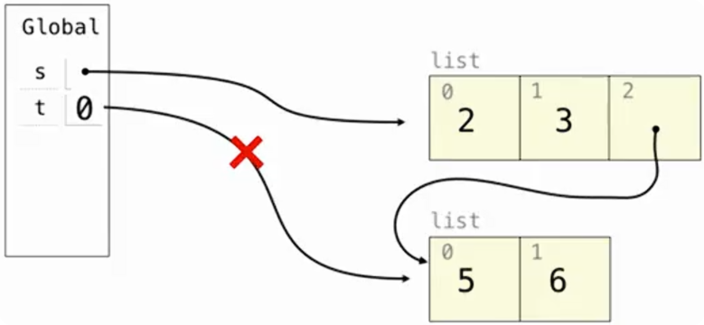

```python
s = [2, 3]
t = [5, 6]
s.append(t)
```

结果：

```
s == [2, 3, [5, 6]]
t == [5, 6]
```

因此：

```python
t[0] = 9 # 修改 t 指向的列表对象
```

会得到：

```
s == [2, 3, [9, 6]]
t == [9, 6]
```

因为 `s` 中的嵌套列表和 `t` 指向的是同一个列表对象。

但如果执行：

```python
t = 0 # 改变名称绑定
```

只是让名字 `t` 改为绑定到整数 `0`：

```
t ──→ 0
```

并不会修改原来的 `[5, 6]`，所以：

```
s == [2, 3, [9, 6]]
t == 0 
```

## extend

> `extend` 将另一个可迭代对象中的**所有元素**依次加入列表。

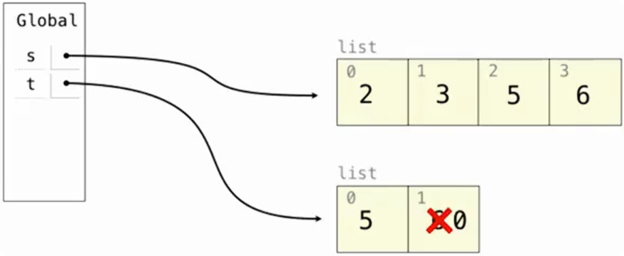

```python
s = [2, 3]
t = [5, 6]
s.extend(t)
```

结果：

```
s == [2, 3, 5, 6]
t == [5, 6]
```

与 `append` 的区别：

```python
s.append(t) # [2, 3, [5, 6]]
s.extend(t) # [2, 3, 5, 6]
```

可以记成：

```
append：把整个对象作为一个元素加入

extend：把其中的元素逐个加入
```

因此：

```python
t[1] = 0
```

得到：

```
s == [2, 3, 5, 6]
t == [5, 0]
```

这里 `s` 中加入的是 `5`、`6` 这些元素，而不是列表 `t` 本身。

> 如果列表中的元素本身也是可变对象，`extend` 加入的仍然是这些对象的引用，因此仍可能出现共享对象的情况。

## 列表加法

> 列表加法 `+` 不修改原列表，而是创建一个**新列表**。

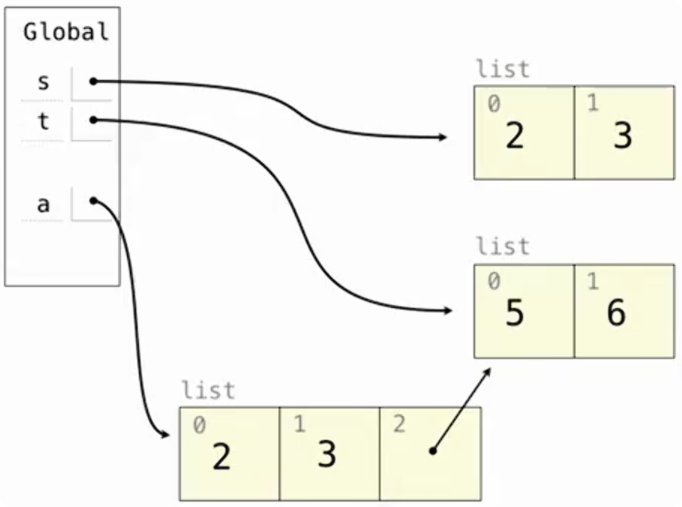

```python
s = [2, 3]
t = [5, 6]
a = s + [t]
```

结果：

```
s == [2, 3]
t == [5, 6]
a == [2, 3, [5, 6]]
```

`a` 是新的外层列表，但其中最后一个元素仍然引用原来的 `t`。

所以列表加法只创建新的**外层列表**，不会递归复制内部对象。

## 列表切片

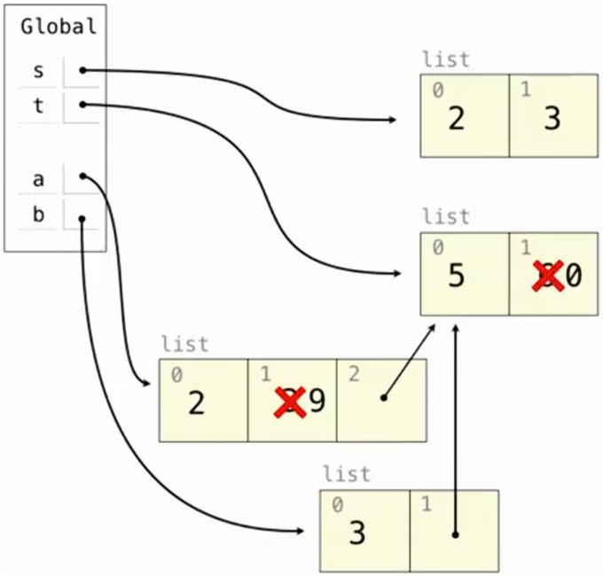

列表切片会创建一个新的列表，本质上产生的是一个浅拷贝：外层列表是新的，但其中的元素仍然引用原来的对象。

```python
b = a[1:]
```

如果：

```
a == [2, 3, [5, 6]]
```

则：

```
b == [3, [5, 6]]
```

此时：

```
a 和 b 是两个不同的外层列表
```

所以：

```
a[1] = 9
```

只修改 `a`：

```
a == [2, 9, [5, 6]]
b == [3, [5, 6]]
```

但内部的 `[5, 6]` 仍然是共享的。

如果：

```python
b[1][1] = 0
```

实际上修改的是共享的内部列表：

```
[5, 6] → [5, 0]
```

最终：

```
t == [5, 0]
a == [2, 9, [5, 0]]
b == [3, [5, 0]]
```

## 浅拷贝

> 浅拷贝（shallow copy）就是复制最外层对象，但里面如果还有子对象，不会继续复制子对象，而是让新旧对象一起指向同一个子对象。

浅拷贝的特点：

```
外层列表：新的对象
内部元素：仍然引用原来的对象
```

对于列表 `s`，下面几种写法都会创建新的外层列表：

```python
s[:]
list(s)
s.copy()
```

它们都是浅拷贝：外层列表不同，但其中的可变子对象仍可能被共享。

例如：

```python
a = [[1, 2], 3]
b = list(a)
```

此时：

```
a 不是 b
```

但：

```
a[0]和 b[0]
```

仍然引用同一个内部列表。

因此：

```python
b[0][0] = 9
```

会同时表现为：

```
a == [[9, 2], 3]
b == [[9, 2], 3]
```

## list 函数

> `list()` 可以根据已有元素创建一个新的列表。

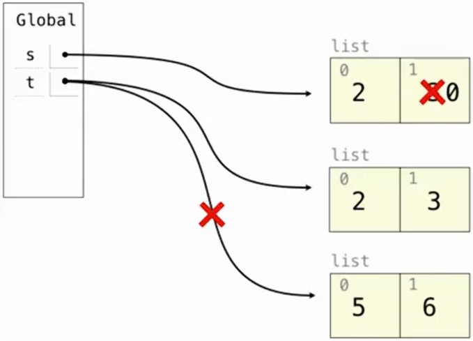

```python
s = [2, 3]
t = list(s)
```

此时：

```
s == [2, 3]
t == [2, 3]
```

虽然内容相同，但：

```
s 和 t 指向两个不同的列表对象
```

所以：

```python
s[1] = 0
```

得到：

```
s == [2, 0]
t == [2, 3]
```

## 切片赋值

### 切片替换

切片出现在赋值语句左边时：

```
s[a:b] = values
```

含义不是“创建一个切片”，而是直接修改原来的列表，把指定区间替换为新的元素。

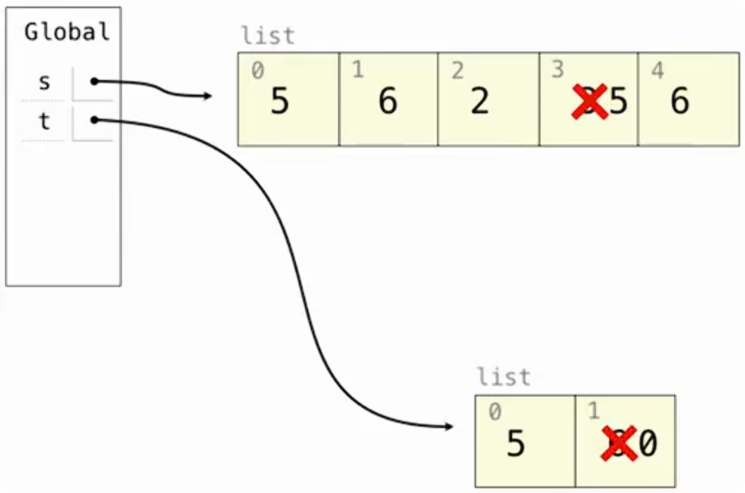

```python
s = [2, 3]
t = [5, 6]

s[0:0] = t
```

`[0:0]` 是一个长度为 `0` 的位置，因此相当于把 `t` 的元素插入最前面：

```
s == [5, 6, 2, 3]
```

再执行：

```python
s[3:] = t
```

原来：

```
s == [5, 6, 2, 3]
```

索引 `3` 开始的部分：

```
[3]
```

被 `[5, 6]` 替换：

```
s == [5, 6, 2, 5, 6]
```

再执行：

```python
t[1] = 0
```

结果：

```
s == [5, 6, 2, 5, 6]
t == [5, 0]
```

### 切片读取与切片赋值

这两种写法需要明确区分：

```
t = s[1:]
```

表示：

```
读取切片
→ 创建新列表
→ t 绑定到新列表
```

而：

```
s[1:] = t
```

表示：

```
切片赋值
→ 直接修改原来的 s
```

因此：

```
s[1:]       创建新列表
s[1:] = ... 修改原列表
```

### 切片插入

> 切片左端点和右端点相同，就没有删除任何东西，只是在那个位置插入。

利用空切片可以在指定位置插入多个元素：

```python
s[i:i] = values
```

例如：

```python
s = [1, 4]
s[1:1] = [2, 3]
```

得到：

```
s == [1, 2, 3, 4]
```

## 删除列表元素

### pop

> `pop` 会：
>
> 1. 从列表中删除元素
> 2. 返回被删除的元素
> 3. 如果列表为空，或指定的索引越界，`pop` 会抛出 `IndexError`。

默认删除最后一个元素：

```python
s = [2, 3]
t = s.pop()
```

结果：

```
s == [2]
t == 3
```

也可以指定索引：

```python
s.pop(0)
```

表示删除并返回索引 `0` 的元素。

### remove

> `remove` 根据**值**删除元素
>
> 如果列表中不存在要删除的值，`remove` 会抛出 `ValueError`。

```
t.remove(x)
```

会删除列表中第一个等于 `x` 的元素。

例如：

```python
t = [5, 6]
t.extend(t)
```

得到：

```
t == [5, 6, 5, 6]
```

再执行：

```python
t.remove(5)
```

结果：

```
t == [6, 5, 6]
```

只删除了**第一个 `5`**。

可以区分：

```
pop     按索引删除，并返回删除的值

remove  按值删除第一个匹配元素
```

### 切片删除

给一个切片赋值为空列表：

```
s[a:b] = []
```

就可以删除这一段元素。

例如：

```python
s = [2, 3]
s[:1] = []
```

相当于删除：

```
[2]
```

得到：

```
s == [3]
```

又例如：

```python
t = [5, 6]
t[0:2] = []
```

删除整个切片：

```
t == []
```

因此：

```
切片赋值为普通序列 → 替换元素
切片赋值为空列表   → 删除元素
空切片赋值非空序列 → 插入元素
```

## 常用列表操作对比

|     操作      | 是否修改原列表 | 是否创建新列表 |            作用             |
| :-----------: | :------------: | :------------: | :-------------------------: |
| `s.append(x)` |       是       |       否       | 把 `x` 作为一个元素加入末尾 |
| `s.extend(t)` |       是       |       否       |   把 `t` 中的元素逐个加入   |
|    `s + t`    |       否       |       是       |      拼接并返回新列表       |
|   `s[a:b]`    |       否       |       是       |     取切片并返回新列表      |
|   `list(s)`   |       否       |       是       |   根据现有元素创建新列表    |
| `s[a:b] = t`  |       是       |       否       |    用 `t` 的元素替换切片    |
|   `s.pop()`   |       是       |       否       |       删除并返回元素        |
| `s.remove(x)` |       是       |       否       |  删除第一个值为 `x` 的元素  |

## 循环引用

```python
t = [1, 2, 3]
t[1:3] = [t]
```

执行 `[t]` 时，并不会复制 `t`，而是创建一个新的列表，其中唯一的元素是**对 t 所指向列表的引用**。

然后：

```python
t[1:3] = [t]
```

把左边切片对应的整段元素删掉，然后把右边这个可迭代对象里的所有元素，依次塞进这个位置。

原来：

```
[1, 2, 3]
```

删掉索引1到2这一段：

```
[2, 3]
```

然后把右边 [t] 里的唯一一个元素放进去：

```
[1, t]
```

也就是说：`t` 的第二个元素又指回了 `t` 自己。

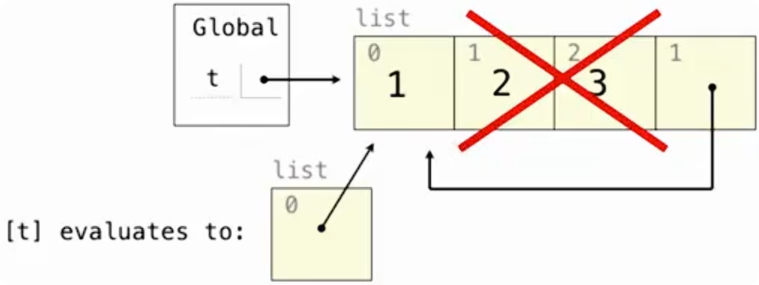

这种结构称为**循环引用（cyclic reference）**或自引用。

## 列表对自身的 extend

继续执行：

```python
t.extend(t)
```

此时原来的 `t` 可以理解为：

```text
[1, t]
```

`extend` 会把 `t` 当前包含的元素追加到 `t` 后面。

因此最终结构相当于：

```text
t = [1, t, 1, t]
```

两个位置都指向 `t` 自己。

Python 打印为：

```python
[1, [...], 1, [...]]
```

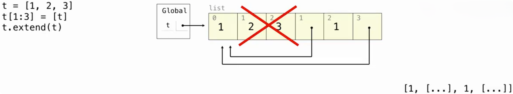

需要注意：

```python
t.extend(t)
```

不会无限执行下去。

它相当于把 `t` 当时已有的元素追加一遍，因此最终列表长度从 `2` 变成 `4`。

## 切片与嵌套列表

```python
t = [[1, 2], [3, 4]]
t[0].append(t[1:2])
```

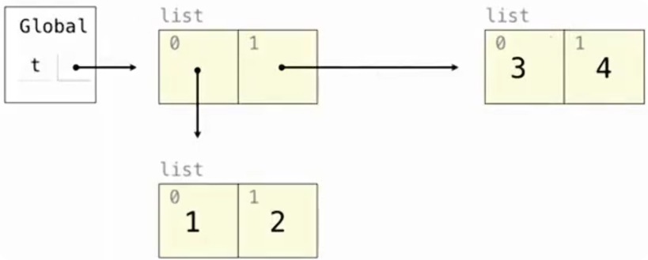

先看：

```python
t[1:2]
```

切片会创建一个**新的外层列表**。

执行：

```python
t[1:2]
```

得到：

```python
[[3, 4]]
```

但这不是把 `[3, 4]` 也重新复制一份。而是切片创建了新的外层列表，但其中的内部列表仍然是原来的对象。

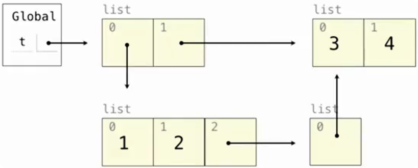

继续：

```python
t[0].append(t[1:2])
```

可以拆开看。

首先：

```python
t[0]
```

得到：

```python
[1, 2]
```

然后：

```python
t[1:2]
```

得到一个新的列表：

```python
[[3, 4]]
```

最后：

```python
t[0].append(...)
```

把整个：

```python
[[3, 4]]
```

作为**一个元素**追加到 `[1, 2]` 中。

因此：

```python
t[0]
```

变成：

```python
[1, 2, [[3, 4]]]
```

最终 t 为：

```python
[[1, 2, [[3, 4]]], [3, 4]]
```

# 类示例

```python
class Worker:
    greeting = 'Sir'
    def __init__(self):
        self.elf = Worker
    def work(self):
        return self.greeting + ', I work'
    def __repr__(self):
    	return Bourgeoisie.greeting
    
class Bourgeoisie(Worker):
    greeting = 'Peon'
    def work(self):
        print(Worker.work(self))
        return 'I gather wealth'
    
jack = Worker()
john = Bourgeoisie()
jack.greeting = 'Maam'
```

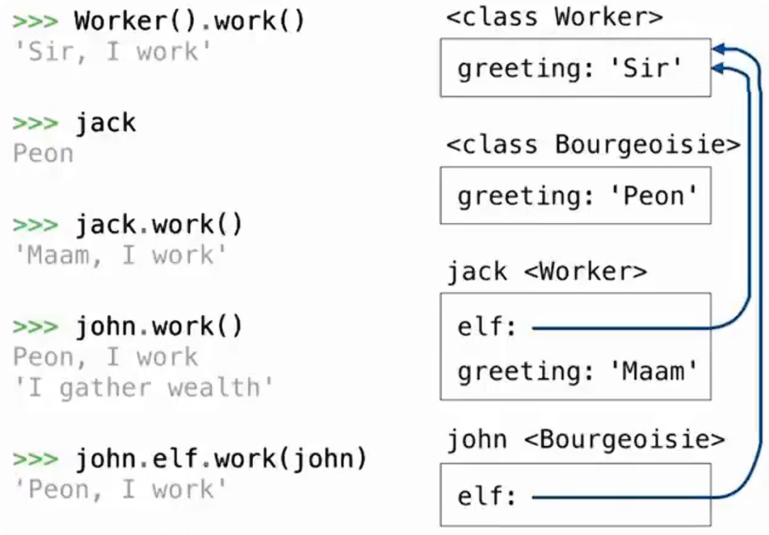

> 类也是对象

```python
self.elf = Worker
```

说明：Python 中类本身也是对象，可以被赋值给变量或实例属性。

`john.elf` 指向 `Worker` 类对象。

因此：

```python
john.elf.work(john)
```

实际上相当于：

```python
Worker.work(john)
```

进入：

```python
def work(self):
    return self.greeting + ', I work'
```

此时：

```text
self = john
```

所以：

```python
self.greeting
```

仍然是：

```python
john.greeting
```

最终从 `Bourgeoisie` 找到：

```text
'Peon'
```

因此结果：

```text
'Peon, I work'
```

---

```text
实例属性优先于类属性

子类可以继承父类的属性和方法

子类同名属性或方法可以覆盖父类版本

self.attribute 从 self 实际对象开始查找

Class.method(obj) 可以显式调用某个类中的方法

类本身也是对象，可以作为属性值保存

__repr__ 决定 repr(obj) 以及交互式环境中对象的表示形式，不会改变对象本身保存的属性。
```