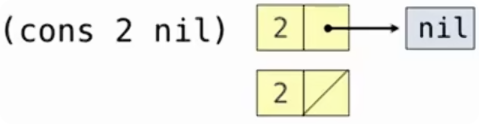
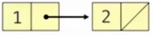

# Scheme 列表

> Scheme 中的列表本质上可以看作一种**链表（linked list）**。

例如：

```scheme
'(1 2 3 4)
```

内部可以理解为：

```text
1 → 2 → 3 → 4 → nil
```

每一个节点都包含两部分：

```text
┌─────────┬─────────┐
│ 当前元素  │ 剩余列表 │
└─────────┴─────────┘
```

## cons

> `cons` 用于构造一个新的 pair。在构造正常列表时，第一个位置保存当前元素，第二个位置保存剩余列表。

基本形式：

```scheme
(cons first rest)
```

其中：

```text
first → 当前节点保存的第一个元素
rest  → 后面的剩余部分
```

例如：

```scheme
(cons 2 nil)
```



得到：

```scheme
(2)
```

### 多个 cons 构造列表

```scheme
(cons 1 (cons 2 nil))
```



先计算内部：

```scheme
(cons 2 nil)
```

得到列表：

```scheme
(2)
```

内部表达式求值得到列表 `(2)` 后，外层可以等价理解为：

```scheme
(cons 1 '(2))
```

最终得到：

```scheme
(1 2)
```

更长的列表：

```scheme
(cons 1
      (cons 2
            (cons 3
                  (cons 4 nil))))
```

得到：

```scheme
(1 2 3 4)
```

## list

> `list` 会把传入的值作为元素，构造一个列表。

例如：

```scheme
(list 1 2 3)
```

得到：

```
(1 2 3)
```

它可以理解成：

```
(cons 1
      (cons 2
            (cons 3 nil)))
```

例如：

```
(list 'a 'b)
```

得到：

```
(a b)
```

## car

> `car` 返回列表的**第一个元素**。

例如：

```scheme
(define x (cons 1 (cons 2 nil)))
```

此时：

```scheme
x
```

为：

```scheme
(1 2)
```

执行：

```scheme
(car x)
```

得到：

```scheme
1
```

## cdr

> `cdr` 返回列表中除第一个元素以外的**剩余列表**。

对于：

```scheme
(define x (cons 1 (cons 2 nil)))
```

有：

```scheme
x
```

结果：

```scheme
(1 2)
```

执行：

```scheme
(cdr x)
```

得到：

```scheme
(2)
```

`cdr` 返回的仍然是一个列表，而不是简单地返回第二个元素。

## nil

> `nil` 表示**空列表（empty list）**。

例如：

```scheme
(cons 2 nil)
```

表示：

```text
创建一个节点
	↓
第一个元素是 2
	↓
后面没有其他元素
```

所以得到：

```scheme
(2)
```

## 列表的递归结构

Scheme 列表本身具有递归结构。

一个非空列表可以理解成：

```text
第一个元素 + 剩余列表
```

即：

```text
list = first + rest
```

对应 Scheme：

```scheme
car → first
cdr → rest
```

例如：

```scheme
(1 2 3)
```

可以拆成：

```text
第一个元素：1
剩余列表：(2 3)
```

而：

```scheme
(2 3)
```

又可以继续拆：

```text
第一个元素：2
剩余列表：(3)
```

直到空列表 `()` 或 `nil`。

## car 与 cdr 的连续使用

假设：

```scheme
(define x
  (cons 1
    (cons 2
      (cons 3 nil))))
```

即：

```scheme
x
```

为：

```scheme
(1 2 3)
```

那么：

```scheme
(car x)
```

得到：

```scheme
1
```

```scheme
(cdr x)
```

得到：

```scheme
(2 3)
```

继续：

```scheme
(car (cdr x))
```

先：

```scheme
(cdr x) → (2 3)
```

再：

```scheme
(car '(2 3)) → 2
```

所以：

```scheme
(car (cdr x))
```

可以取得第二个元素。

继续：

```scheme
(car (cdr (cdr x)))
```

得到：

```scheme
3
```

# Scheme 符号与引用

## 符号与值

> Scheme 中，符号通常作为名称使用，并绑定到某个值。

例如：

```scheme
(define a 1)
(define b 2)
```

建立绑定：

```text
a → 1
b → 2
```

之后直接写：

```scheme
a
```

Scheme 会查找 `a` 的绑定，得到：

```scheme
1
```

因此：

```scheme
(list a b)
```

在构造列表之前，会先分别求值：

```text
a → 1
b → 2
```

最终得到：

```scheme
(1 2)
```

原来的符号 `a`、`b` 不会出现在结果中，因为它们已经被求值成了对应的值。

## quote

> 如果希望得到**符号本身**，而不是得到符号绑定的值，需要使用 `quote`。

基本形式：

```scheme
(quote 表达式)
```

> `quote` 是一个特殊形式，它的核心作用是：不对后面的表达式进行正常求值，而是直接把表达式本身作为数据。

例如：

```scheme
(quote a)
```

结果：

```scheme
a
```

即使之前已经有：

```scheme
(define a 1)
```

这里也不会得到 `1`，因为 `a` 没有被正常求值。

Scheme 提供了更常用的简写：

```scheme
'a
```

等价于：

```scheme
(quote a)
```

因此：

```scheme
(list 'a 'b)
```

得到：

```scheme
(a b)
```

这里放进列表的是两个符号：

```text
a
b
```

而不是它们绑定的值。

## 符号与变量值的混合

假设：

```scheme
(define a 1)
(define b 2)
```

执行：

```scheme
(list 'a b)
```

可以分别分析：

```text
'a
→ 不求值
→ 符号 a
```

```text
b
→ 正常求值
→ 2
```

所以结果：

```scheme
(a 2)
```

这说明：

```text
a      → 查找绑定的值
'a     → 得到符号 a 本身
```

## 引用列表

> `quote` 不仅可以作用于单个符号，也可以作用于整个列表。

例如：

```scheme
'(a b c)
```

等价于：

```scheme
(quote (a b c))
```

内部的 `(a b c)`不会被当作调用表达式求值，而是直接作为列表数据。

结果：

```scheme
(a b c)
```

> 被引用得到的列表仍然是一个列表，因此可以使用之前学习的列表操作。

例如：

```scheme
(car '(a b c))
```

先看：

```scheme
'(a b c)
```

得到列表：

```scheme
(a b c)
```

然后：

```scheme
car
```

取得第一个元素：

```scheme
a
```

所以：

```scheme
(car '(a b c))
```

结果：

```scheme
a
```

类似地：

```scheme
(cdr '(a b c))
```

得到：

```scheme
(b c)
```

## 代码与数据的区别

如果直接写：

```scheme
(a b c)
```

Scheme 会按照调用表达式理解：

```text
a → 运算符
b、c → 操作数
```

也就是说，它会尝试调用 `a`。

但如果写：

```scheme
'(a b c)
```

则不会执行：

```text
a
b
c
```

而是直接得到列表：

```scheme
(a b c)
```

因此：

```text
(a b c) → 代码，按照调用表达式求值

'(a b c) → 数据，一个包含符号 a、b、c 的列表
```

# Scheme 内置列表处理过程

## append

> `append` 用于把多个列表中的元素依次连接起来，得到一个新的列表。

基本形式：

```scheme
(append 列表1 列表2 ...)
```

例如：

```scheme
(define s (cons 1 (cons 2 nil)))
```

此时：

```scheme
s
```

为：

```scheme
(1 2)
```

执行：

```scheme
(append s s)
```

得到：

```scheme
(1 2 1 2)
```

还可以连接多个列表：

```scheme
(append s s s s)
```

得到：

```scheme
(1 2 1 2 1 2 1 2)
```

## append 与 list 的区别

下面两句看起来相似，但结果完全不同：

```scheme
(append s s s s)
```

得到：

```scheme
(1 2 1 2 1 2 1 2)
```

而：

```scheme
(list s s s s)
```

得到：

```scheme
((1 2) (1 2) (1 2) (1 2))
```

区别可以记成：

```text
append → 把各个列表中的元素取出来拼接

list → 把传入的对象整体作为元素放入新列表
```

## map

> `map` 会对列表中的**每一个元素**调用同一个过程，并把所有结果组成一个新列表。

基本形式：

```scheme
(map 过程 列表)
```

可以理解为：

```text
 列表中的每个元素
	  ↓
  分别传给过程
	  ↓
收集每次调用的结果
	  ↓
   形成新列表
```

### map 的基本使用

```scheme
(define s '(1 2))
```

执行：

```scheme
(map even? s)
```

其中：

```scheme
even?
```

用于判断一个数是否为偶数。

所以：

```scheme
(even? 1) → #f
(even? 2) → #t
```

最终得到：

```scheme
(#f #t)
```

注意：`map` 保留的是过程的返回值，而不是原列表中的元素。

### map 与 lambda

`map` 可以和 `lambda` 一起使用。

例如：

```scheme
(map (lambda (x) (* 2 x)) s)
```

如果：

```scheme
(define s '(1 2))
```

那么依次计算：

```scheme
(* 2 1) → 2
```

```scheme
(* 2 2) → 4
```

最终：

```scheme
(2 4)
```

也就是：

```text
(1 2)
  ↓ 每个元素乘 2
(2 4)
```

因此 `map` 很适合表示：

> 对列表中的所有元素执行相同的转换。

## filter

> `filter` 用于根据条件筛选列表元素。

基本形式：

```scheme
(filter 判断过程 列表)
```

它会：

```text
对每个元素调用判断过程
   ↓
结果为真 → 在结果列表中保留该元素
结果为假 → 在结果列表中不保留该元素
```

这里和 `map` 有一个重要区别：

```text
map → 保存过程计算后的结果

filter → 保存原列表中满足条件的元素
```

> `list?` 用来判断一个值是否为列表。

```scheme
(filter list? '(5 (6 7) 8 (9)))
```

列表中的元素分别是：

```text
5
(6 7)
8
(9)
```

其中：

```scheme
(6 7)
(9)
```

是列表，因此结果为：

```scheme
((6 7) (9))
```

## map 与 filter 的组合

列表处理过程可以嵌套使用。

```scheme
(map
  (lambda (s) (cons 5 s))
  (filter list? '(5 (6 7) 8 (9))))
```

可以从内向外分析。

先执行：

```scheme
(filter list? '(5 (6 7) 8 (9)))
```

得到：

```scheme
((6 7) (9))
```

然后执行：

```scheme
(map
  (lambda (s) (cons 5 s))
  '((6 7) (9)))
```

分别处理：

```scheme
(cons 5 '(6 7)) → (5 6 7)
```

```scheme
(cons 5 '(9)) → (5 9)
```

最终得到：

```scheme
((5 6 7) (5 9))
```

## apply

> `apply` 会把一个列表中的元素展开，作为某个过程的参数。

基本形式：

```scheme
(apply 过程 列表)
```

例如：

```scheme
(apply + '(1 2 3 4))
```

相当于：

```scheme
(+ 1 2 3 4)
```

结果：

```scheme
10
```

因此可以把 `apply` 理解成：

```text
 '(1 2 3 4)
	  ↓
   把列表拆开
	  ↓
   1 2 3 4
	  ↓
作为 + 的多个参数
```

## map 与 apply

`map` 和 `apply` 很容易混淆。

例如：

```scheme
(map + '(1 2 3 4))
```

`map` 的意思是：

```text
分别调用：

(+ 1)
(+ 2)
(+ 3)
(+ 4)
```

而 `+` 接收一个参数时，结果就是这个参数本身，所以：

```scheme
(map + '(1 2 3 4))
```

得到：

```scheme
(1 2 3 4)
```

可以理解为：

```scheme
(list (+ 1)
      (+ 2)
      (+ 3)
      (+ 4))
```

---

而：

```scheme
(apply + '(1 2 3 4))
```

表示一次性调用：

```scheme
(+ 1 2 3 4)
```

得到：

```scheme
10
```

因此：

```text
map
→ 一个元素调用一次过程
→ 调用很多次
→ 得到一个结果列表

apply
→ 把整个列表拆成参数
→ 只调用一次过程
→ 得到一次调用的结果
```
