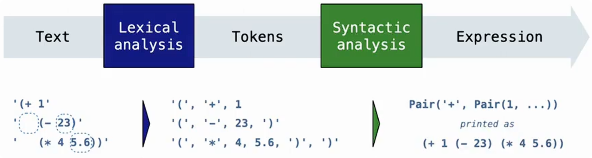

# 异常处理

程序运行过程中可能出现无法正常执行的情况，例如：

```python
1 / 0
```

会产生：

```python
ZeroDivisionError
```

> 异常（Exception）表示程序执行过程中发生的问题。
>
> 如果异常没有被处理，程序会直接终止。

Python 使用：

```python
raise
```

主动产生异常。

使用：

```python
try-except
```

捕获并处理异常。

## raise 主动抛出异常

基本形式：

```python
raise 异常类 / 异常实例
```

> `raise` 后面可以是异常实例，也可以直接是异常类。
>
> 如果提供的是异常类，Python 会自动创建对应的异常实例。

例如：

```python
raise TypeError("Bad argument!")
```

实际上是在创建一个 `TypeError` 对象，然后把这个异常对象抛出。

执行后会产生：

```text
TypeError: Bad argument!
```

### raise 的要求

`raise` 后面的表达式必须计算为：

- 一个异常类
- 或一个异常实例

例如：

```python
raise TypeError
```

或者：

```python
raise TypeError("wrong type")
```

都是合法的。

## 常见异常类型

### `TypeError`

> 类型错误。表示操作或函数调用中的对象类型不符合要求，也可能包括参数数量不正确。

例如：

```python
len(10)
```

因为整数没有长度，会产生：

```text
TypeError
```

### `NameError`

> 名称不存在。

例如：

```python
print(x)
```

但是之前没有定义：

```python
x
```

会产生：

```text
NameError
```

### `KeyError`

> 字典中不存在对应键。

例如：

```python
d = {"a": 1}

d["b"]
```

因为：

```text
b 不存在
```

产生：

```text
KeyError
```

### `RecursionError`

> 递归调用次数过多。

例如：

```python
def f():
    f()

f()
```

函数不断调用自身，没有终止条件。

最终：

```text
RecursionError
```

## try-except 处理异常

基本结构：

```python
try:
    可能产生异常的代码
except 异常类型 as 名称:
    处理代码
```

执行流程：

```text
执行 try 中的代码
        │
        ├─ 没有异常
        │      ↓
        │   跳过 except
        │
        └─ 发生异常
               ↓
         停止执行 try 中剩余代码
               ↓
         判断异常类型
          /          \
       匹配           不匹配
        ↓               ↓
执行 except        异常继续向外传播
```

### try-except 执行过程

例如：

```python
try:
    x = 1 / 0
except ZeroDivisionError as e:
    print("handling a", type(e))
    x = 0
```

执行：

```python
x = 1 / 0
```

发生：

```python
ZeroDivisionError
```

程序不会直接结束，而是寻找：

```python
except ZeroDivisionError
```

匹配成功。

进入：

```python
except
```

执行：

```python
print("handling a", type(e))
```

其中：

```python
e
```

保存异常对象。

输出：

```text
handling a <class 'ZeroDivisionError'>
```

然后：

```python
x = 0
```

最终：

```python
x
```

值为：

```text
0
```

## 异常对象绑定

语法：

```python
except ExceptionType as e:
```

其中：

```python
as e
```

> 表示将捕获到的异常对象绑定给变量 e

例如：

```python
except ZeroDivisionError as e:
```

执行后：

```text
		e
		↓
ZeroDivisionError 异常对象
```

因此可以：

```python
type(e)
```

查看异常类型。

## 异常传播

> 如果当前函数没有处理异常，异常会向调用者传播。

例如：

```python
def f():
    x = 1 / 0

def g():
    f()

g()
```

执行：

```text
		g()
 		 ↓
		f()
 		 ↓
发生 ZeroDivisionError
```

如果 `f` 和 `g` 都没有处理：

```text
继续向外传播
```

直到：

- 找到匹配的 `except`
- 或程序终止

## raise 与 try-except 的关系

raise主动制造异常：

```text
程序发现错误
	↓
  raise
	↓
 产生异常
```

try-except处理异常：

```text
 发生异常
	↓
except 捕获
	↓
执行处理逻辑
```

组合起来：

```text
raise      → 主动产生异常

try-except → 捕获并处理异常
```

例如：

```python
def withdraw(balance, amount):
    if amount > balance:
        raise ValueError("余额不足")
```

调用：

```python
withdraw(100, 200)
```

产生：

```text
ValueError
```

外层可以处理：

```python
try:
    withdraw(100, 200)
except ValueError as e:
    print(e)
```

输出：

```text
余额不足
```

# 编程语言

计算机可以运行用不同编程语言编写的程序。

从抽象层次来看，可以粗略分为：

- 机器语言（Machine Language）
- 高级语言（High-level Language）

两者最主要的区别在于：

```text
机器语言 → 更接近硬件

高级语言 → 更接近人的思考和问题描述
```

## 机器语言

> 机器语言中的指令直接由计算机硬件执行。

CPU 支持一组固定的机器指令，例如：

```text
读取数据
写入数据
进行算术运算
进行跳转
```

这些操作最终由 CPU 内部的电路完成。

机器语言通常需要直接处理：

```text
寄存器
内存地址
机器指令
硬件细节
```

因此抽象程度很低。

可以简单理解为：

```text
高级语言：x = x + 1
```

底层最终需要转换成类似：

```text
读取 x
读取 1
执行加法
保存结果
```

这样的机器操作。

## 高级语言

Python、Scheme、Java 等都属于高级语言。

高级语言提供了很多抽象机制，例如：

```text
变量命名
函数
对象
类
数据结构
```

例如 Python：

```python
def square(x):
    return x * x
```

程序员只需要表达：

```text
计算 x 的平方
```

而不需要自己处理：

```text
x 存在哪个内存地址
使用哪个 CPU 寄存器
乘法对应哪条机器指令
```

因此高级语言的一个重要作用就是：隐藏底层系统细节，让程序员关注程序本身的逻辑。

高级语言通常通过语言实现和运行环境屏蔽大量底层硬件差异，因此同一份程序往往可以在不同平台上运行。

但如果程序使用了特定操作系统或硬件提供的功能，仍然可能存在平台依赖。

例如：

```python
print("hello")
```

程序员不需要知道：

```text
Windows 如何显示字符
Linux 如何显示字符
Intel CPU 如何执行
ARM CPU 如何执行
```

这些细节由更底层的软件和语言实现负责。

因此可以形成多层抽象：

```text
Python 程序
	↓
Python 实现
	↓
 操作系统
	↓
 机器指令
	↓
   CPU
```

上层只需要依赖下一层提供的抽象接口。

## 编译与解释

高级语言源代码通常不能直接被 CPU 执行，需要通过语言实现进行处理。

常见方式包括解释（interpret）和编译（compile）。

### 解释

> 解释器读取程序，并按照语言规则执行程序。

可以粗略理解为：

```text
源程序
  ↓
解释器
  ↓
 执行
```

### 编译

> 编译器把一种语言翻译成另一种语言。

可以理解为：

```text
	源程序
  	  ↓
	编译器
  	  ↓
另一种形式的程序
```

例如可以把高级语言编译成机器代码，也可能先编译成某种中间表示。

Python 源代码：

```python
def square(x):
    return x * x
```

这里以 ``CPython` 为例，不同语言实现可能采用不同执行方式。

在常见的 `CPython` 实现中，会先被编译成一种中间表示：

```text
Python 字节码（Bytecode）
```

可以把过程简化为：

```text
Python 源代码
	 ↓
	编译
	 ↓
 Python 字节码
	 ↓
Python 虚拟机执行
```

因此 Python 并不能简单理解为纯解释执行。

更准确地说，`CPython` 会先把源代码转换成字节码，再由虚拟机执行字节码。

## 元语言抽象

> 设计或使用更适合某类问题的语言抽象来表达问题。这种思想称为**元语言抽象（`Metalinguistic Abstraction`）**。

元语言抽象的核心思想是：

```text
	面对某一类问题
		 ↓
设计适合描述这类问题的语言
		 ↓
   使用这种语言解决问题
```

也就是说，不只是使用现有语言中的：

```text
函数
类
对象
```

进行抽象，而是进一步：

```text
设计语言本身
```

让语言直接包含某个领域中最常用的概念。

> 有些语言会针对某种应用类型进行设计。

例如 Erlang 被设计用于并发程序，其中直接提供了适合：

```text
并发
进程通信
消息传递
```

的语言机制。

如果使用普通语言实现这些功能，可能需要自己搭建很多基础设施。

而专门设计的语言可以直接表达：

```text
我要创建并发任务

我要让两个任务通信
```

这就是通过语言本身提供更高层次的抽象。

> 有些语言是为了描述某一个特定问题领域而设计的。

例如 `MediaWiki` 的标记语言主要用于编写 `Wiki` 页面。

它直接提供：

```text
文本格式
页面链接
标题结构
```

等与网页内容相关的表示方式。

常见例子还包括：

```text
SQL → 描述数据库查询

HTML → 描述网页结构

正则表达式 → 描述字符串模式
```

它们并不一定适合解决所有问题，但在特定领域中表达能力很强。

## 编程语言的组成

### 语法

> 语法（Syntax）规定：哪些程序写法是合法的。

例如 Python：

```python
x = 3
```

是合法语法。

而：

```python
3 = x
```

不是合法的赋值语法。

Scheme：

```scheme
(+ 1 2)
```

是合法表达式。

语法主要回答：

```text
程序应该怎么写
```

### 语义

> 语义（Semantics）规定：一个合法的程序意味着什么，以及应该如何执行或求值。

例如：

```scheme
(+ 1 2)
```

语法告诉我们它是合法的调用表达式。

语义告诉我们：

```text
  求值 +
	↓
求值 1 和 2
	↓
调用 + 过程
	↓
  得到 3
```

因此：

```text
语法 → 程序长什么样

语义 → 程序是什么意思、怎么执行
```

# Scheme 表达式的读取与解析



我们在文件或终端中输入的 Scheme 程序，一开始只是**文本**。

例如：

```scheme
(+ 1 (- 23) (* 4 5.6))
```

计算机最初看到的只是类似：

```text
"(+ 1 (- 23) (* 4 5.6))"
```

这样的字符。

解释器需要把这些字符转换成真正能够处理的 Scheme 表达式结构，这个过程称为**解析（Parsing）**。

可以概括为：

```text
 	 文本
  	  ↓
   词法分析
  	  ↓
	Token
  	  ↓
   语法分析
	  ↓
Scheme 表达式
```

## 表达式的树形表示

例如：

```scheme
(+ 1 (* 2 3))
```

可以理解成：

```text
        +
       / \
      1   *
         / \
        2   3
```

所以解析 Scheme 并不只是把字符拆开，还需要恢复这些：

```text
谁属于哪个括号
哪些元素属于同一个表达式
哪些表达式嵌套在其他表达式中
```

的结构关系。

## 词法分析

> 词法分析（Lexical Analysis）的任务是：把一整段文本拆分成一个个有意义的最小单位。这些单位称为 **词法单元(token)**。

例如：

```scheme
(+ 1 (- 23) (* 4 5.6))
```

经过词法分析后，大致得到：

```text
(
+
1
(
-
23
)
(
*
4
5.6
)
)
```

例如在 Python 中，可以把这些词法单元暂时表示成一个列表：

```python
['(', '+', 1, '(', '-', 23, ')',
 '(', '*', 4, 5.6, ')', ')']
```

> 词法分析不仅需要把文本切开，还需要判断 Token 的类型。

```text
"23"
```

应该转换为数字：

```python
23
```

而：

```text
"5.6"
```

应该转换为：

```python
5.6
```

但：

```text
"+"
```

仍然是符号：

```text
+
```

词法分析主要负责：

```text
拆分 Token

识别数字、符号、括号等类型

检查非法 Token

逐行读取输入
```

这一阶段关注的是：每一个单独的 Token 是什么，它暂时不负责完整理解表达式的嵌套关系。

## 语法分析

> 语法分析（Syntactic Analysis）的任务是：根据 Token 之间的关系，恢复表达式的层次结构。
>
> 语法分析不负责判断程序是什么意思，只负责判断结构是否符合语法规则。

例如词法分析得到：

```python
['(', '+', 1, '(', '*', 2, 3, ')', ')']
```

语法分析需要识别出：

```scheme
(+ 1 (* 2 3))
```

而不是把这些 Token 当成没有关系的一排数据。
