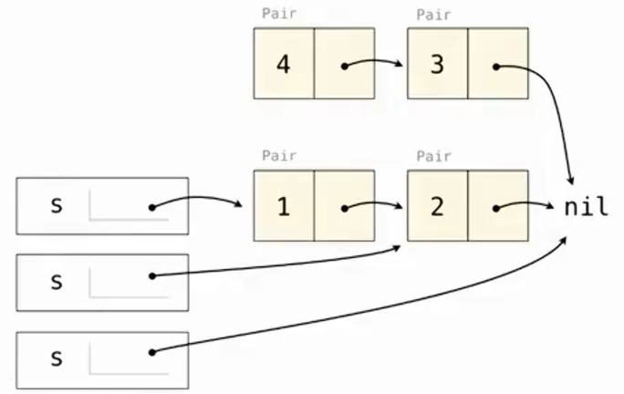
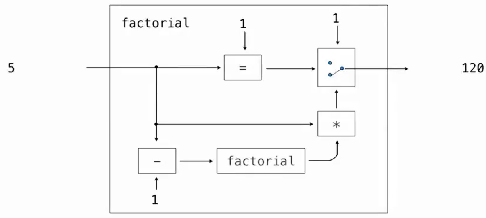
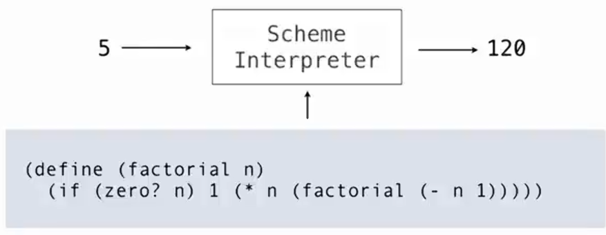

# 函数式编程

> 函数式编程（Functional Programming）强调把程序看成**表达式和函数的组合**，尽量减少程序状态的改变。

在较严格的纯函数式编程模型中，通常强调：

- 函数都是纯函数。
- 不重新给已有名称赋值。
- 不使用可变数据。
- 名称与值之间的绑定保持不变。

这里描述的是一种较纯粹的函数式编程思想，不代表所有支持函数式编程的语言都绝对禁止可变数据。

## 纯函数

纯函数（Pure Function）具有两个重要特点：

```text
相同输入 → 总是得到相同输出

函数执行 → 不改变外部可观察状态
```

例如：

```python
def square(x):
    return x * x
```

就是典型的纯函数。

调用：

```python
square(3)
```

无论执行多少次，结果都是：

```text
9
```

而且不会修改其他变量或对象。

> 函数式编程更强调：**把计算看成“输入经过一个个函数变成输出”，尽量少去修改原来的东西。**

比如现在有：

```python
nums = [1, 2, 3, 4]
```

我们想把每个数乘 2。

普通的“命令式”写法可能是：

```python
result = []

for x in nums:
	result.append(x * 2)
```

你是在一步一步命令计算机：

```
 创建空列表
	↓
 取一个元素
	↓
   乘 2
	↓
修改 result
	↓
 再取下一个
	……
```

重点是：**“怎么一步一步做”**

而函数式的思路更像：

```python
result = list(map(lambda x: x * 2, nums))
```

这里表达的是：

> 把“乘 2 这个函数”应用到 `nums` 的每一个元素。

你更关心：

```
 nums
  ↓
 乘2
  ↓
result
```

而不是一直操作“状态”。

```
命令式：
	创建变量 → 修改 → 再修改 → 再修改 → 得到结果

函数式：
	数据 → 函数 → 数据 → 函数 → 结果
```

## 函数式编程的优势

### 求值顺序的影响减小

如果各个子表达式的求值都没有副作用（每个子表达式只是负责算出自己的值，不会修改变量、输出内容、修改数据结构等，先算哪个、后算哪个通常不会影响最终结果），并且其中调用的函数都是纯函数，那么：

```text
先计算 A，再计算 B
```

和：

```text
先计算 B，再计算 A
```

通常不会因为副作用而得到不同结果。

例如：

```text
f(x) + g(y)
```

如果 `f`、`g` 都是纯函数，那么先计算哪一个通常不会改变最终结果。

### 并行与惰性求值

由于不同子表达式不会互相修改状态，它们通常更容易独立或并行计算。

纯函数也使“推迟到真正需要结果时再求值”更容易推理。这种需要时再计算的策略称为**惰性求值（lazy evaluation）**。

例如：

```text
表达式 A
表达式 B
```

如果两者之间不存在状态依赖，就更容易独立处理。

### 引用透明性

> 引用透明性（Referential Transparency）表示：一个表达式可以被它的值替换，而不改变整个程序的结果。

例如：

```text
square(3)
```

的值是：

```text
9
```

那么在纯函数环境中：

```text
square(3) + 1
```

可以安全替换成：

```text
9 + 1
```

程序含义不会改变。

因此可以简单理解为：

```text
表达式 ↔ 表达式的值
```

可以安全替换。

这也是纯函数代码通常更容易推理的原因之一。

# 递归与循环

## 递归调用的环境帧

在 Python 中，每进行一次递归调用，通常都会创建一个新的活动环境帧。

例如：

```python
def factorial(n, k):
    if n == 0:
        return k
    return factorial(n - 1, k * n)
```

调用：

```python
factorial(4, 1)
```

大致会形成：

```text
factorial(4, 1)
	 ↓
factorial(3, 4)
	 ↓
factorial(2, 12)
	 ↓
factorial(1, 24)
	 ↓
factorial(0, 24)
```

这些尚未返回的函数调用都会占用调用栈空间。

因此：

```text
时间复杂度：Θ(n)
空间复杂度：Θ(n)
```

## while 循环的空间消耗

对应的循环版本：

```python
def factorial(n, k):
    while n > 0:
        n, k = n - 1, k * n
    return k
```

虽然循环执行约 `n` 次：

```text
时间复杂度：Θ(n)
```

但是始终在同一个函数调用中修改：

```text
n
k
```

不会不断产生新的递归环境帧。

所以：

```text
空间复杂度：Θ(1)
```

对比：

|    实现方式    |  时间  |  空间  |
| :------------: | :----: | :----: |
|  Python 递归   | `Θ(n)` | `Θ(n)` |
| Python `while` | `Θ(n)` | `Θ(1)` |

## 尾位置

> 尾位置（Tail Context）是指：一个表达式的求值结果会直接成为当前过程调用的结果，不需要再利用这个结果进行其他计算。

比如：

```python
def f(x):
	return g(x)
```

这里 `g(x)` 就在尾位置。因为 `g(x)` 算完以后，`f` 直接把结果返回。

没有：

```
+ 1
* 2
```

之类的后续操作。

------

再看：

```python
def f(x):
	return g(x) + 1
```

这里 `g(x)` 不在尾位置。因为 `g(x)` 算完以后，还要 `+1`，所以当前函数还不能结束。

## 尾调用

> 尾调用（Tail Call）指：一个处在尾位置中的过程调用。
>
> 核心判断方式：这个调用返回之后，当前过程还有没有其他工作需要完成？
>
> ​	如果没有，这个调用就可能是尾调用。
>
> ​	如果还有加法、乘法或其他计算，就不是尾调用。

### Scheme 的尾调用优化

> Scheme 要求实现正确支持尾调用：当一个过程调用位于尾位置时，不需要因为连续的尾调用而不断增加活动调用帧。
>
> 尾递归只是尾调用的一种特殊情况：被调用的过程恰好是当前过程自己。
>
> 利用这种性质，可以让尾递归等计算过程保持常数数量的活动调用帧。

因此：

```scheme
(define (factorial n k)
  (if (= n 0)
      k
      (factorial (- n 1)
                 (* k n))))
```

虽然看起来是递归：

```text
factorial
调用
factorial
调用
factorial
...
```

但支持尾调用优化的 Scheme 实现不需要不断保留旧的环境帧。

所以：

```text
时间复杂度：Θ(n)
空间复杂度：Θ(1)
```

从资源使用角度看，它类似于 Python 中：

```python
while n > 0:
    n, k = n - 1, k * n
```

### 尾调用优化的核心

考虑：

```scheme
(define (f x)
  (g x))
```

`f` 调用 `g` 后：

```text
f 已经没有任何工作需要完成
```

而最终：

```text
g 的返回值 = f 的返回值
```

因此没有必要：

```text
 保留 f 的调用帧
	  ↓
  等待 g 返回
	  ↓
再把相同结果返回出去
```

可以直接让：

```text
g 的结果
```

交给 `f` 原本的调用者。

所以尾调用的核心可以理解为：

```text
   当前过程已经没有后续计算
           ↓
不需要为了等待返回而保留当前调用帧
           ↓
	  直接执行尾调用
           ↓
最终结果直接返回给原来的调用者
```

这就是在支持尾调用优化的实现中，尾调用可以避免不断增加活动调用帧的原因。

### Python 与 Scheme 的差异

即使 Python 写成：

```python
def factorial(n, k):
    if n == 0:
        return k
    return factorial(n - 1, k * n)
```

从程序结构上看：

```python
factorial(...)
```

确实位于尾位置。

> `CPython` 不进行尾调用优化，Python 语言本身也不保证尾调用使用常数栈空间。

所以：

```text
Python 尾递归
→ 仍然不断创建新的调用帧
→ 空间 Θ(n)
```

而符合 Scheme 要求的实现：

```text
Scheme 尾递归
→ 可以不增加活动环境数量
→ 空间 Θ(1)
```

> “尾递归”描述的是程序结构，“尾调用优化”描述的是语言实现是否利用这种结构节省空间。
>
> 不能认为只要代码写成尾递归，就一定自动获得 `Θ(1)` 空间。

## 尾递归

> 尾递归（Tail Recursion）是一种特殊的递归形式：尾调用调用的是函数自己。

例如：

```scheme
(define (factorial n k)
  (if (= n 0)
      k
      (factorial (- n 1)
                 (* k n))))
```

在：

```scheme
(factorial (- n 1) (* k n))
```

执行完成以后，当前这一层函数已经不需要再进行其他计算。

它的结果可以直接作为当前函数的结果。

因此这是尾递归。

## 普通递归的执行过程

例如列表：

```
(a b c)
```

执行：

```scheme
(length '(a b c))
```

可以理解为：

```text
1 + length((b c))
        ↓
    1 + length((c))
            ↓
        1 + length(())
                ↓
                0
```

返回时还需要逐层计算：

```text
  0
  ↓
1 + 0
  ↓
1 + 1
  ↓
1 + 2
  ↓
  3
```

所以每层递归调用都必须等待下一层返回。

## 尾递归版本的执行过程

> 线性递归经常可以通过增加一个**累加器（accumulator）**改写成尾递归。

例如列表长度：

```scheme
(define (length-tail s)

  (define (length-iter s n)
    (if (null? s)
        n
        (length-iter (cdr s)
                     (+ n 1))))

  (length-iter s 0))
```

这里 n 就是累加器。它保存目前已经处理了多少个元素。

对于：

```
(a b c)
```

过程大致为：

```text
length-iter((a b c), 0)
		↓
length-iter((b c), 1)
		↓
length-iter((c), 2)
		↓
length-iter((), 3)
		↓
		3
```

每次调用之前就已经把：

```text
+ 1
```

计算完成。

因此递归调用返回以后：

```text
不需要再做任何计算
```

所以：

```scheme
(length-iter (cdr s) (+ n 1))
```

是尾调用。

# Reduce 与常数栈帧的列表处理

> `reduce` 用于把一个列表中的元素依次合并，最终得到一个结果。

```scheme
(define (reduce procedure s start)
  (if (null? s)
      start
      (reduce procedure
              (cdr s)
              (procedure start (car s)))))
```

三个参数分别表示：

```text
procedure → 每一步使用的合并过程
s         → 还没有处理的列表
start     → 当前已经累积得到的结果
```

这里的 `start` 实际上承担了**累加器（accumulator）**的作用。

## reduce 的执行过程

例如：

```scheme
(reduce * '(3 4 5) 2)
```

初始：

```text
s     = (3 4 5)
start = 2
```

第一次：

```scheme
(* 2 3)
```

得到：

```text
6
```

进入：

```scheme
(reduce * '(4 5) 6)
```

第二次：

```scheme
(* 6 4)
```

得到：

```text
24
```

进入：

```scheme
(reduce * '(5) 24)
```

第三次：

```scheme
(* 24 5)
```

得到：

```text
120
```

最后：

```scheme
(reduce * nil 120)
```

因为：

```scheme
(null? s)
```

为真，所以直接返回：

```text
120
```

## reduce 的尾递归结构

关键递归调用：

```scheme
(reduce procedure
        (cdr s)
        (procedure start (car s)))
```

是尾调用。

原因是：这次 `reduce` 返回之后，当前这一层不需要再进行任何计算，它的结果可以直接作为当前过程的结果。

执行顺序实际上是：

```text
先计算(cdr s) 以及(procedure start (car s))
				 ↓
	     得到下一次递归所需的参数
			  	 ↓
		    调用新的 reduce
			  	 ↓
		  直接返回递归调用的结果
```

所以：

```scheme
(procedure start (car s))
```

是在递归调用**之前**完成的。

递归回来以后没有：

```text
+ 1
cons
乘法
其他操作
```

需要继续执行，因此 `reduce` 的递归调用处于尾位置。

## procedure 对空间的影响

虽然 `reduce` 本身是尾递归，但不能因此直接认为整个计算一定只使用常数空间。

例如：

```scheme
(procedure start (car s))
```

在进入下一次递归之前必须先求值。

如果 `procedure` 本身需要：

```text
Θ(n)
```

的空间，那么整个 `reduce` 的空间开销也会受到它的影响。

因此更准确地说：

> `reduce` 自身的递归不会不断积累新的活动栈帧，但总空间还取决于传入的 `procedure` 做了什么。

如果 `procedure` 本身只需要常数额外空间，那么支持尾调用优化的 Scheme 可以让这部分迭代保持常数数量的活动栈帧。

## reduce 构造列表

`reduce` 不仅可以进行数字运算，也可以构造列表。

例如：

```scheme
(reduce
  (lambda (x y) (cons y x))
  '(3 4 5)
  '(2))
```

这里：

```scheme
(lambda (x y) (cons y x))
```

表示把当前元素 y 放到累计结果 x 的最前面

执行：

```text
start = (2)
```

处理 `3`：

```scheme
(cons 3 '(2)) → (3 2)
```

处理 `4`：

```scheme
(cons 4 '(3 2)) → (4 3 2)
```

处理 `5`：

```scheme
(cons 5 '(4 3 2)) → (5 4 3 2)
```

最终：

```scheme
(5 4 3 2)
```

因为每次都是：

```scheme
cons 当前元素 到 start 前面
```

所以原列表中的元素会以相反顺序累积。

# map 的递归结构

一种直接的 `map` 实现：

```scheme
(define (map procedure s)
  (if (null? s)
      nil
      (cons (procedure (car s))
            (map procedure (cdr s)))))
```

例如：

```scheme
(map
  (lambda (x) (- 5 x))
  '(1 2))
```



得到：

```scheme
(4 3)
```

关键部分：

```scheme
(cons (procedure (car s))
      (map procedure (cdr s)))
```

递归调用：

```scheme
(map procedure (cdr s))
```

不是尾调用。

原因是递归返回之后，还需要 `cons` 把当前元素放到递归结果前面。

因此每层调用都必须保留下来等待下一层返回。

对于长度为 `n` 的列表，会产生：

```text
Θ(n)
```

层活动栈帧。

## 使用累加器改写 map

为了避免递归帧不断增加，可以先把结果**反向累积**。

```scheme
(define (map procedure s)

  (define (map-reverse s m)
    (if (null? s)
        m
        (map-reverse
          (cdr s)
          (cons (procedure (car s))
                m))))

  (reverse (map-reverse s nil)))
```

其中m是累加器。

> 这里减少的是**活动调用帧的数量**。
>
> 在支持尾调用优化的 Scheme 中，`map-reverse` 的递归过程可以保持常数数量的活动调用帧。
>
> 但是 `map` 本身需要构造一个包含 `n` 个元素的新列表，因此如果把结果列表占用的空间也计算进去，总的数据存储仍然是 `Θ(n)`。

## map-reverse 的执行过程

例如：

```scheme
(map
  (lambda (x) (- 5 x))
  '(1 2))
```

首先：

```scheme
map-reverse
```

从：

```text
s = (1 2)
m = ()
```

开始。

处理 `1`：

```scheme
(- 5 1)
→ 4
```

然后：

```scheme
(cons 4 nil)
→ (4)
```

进入：

```text
s = (2)
m = (4)
```

处理 `2`：

```scheme
(- 5 2) → 3
```

然后：

```scheme
(cons 3 '(4)) → (3 4)
```

最终：

```text
map-reverse 的结果：
(3 4)
```

这里顺序与最终结果相反。

# reverse 的尾递归实现

```scheme
(define (reverse s)

  (define (reverse-iter s r)
    (if (null? s)
        r
        (reverse-iter
          (cdr s)
          (cons (car s) r))))

  (reverse-iter s nil))
```

其中r也是累加器。

例如：

```scheme
(reverse '(3 4))
```

过程：

```text
s = (3 4), r = ()
		↓
s = (4),   r = (3)
		↓
s = (),    r = (4 3)
```

得到：

```scheme
(4 3)
```

# 程序定义计算过程

> **编程语言**：规定程序如何书写以及具有什么含义的一套规则。
>
> **程序**：按照某种编程语言写出的表达式或指令，可以看成是在描述一个计算过程。

例如阶乘程序：

```scheme
(define (factorial n)
  (if (zero? n)
      1
      (* n (factorial (- n 1)))))
```

它规定了：

```
   输入 n
	↓
判断 n 是否为 0
	↓
   如果是：
    	返回 1
	否则：
    	计算 n - 1
    	递归计算 factorial(n - 1)
    	再乘以 n
	↓
  得到结果
```



这里真正重要的不是“真的造出一台硬件机器”，而是程序规定了一套计算规则，所以可以把程序抽象地看成一台执行特定计算的机器。

如果换一个程序：

```scheme
(define (square x)
  (* x x))
```

就相当于定义了另一台机器：

```
  5
  ↓
square
  ↓
  25
```

因此，不同程序规定不同的计算逻辑，相当于定义不同的机器。

# 解释器

> 解释器（Interpreter）本身也是一个程序。
>
> 它的任务不是只执行某一个固定计算，而是：读取另一个程序，并按照这门语言的规则执行它。

例如 Scheme 解释器接收到：

```scheme
(define (factorial n)
  (if (zero? n)
      1
      (* n (factorial (- n 1)))))
```

以后，再输入：

```
(factorial 5)
```

解释器会按照 Scheme 的语义执行这个程序，得到：

```
120
```



> 解释器的核心组成之一是**求值器（evaluator）**。
>
> 求值器根据一组**求值规则（evaluation rules）**，判断不同类型的表达式应该如何求值。

例如：

数字：

```
数字 → 求值得到自身
```

符号：

```
符号 → 在环境中查找绑定
```

调用表达式：

```
(operator operand...)
		↓
   求值 operator
		↓
   求值 operands
		↓
	 调用过程
```

`if`：

```
	 先求值条件
		↓
根据真假只求值一个分支
```

`define`：

```
变量定义：
        (define name expression)
                   ↓
        	 求值 expression
                   ↓
         把 name 绑定到求值得到的值
         
过程定义：
            (define (f x) body)
                    ↓
            	  创建过程
                    ↓
            把名称 f 绑定到这个过程
	(body 此时不会执行，调用 f 时才会执行过程体。)
```

解释器就是不断根据表达式的类型选择对应规则。

```
程序决定“算什么”

解释器决定“怎样按照语言规则执行程序”
```
