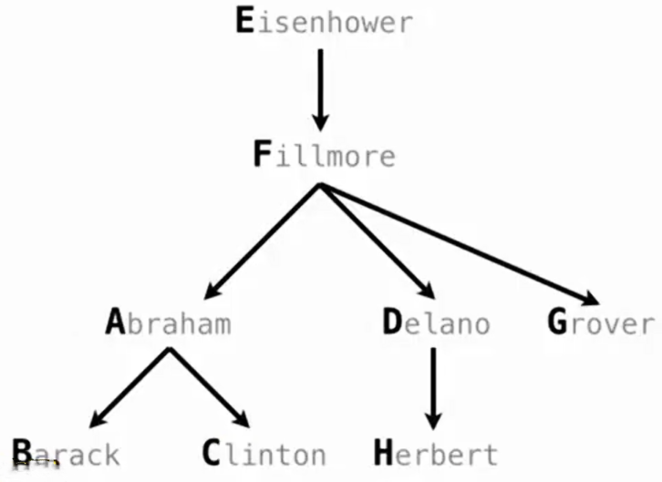

# SQL 表

## SELECT 生成结果表

SQL 中的 `SELECT` 用于生成一个结果表。

最基本的形式：

```sql
select 表达式;
```

例如：

```sql
select 1;
```

会得到一个只有一行、一列的表：

```text
1
```

也可以一次选择多个表达式：

```sql
select 1, 2, 3;
```

得到：

```text
1 | 2 | 3
```

因此即使没有从已有表中读取数据，`SELECT` 本身也可以产生一个表。

---

直接在 `SELECT` 中写数字、字符串等固定值，可以创建一个只有一行的结果表。

例如：

```sql
select 'abraham', 'barack';
```

结果可以理解为：

|  第1列  | 第2列  |
| :-----: | :----: |
| abraham | barack |

这里：

```text
'abraham'
'barack'
```

都是字面值（literal）。

所以：

```sql
select 表达式1, 表达式2;
```

实际上是在描述：

```text
这一行的第一列是什么
这一行的第二列是什么
```

但是直接执行：

```sql
select ...;
```

得到的结果会显示出来，但这个结果本身并没有自动成为一个可以长期通过名字访问的表。

## AS 设置列名

每个 `SELECT` 表达式都对应结果表中的一列。

可以使用：

```sql
as
```

给列起名字：

```sql
select 'abraham' as parent,
       'barack' as child;
```

得到：

| parent  | child  |
| :-----: | :----: |
| abraham | barack |

一般形式：

```sql
select 表达式 as 列名,
       表达式 as 列名;
```

`AS` 可以理解为：

```text
给这一列结果取一个名字
```

## 表达式与列

`SELECT` 后面可以写多个用逗号分隔的表达式：

```sql
select expression1,
       expression2,
       expression3;
```

每一个表达式都会形成结果表中的一列。

例如：

```sql
select 2 + 3 as sum,
       2 * 3 as product;
```

得到：

| sum  | product |
| :--: | :-----: |
|  5   |    6    |

因此列并不一定只是保存固定值，也可以由表达式计算得到。

当 SQL 处理某一行时，列名就表示这一行中对应的值。

## UNION

### 合并多行数据

在前面这种不带 `FROM`、直接选择字面值或表达式的写法中：

```sql
select ...
```

通常会产生一行结果。

如果想用这种方式手动构造多行数据，可以使用 `UNION`：

```sql
select 'abraham' as parent, 'barack' as child
union
select 'abraham', 'clinton';
```

结果：

| parent  |  child  |
| :-----: | :-----: |
| abraham | barack  |
| abraham | clinton |

可以把它理解成：

```text
第一条 SELECT 产生一行
		+
第二条 SELECT 产生一行
		↓
	  UNION
		↓
	组合成一个表
```

### 多个 SELECT 的联合

可以继续连接更多查询：

```sql
select 'abraham' as parent, 'barack' as child
union
select 'abraham', 'clinton'
union
select 'delano', 'herbert'
union
select 'fillmore', 'abraham';
```

每一个 `SELECT` 都提供一行数据。

最终：

|  parent  |  child  |
| :------: | :-----: |
| abraham  | barack  |
| abraham  | clinton |
|  delano  | herbert |
| fillmore | abraham |

UNION 把多个查询产生的行组合到同一个结果表中。

这里的表格主要用来展示结果中包含哪些行。没有使用 `ORDER BY` 时，不应该依赖查询结果的行顺序。

### UNION 的列数要求

> 参与 `UNION` 的各个查询必须产生相同数量的列；对应位置的值还需要能够作为同一结果列中的数据进行组合。

例如：

```sql
select 'a', 'b'
union
select 'c', 'd';
```

两边都是两列，可以组合。

而类似：

```sql
select 'a', 'b'
union
select 'c';
```

列数不同，不能作为对应的表行正常联合。

### UNION 与重复行

标准 SQL 中：

```sql
UNION
```

会去除完全重复的行。

如果希望保留重复行，通常使用：

```sql
UNION ALL
```

例如：

```sql
select 1
union
select 1;
```

结果通常只有：

```text
1
```

而：

```sql
select 1
union all
select 1;
```

则保留两行：

```text
1
1
```

## CREATE TABLE

使用：

```sql
create table
```

创建一个真正有名字的表。

一种重要写法是：

```sql
create table 表名 as
select ...;
```

就是先通过 SELECT 产生一个结果表，再把这个结果保存为一个有名字的表。

例如：

```sql
create table parents as
select 'abraham' as parent, 'barack' as child;
```

这样就创建了 parents 表。

### 使用查询结果创建表

也可以把多个 `SELECT` 联合后的完整结果保存下来：

```sql
create table parents as

select 'abraham' as parent, 'barack' as child
union
select 'abraham', 'clinton'
union
select 'delano', 'herbert'
union
select 'fillmore', 'abraham'
union
select 'fillmore', 'delano'
union
select 'fillmore', 'grover'
union
select 'eisenhower', 'fillmore';
```

最终得到名为 parents 的表：

|   parent   |  child   |
| :--------: | :------: |
|  abraham   |  barack  |
|  abraham   | clinton  |
|   delano   | herbert  |
|  fillmore  | abraham  |
|  fillmore  |  delano  |
|  fillmore  |  grover  |
| eisenhower | fillmore |



## 查询结果也是表

> 一个查询的结果本身就是一个表。

例如：

```sql
select 'abraham' as parent,
       'barack' as child;
```

结果是表。

两个查询：

```sql
select ...
union
select ...
```

结果仍然是表。

进一步：

```sql
create table parents as
select ...
union
select ...;
```

就是把这个结果表保存起来。

## SELECT 查询结构

前面使用：

```sql
select 1, 2;
```

可以直接构造一个结果表。

当数据已经存在于某个表中时，可以使用 `FROM` 指定查询的数据来源。

常见结构：

```sql
select columns
from table
where condition
order by order;
```

按照下面的逻辑处理顺序理解：

```
FROM → 指定从哪个表读取数据

WHERE → 筛选需要的行

SELECT → 决定结果中保留哪些列，以及每列计算什么

ORDER BY → 对最终结果进行排序（默认是升序 ASC，降序使用 DESC）
```

## SELECT 的投影

> 把 `SELECT` 对列的处理称为**投影（projection）**。

例如原始的一行：

```
parent = abraham
child  = barack
```

执行：

```sql
select child
from parents;
```

这一行被投影为：

```
barack
```

如果写：

```sql
select parent, child
from parents;
```

则这一行被投影为：

```
abraham | barack
```

如果写：

```sql
select parent as p, child as c
from parents;
```

则结果仍然来自相同数据，只是列名变成：

```
p | c
```

因此：`SELECT` 决定每一条输入行最终变成什么样的结果行。

## SELECT 中的算术运算

SQL 中可以在表达式里使用常见算术运算：

```
+   加法
-   减法
*   乘法
/   除法
```

算术表达式同样存在运算优先级。

如果希望明确改变计算顺序，可以使用括号。

`SELECT` 中不仅可以直接选择已有列，还可以使用这些列进行计算。

在 `SELECT` 表达式中，列名会根据当前正在处理的行，得到这一行对应的值。

例如有表：

```sql
create table lift as
select 101 as chair, 2 as single, 2 as couple union
select 102,          0,           3      union
select 103,          4,           1;
```

得到：

| chair | single | couple |
| :---: | :----: | :----: |
|  101  |   2    |   2    |
|  102  |   0    |   3    |
|  103  |   4    |   1    |

```sql
select chair,
       single + 2 * couple as total
from lift;
```

> `SELECT` 中的每个表达式都会针对当前输入行求值，表达式的结果成为输出行中的一列。

第一行：

```
chair  = 101
single = 2
couple = 2
```

所以：

```
single + 2 * couple
= 2 + 2 * 2
= 6
```

得到：

```
101 | 6
```

第二行：

```
chair  = 102
single = 0
couple = 3
```

计算：

```
0 + 2 * 3
= 6
```

得到：

```
102 | 6
```

第三行：

```
chair  = 103
single = 4
couple = 1
```

计算：

```
4 + 2 * 1
= 6
```

得到：

```
103 | 6
```

最终结果：

| chair | total |
| :---: | :---: |
|  101  |   6   |
|  102  |   6   |
|  103  |   6   |

### AS 给计算结果命名

表达式：

```sql
single + 2 * couple
```

本身没有一个简洁的列名。

因此可以写：

```sql
single + 2 * couple as total
```

给计算结果命名为：

```
total
```

因此：

```
expression as name
```

可以用于：

```
已有列
```

也可以用于：

```
计算出来的新列
```

例如：

```sql
select single as people,
       single + 2 * couple as total
from lift;
```