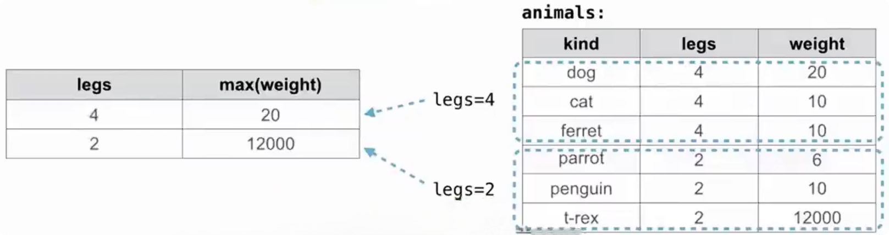

# 聚合函数

例如：

```sql
select weight / legs
from animals;
```

`SQL` 会对每一行分别计算：

```text
这一行的 weight / 这一行的 legs
```

而聚合函数（Aggregate Function）不同：

> 聚合函数会同时处理一组行，并把这一组数据汇总成一个值。

常见聚合函数：

```text
max     最大值
min     最小值
avg     平均值
sum     总和
count   数量
```

假设有表：

|  kind   | legs | weight |
| :-----: | :--: | :----: |
|   dog   |  4   |   20   |
|   cat   |  4   |   10   |
| ferret  |  4   |   10   |
| parrot  |  2   |   6    |
| penguin |  2   |   10   |
|  t-rex  |  2   | 12000  |

## max / min

最大值：

```sql
select max(legs)
from animals;
```

`SQL` 不再逐行输出 `legs`，而是观察所有行：

```text
4
4
4
2
2
2
```

最终只得到：

```text
4
```

同理：

```sql
select min(weight)
from animals;
```

查看：

```text
20
10
10
6
10
12000
```

得到：

```text
6
```

## 聚合函数内部使用表达式

聚合函数的参数不一定只是列名，也可以是表达式：

```sql
select max(legs - weight) + 5
from animals;
```

首先对每一行计算：

```text
dog      → 4 - 20    = -16
cat      → 4 - 10    = -6
ferret   → 4 - 10    = -6
parrot   → 2 - 6     = -4
penguin  → 2 - 10    = -8
t-rex    → 2 - 12000 = -11998
```

然后：

```text
max(...) → -4
```

最后：

```text
-4 + 5 → 1
```

## 多个聚合函数

一个 `SELECT` 中可以同时使用多个聚合函数：

```sql
select max(legs), min(weight)
from animals;
```

分别计算：

```text
max(legs)   → 4
min(weight) → 6
```

结果：

```text
4 | 6
```

也可以继续组合：

```sql
select max(legs) - min(weight)
from animals;
```

得到：

```text
4 - 6 = -2
```

## WHERE 与聚合

可以先通过 `WHERE` 筛选行，再进行聚合。

例如：

```sql
select min(legs), max(weight)
from animals
where kind <> 't-rex';
```

`<>` 表示：

```text
不等于
```

因此先去掉：

```text
t-rex | 2 | 12000
```

剩下的数据再进行：

```text
min(legs)
max(weight)
```

得到：

```text
2 | 20
```

## avg

> `avg` 用于求平均值。

```sql
select avg(legs)
from animals;
```

计算：

```text
(4 + 4 + 4 + 2 + 2 + 2) / 6
= 18 / 6
= 3
```

结果：

```text
3.0
```

## count(column)

> count(column)：统计这一列中非 NULL 值的数量。

例如：

```sql
select count(legs)
from animals;
```

得到：

```text
6
```

同样：

```sql
select count(kind)
from animals;
```

也是：

```text
6
```

因为当前表中这两列每一行都有值。

## count(*)

> 统计表中的行数。

```sql
select count(*)
from animals;
```

得到：

```text
6
```

# 聚合函数中的 DISTINCT

> 在聚合函数中使用 `DISTINCT` 时，会先去除重复值，再进行聚合。

例如：

```sql
select count(distinct legs)
from animals;
```

`legs` 中有：

```text
4
4
4
2
2
2
```

去重之后为：

```text
4
2
```

所以：

```text
count(distinct legs) → 2
```

---

`weight`：

```text
20
10
10
6
10
12000
```

不同值为：

```text
20
10
6
12000
```

因此：

```sql
select count(distinct weight)
from animals;
```

得到：

```text
4
```

---

同样可以：

```sql
select sum(distinct weight)
from animals;
```

只把不同的重量加一次：

```text
20 + 10 + 6 + 12000 = 12036
```

注意：

```text
sum(weight)
```

和：

```text
sum(distinct weight)
```

含义不同。

前者：

```text
每一行都参与求和
```

后者：

```text
重复值只计算一次
```

# GROUP BY

> `GROUP BY` 根据一个或多个表达式，把行划分成不同的组。
>
> 如果查询中使用了聚合函数，聚合函数会分别对每一组进行计算。
>
> 分组表达式有多少种不同的结果，通常就会形成多少组。

基本形式：

```sql
select ...
from ...
group by expression;
```

例如：

```sql
select legs, max(weight)
from animals
group by legs;
```

表示按 legs 分组。

表中的 `legs` 只有两个不同值：

```text
4
2
```

因此形成两个组。



没有 `ORDER BY` 时，不应依赖结果行的具体顺序。

## 多列分组

可以同时根据多个表达式分组：

```sql
select legs, weight
from animals
group by legs, weight;
```

此时只有：

```text
legs 和 weight 都相同
```

的行才属于同一组。

原始组合：

```text
(4, 20)
(4, 10)
(4, 10)
(2, 6)
(2, 10)
(2, 12000)
```

不同组合：

```text
(4, 20)
(4, 10)
(2, 6)
(2, 10)
(2, 12000)
```

所以得到 5 个组。

## 使用表达式分组

`GROUP BY` 后面也可以使用表达式：

```sql
group by weight / legs
```

对于当前数据：

```text
dog      → 20 / 4    = 5
cat      → 10 / 4    = 2
ferret   → 10 / 4    = 2
parrot   → 6 / 2     = 3
penguin  → 10 / 2    = 5
t-rex    → 12000 / 2 = 6000
```

于是形成：

```text
weight/legs = 2 → cat、ferret

weight/legs = 3 → parrot

weight/legs = 5 → dog、penguin

weight/legs = 6000 → t-rex
```

这里 `weight` 和 `legs` 的值都是整数。在当前 `SQLite` 计算中，整数除以整数会得到整数除法结果，因此 `10 / 4` 得到 `2`，而不是 `2.5`。

# HAVING

> `HAVING` 用于筛选**分组后的组**。

例如：

```sql
select weight / legs, count(*)
from animals
group by weight / legs
having count(*) > 1;
```

首先：

```text
GROUP BY weight/legs
```

形成：

```text
2    → 2 行
3    → 1 行
5    → 2 行
6000 → 1 行
```

然后：

```sql
having count(*) > 1
```

只保留数量大于 1 的组：

```text
2 → 2 行
5 → 2 行
```

最终：

| weight/legs | count(*) |
| :---------: | :------: |
|      2      |    2     |
|      5      |    2     |

## WHERE 与 HAVING

`WHERE`：

```text
在分组之前筛选“行”
```

`HAVING`：

```text
在分组之后筛选“组”
```

例如：

```sql
select legs, count(*)
from animals
where weight >= 10
group by legs
having count(*) >= 2;
```

理解顺序：

```text
animals
↓
WHERE weight >= 10
先去掉不符合条件的单独行
↓
GROUP BY legs
把剩余行分组
↓
COUNT(*)
计算每组数量
↓
HAVING count(*) >= 2
去掉数量不足的组
```

# 聚合查询的逻辑顺序

对于：

```sql
select legs, max(weight)
from animals
where weight >= 10
group by legs
having count(*) > 1
order by legs;
```

理解时可以按照：

```text
  FROM
   ↓
确定输入表

  WHERE
    ↓
筛选单独的行

 GROUP BY
	↓
把剩余行分组

		   聚合
			↓
每组计算 max、count、avg 等

 HAVING
   ↓
筛选整个组

  SELECT
	↓
形成最终结果列

ORDER BY
	↓
   排序
```

# 聚合列与普通列混合

例如：

```sql
select max(weight), kind
from animals;
```

这里：

```text
max(weight)
```

是聚合结果，

而：

```text
kind
```

是普通列。

在 `SQLite` 中，如果查询中恰好有一个内置的 `min` 或 `max` 聚合函数，裸列通常会从包含该最小值或最大值的输入行中取值。

如果有多行具有相同的最小值或最大值，具体选择其中哪一行的裸列值并不确定，因此不要依赖这种情况得到固定结果。

例如：

```sql
select max(weight), kind
from animals;
```

当前最大重量是：

```text
12000
```

对应：

```text
t-rex
```

因此 `SQLite` 可以得到类似：

```text
12000 | t-rex
```

不要把下面这种写法普遍理解成：

```sql
select avg(weight), kind
from animals;
```

一定能够找到“平均重量对应的动物”。

实际上平均值通常并不属于某一条具体记录，而且未分组的普通列可能没有明确、可移植的含义。

因此在实际 `SQL` 中，更稳妥的原则是：

> `SELECT` 中的普通列通常应该出现在 `GROUP BY` 中，或者也通过聚合函数处理。

例如：

```sql
select legs, avg(weight)
from animals
group by legs;
```

这里：

```text
legs
```

是分组依据，所以含义明确：

```text
每种 legs 对应一个组 → 计算这个组的平均 weight
```
