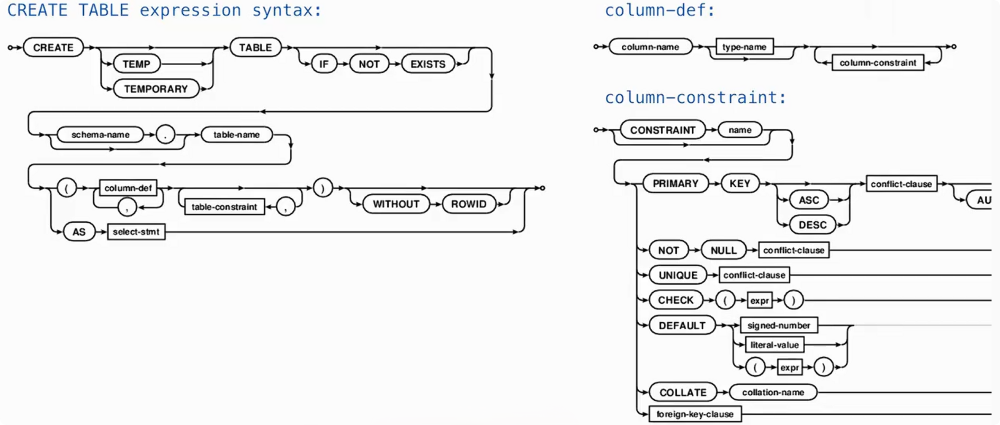
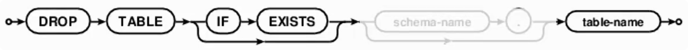
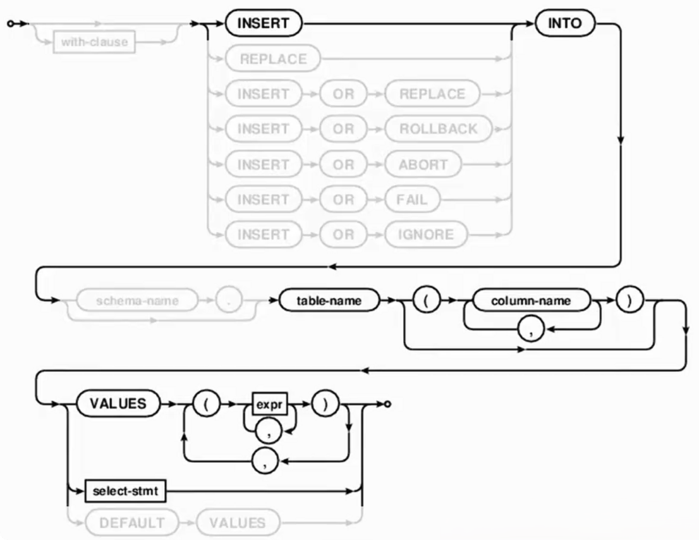
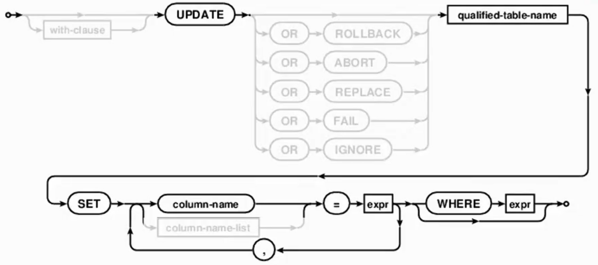
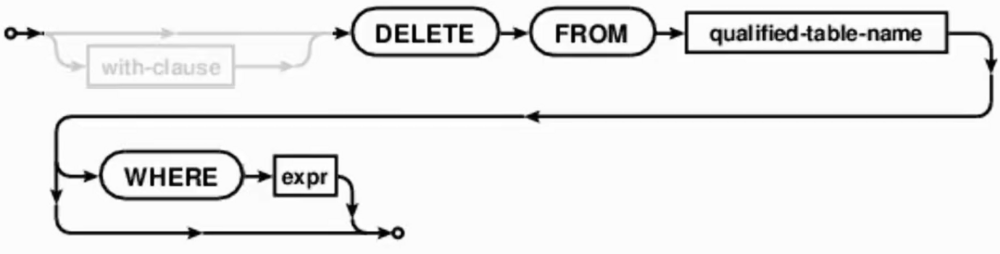

# CREATE TABLE



除了前面使用：

```sql
create table parents as
select ...;
```

通过查询结果创建表以外，也可以直接指定表的列结构：

```sql
CREATE TABLE 表名 (
    列名  类型  约束,
    列名  类型  约束,
    ...
)
```

> 其中类型和约束可以根据需要省略或组合使用。
>
> 在 `SQLite` 中，声明类型可以省略；一个列也可以同时具有多个约束。

例如：

```sql
create table primes (
    n unique,
    prime default 1
);
```

创建了一个 `primes` 表：

```
n     → 用来保存要判断的数
prime → 标记这个数是否为质数
```

这里没有立即插入任何数据，所以刚创建完成时：

```sql
select * from primes;
```

不会得到任何行。

# 列约束

> 创建表时，可以给列增加约束（constraint），用来限制或规定这一列的数据。

常见约束包括：

```
PRIMARY KEY → 主键

NOT NULL → 不允许为空

UNIQUE → 非 NULL 值不能重复

CHECK → 插入或修改的数据必须满足指定条件

DEFAULT → 没有显式提供值时使用默认值

FOREIGN KEY → 描述表与表之间的引用关系
```

## UNIQUE

> `UNIQUE` 用来限制列中的非 `NULL` 值不能重复。
>
> 在 `SQLite` 中，多个 `NULL` 可以同时存在于具有 `UNIQUE` 约束的列中。

例如：

```sql
create table primes (
    n unique,
    prime default 1
);
```

其中：

```
n unique
```

表示：n 列中的非 NULL 值不能重复。

例如已经存在：

```
n = 2
```

就不能再正常插入另一行：

```
n = 2
```

## DEFAULT

定义：

```sql
prime default 1
```

表示如果插入一行时没有给 `prime` 指定值，就自动使用：

```
1
```

例如：

```sql
insert into primes(n)
values (4);
```

这里只提供：

```
n = 4
```

没有提供 `prime`。

数据库会自动补上：

```
prime = 1
```

因此实际得到：

```
4 | 1
```

只有没有显式提供这一列时才会使用。

# DROP TABLE

> `DROP TABLE` 用来删除整张表。



基本形式：

```sql
drop table 表名;
```

例如：

```sql
drop table primes;
```

会删除：

```
primes 表本身 + 表中的所有数据
```

因此它和后面学习的：

```
delete from primes;
```

不同。

```
DROP TABLE → 整张表都不存在了

DELETE → 表还存在，只删除其中的行
```

也可以写：

```
drop table if exists primes;
```

意思是：

```
如果 primes 存在 → 删除它

如果不存在 → 不因为“找不到表”而报错
```

类似地，创建表时也可以使用：

```
create table if not exists ...
```

避免重复创建已经存在的表。

# INSERT 插入数据

> `INSERT` 用于向已经存在的表中增加新行。



基本形式：

```sql
insert into 表名
values (...);
```

例如表：

```sql
create table primes (
    n unique,
    prime default 1
);
```

每一对括号表示一行。

> 如果 `INSERT` 中没有显式写列名，那么 `VALUES` 中的值需要按照表中列的顺序提供。

插入多行：

```sql
insert into primes
values (2, 1),
       (3, 1);
```

相当于插入两行：

|  n   | prime |
| :--: | :---: |
|  2   |   1   |
|  3   |   1   |

## 指定插入的列

不一定要给表中的所有列提供值。

例如：

```
insert into primes(n)
values (4),
       (5),
       (6),
       (7);
```

这里只指定：

```
n
```

所以：

```
4
5
6
7
```

分别进入 `n` 列。

而 `prime` 没有提供，由于定义了：

```
prime default 1
```

所以自动变成：

```
4 | 1
5 | 1
6 | 1
7 | 1
```

## 指定列时的位置对应

例如某表：

```
a | b
```

写：

```sql
insert into t(a)
values (10);
```

表示：

```
a = 10
```

而：

```sql
insert into t(b)
values (10);
```

表示：

```
b = 10
```

括号中的列名决定：VALUES 中的值分别放到哪些列里。

## 使用查询结果插入数据

`INSERT` 不一定只能接 VALUES，也可以把一个查询的结果直接插入表中。

查询结果的列数需要和 `INSERT INTO (...)` 中指定的目标列数对应。

例如：

```sql
insert into primes(n)
select n + 6
from primes;
```

这里先执行：

```sql
select n + 6
from primes;
```

假设原来：

```
n = 2, 3, 4, 5, 6, 7
```

查询得到：

```
8
9
10
11
12
13
```

然后这些结果被插入：

```
primes.n
```

最终增加：

```
8 | 1
9 | 1
10 | 1
11 | 1
12 | 1
13 | 1
```

其中 `prime` 仍然使用默认值：

```
1
```

# UPDATE 修改已有数据

> `UPDATE` 用于修改表中已经存在的行。



基本形式：

```sql
update 表名
set 列名 = 新值
where 条件;
```

例如：

```sql
update primes
set prime = 0
where n > 2 and n % 2 = 0;
```

含义：

```
找到满足条件的行：n > 2 并且 n % 2 = 0
				↓
		这些数是大于 2 的偶数
				↓
	  把这些行中的 prime 改成 0
```

例如：

```
2  | 1
3  | 1
4  | 1
5  | 1
6  | 1
```

执行后：

```
2  | 1
3  | 1
4  | 0
5  | 1
6  | 0
```

如果写：

```
update primes
set prime = 0;
```

没有：

```
where ...
```

则表中的所有行都会被修改。

因此 `UPDATE` 时要特别注意是否需要 `WHERE`。

# DELETE 删除数据

> `DELETE` 用于从表中删除行。



基本形式：

```sql
delete from 表名
where 条件;
```

例如经过前面的更新后：

```
2  | 1
3  | 1
4  | 0
5  | 1
6  | 0
7  | 1
8  | 0
...
```

执行：

```sql
delete from primes
where prime = 0;
```

会找到：

```
prime = 0
```

的所有行并删除。

最终只留下：

```
prime = 1
```

的记录。

如果写：

```sql
delete from primes;
```

表示：删除 `primes` 表中的所有行。

但是 primes 这张表仍然存在，只是变成空表。

