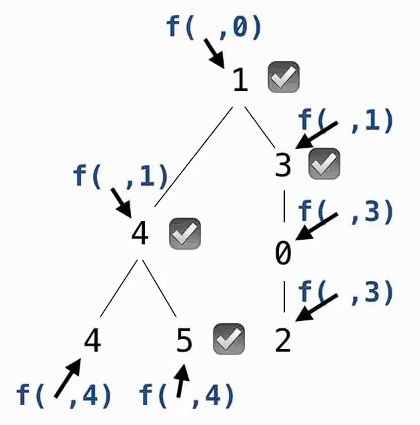
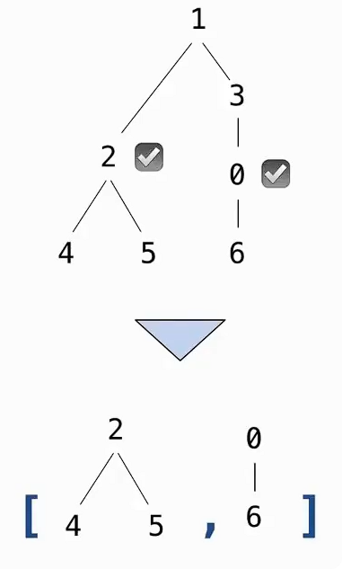

# 节点是否大于所有祖先问题

统计树中满足条件的节点数量：当前节点的 `label` 大于它所有祖先节点的 `label`。



这里的关键不只是比较：

```text
当前节点 > 父节点
```

而是：

```text
当前节点 > 所有祖先
```

判断一个节点是否大于所有祖先，并不需要把所有祖先值都保存下来。

例如当前节点的祖先是：

```text
1, 4, 7, 3
```

只需要知道：

```text
最大祖先值 = 7
```

然后判断：

```python
a.label > 7
```

即可。

因此递归辅助函数可以设计成：

```python
f(a, x)
```

含义：

```text
a → 当前正在处理的节点
x → 当前节点所有祖先中的最大 label
```

这个 `x` 是整道题最关键的递归状态。

## 方法一：返回值累加的写法

```python
def bigs(t):
    def f(a, x):
        if a.label > x:
            return 1 + sum(f(b, a.label) for b in a.branches)
        else:
            return sum(f(b, x) for b in a.branches)

    return f(t, t.label - 1)
```

> 父节点把子树以后还需要的信息作为参数传下去。

### 当前节点满足条件

如果：

```python
a.label > x
```

说明当前节点比之前所有祖先都大。

因此当前节点应该计数：

```python
1
```

于是：

```python
return 1 + ...
```

同时，因为：

```text
a.label > 原来的最大祖先值 x
```

所以对于当前节点的孩子来说，新的最大祖先值就是：

```python
a.label
```

因此递归：

```python
f(b, a.label)
```

整体：

```python
return 1 + sum(f(b, a.label) for b in a.branches)
```

### 当前节点不满足条件

如果：

```python
a.label <= x
```

当前节点不能计数。

所以没有：

```python
1 +
```

而是直接统计所有子树：

```python
return sum(f(b, x) for b in a.branches)
```

同时，因为当前：

```text
a.label <= x
```

所以最大祖先值仍然是原来的：

```text
x
```

不需要更新。

最后调用：

```python
f(t, t.label - 1)
```

根节点没有祖先。

但是为了让：

```python
a.label > x
```

对于根节点一定成立，需要人为给它一个比根节点小的初始最大祖先值：

```python
t.label - 1
```

因为题目说明：

```text
label 都是整数
```

所以一定有：

```text
t.label > t.label - 1
```

于是根节点会被正常计数。

也可以使用更通用的写法：

```python
float('-inf')
```

例如：

```python
return f(t, float('-inf'))
```

表示初始最大祖先值是负无穷：

```text
任何正常数字都会比它大
```

## 方法二：使用外部计数器

另一种解法不是让每次递归“返回数量”，而是创建一个共享计数器：

```python
def bigs(t):
    n = [0]

    def f(a, x):
        if a.label > x:
            n[0] += 1

        for b in a.branches:
            f(b, max(a.label, x))

    f(t, t.label - 1)
    return n[0]
```

这里 n[0] 保存目前已经发现的满足条件的节点数量。

如果：

```python
a.label > x
```

说明当前节点符合要求：

```python
n[0] += 1
```

然后无论当前节点是否满足条件，都必须继续访问它的所有子节点：

```python
for b in a.branches:
    ...
```

因为当前节点不满足条件，并不意味着它的后代也不满足条件。

递归时：

```python
f(b, max(a.label, x))
```

这一行非常重要。

假设：

```text
原来的最大祖先值 x = 10
当前节点 a.label = 5
```

那么对于孩子来说：

```text
最大祖先值仍然是 10
```

所以：

```python
max(5, 10) → 10
```

如果：

```text
x = 10
a.label = 15
```

那么当前节点已经成为新的最大祖先：

```python
max(15, 10) → 15
```

因此：

```python
max(a.label, x)
```

始终维护从根节点到当前节点这条路径上的最大 label。

```python
n = [0]
```

而不是：

```python
n = 0
```

是因为内部函数要修改外层保存的计数。

列表是可变对象：

```python
n[0] += 1
```

是在修改同一个列表中的元素，并没有把名字 `n` 重新绑定到另一个对象。

所以内部函数可以直接修改。

### 使用 nonlocal 的另一种写法

也可以：

```python
def bigs(t):
    n = 0

    def f(a, x):
        nonlocal n

        if a.label > x:
            n += 1

        for b in a.branches:
            f(b, max(a.label, x))

    f(t, t.label - 1)
    return n
```

这里：

```python
nonlocal n
```

明确表示：内部函数修改的是外层 `bigs` 中的 `n`。


# 非叶子节点小于后代节点问题

> 返回树中所有非叶节点，并且这些节点的 `label` 小于它所有后代节点的 `label`。



```python
def smalls(t):
    """Return the non-leaf nodes in t that are smaller than all their descendants."""

    result = []

    def process(t):
        if t.is_leaf():
            return t.label

        smallest = min(process(b) for b in t.branches)

        if t.label < smallest:
            result.append(t)

        return min(smallest, t.label)

    process(t)
    return result
```

当前节点要判断：

```text
自己是否小于所有后代
```

例如节点：

```text
2
```

下面有：

```text
4
5
```

其实没有必要把：

```text
4、5
```

全部保存下来。

只需要知道：

```text
所有后代中的最小值
```

因为如果：

```text
当前节点 < 最小后代
```

那么它自然就：

```text
< 其他所有后代
```

所以问题可以转换为：

```text
当前节点 < 所有后代
```

等价于：

```text
当前节点 < 最小后代值
```

## 自底向上的递归

上一道 `bigs` 问题需要知道祖先信息，所以信息从：

```text
父节点
  ↓
子节点
```

向下传递。

而当前 `smalls` 需要知道：

```text
后代中的最小值
```

这些信息只有处理完子树以后才能得到。

因此信息流是：

```text
叶节点
  ↑
父节点
  ↑
根节点
```

也就是**自底向上**。

```
需要祖先的信息 → 参数向下传

需要后代的信息 → return 向上传
```

这类题通常需要：递归函数先处理子树，再利用子树返回的信息处理当前节点。

递归首先处理最简单的情况：

```python
if t.is_leaf():
    return t.label
```

叶节点没有后代，因此它不需要加入：

```python
result
```

但父节点需要知道：

```text
这棵子树里的最小 label
```

叶节点的子树只有它自己，所以：

```text
最小值 = 自己的 label
```

因此返回：

```python
t.label
```

对于非叶节点：

```python
smallest = min([process(b) for b in t.branches])
```

可以拆开理解。

首先：

```python
process(b)
```

会返回：

```text
每一个分支中的最小 label
```

假设当前节点是：

```text
    2
   / \
  4   5
```

那么：

```python
process(Tree(4)) → 4
process(Tree(5)) → 5
```

列表：

```python
[process(b) for b in t.branches]
```

得到：

```python
[4, 5]
```

然后：

```python
min([4, 5])
```

得到：

```text
4
```

所以：

```python
smallest
```

表示当前节点所有分支中的最小值，也就是当前节点所有后代中的最小值。

有了：

```python
smallest
```

以后：

```python
if t.label < smallest:
    result.append(t)
```

就可以判断当前节点是否满足条件。

例如：

```text
    2
   / \
  4   5
```

得到：

```text
smallest = 4
```

然后：

```text
2 < 4
```

成立，所以：

```python
result.append(t)
```

把节点 `2` 加入结果。

处理完当前节点后：

```python
return min(smallest, t.label)
```

这一行非常关键。

前面的：

```python
smallest
```

只表示：

```text
后代节点中的最小值
```

但是对于当前节点的父节点来说，它需要知道：

```text
整个当前子树的最小值
```

整个当前子树包括：

```text
当前节点 + 所有后代
```

所以必须比较：

```python
min(smallest, t.label)
```

# 程序设计的基本流程

重点不是直接开始写代码，而是先逐步明确：

```text
问题需要表示什么数据
		↓
函数接收什么、返回什么
		↓
  通过例子理解目标
		↓
根据数据结构设计递归框架
		↓
	补全具体逻辑
		↓
	通过测试验证
```

## 数据定义

开始写函数之前，先明确：

> 问题中的信息使用什么数据结构表示。

例如当前问题使用：

```python
Tree
```

表示树。

每个节点具有：

```python
t.label
```

表示节点的值，

以及：

```python
t.branches
```

表示所有子树。

因此看到一个树问题时，可以先建立：

```text
Tree
├── label
└── branches
    ├── Tree
    ├── Tree
    └── ...
```

## 类型签名

类型签名（type signature）描述函数输入数据的类型和返回结果的类型。

例如：

```text
Tree → List of Trees
```

表示：

```text
输入：一棵 Tree
输出：由若干 Tree 节点组成的列表
```

当前函数：

```python
smalls(t)
```

就是：

```text
Tree → List of Trees
```

因为它不是返回节点的 `label`，而是返回符合要求的**节点本身**。

## 测试

函数实现以后，应把之前用于理解问题的例子变成测试。

例如：

```python
a = Tree(
    1,
    [
        Tree(2, [Tree(4), Tree(5)]),
        Tree(3, [Tree(0, [Tree(6)])])
    ]
)

assert sorted(t.label for t in smalls(a)) == [0, 2]
```

测试不仅用于发现错误，也明确记录：

```text
函数应该具有怎样的行为
```

因此好的例子通常可以直接转化成测试。

